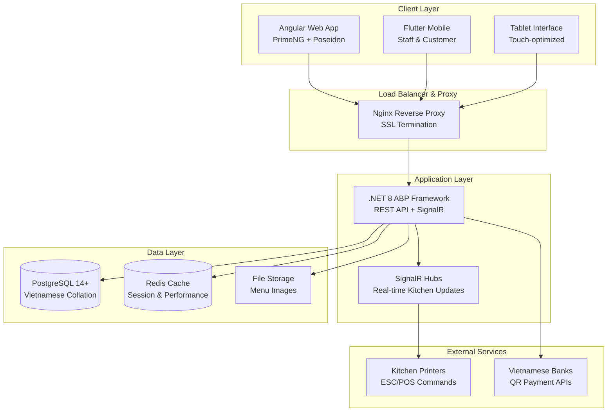
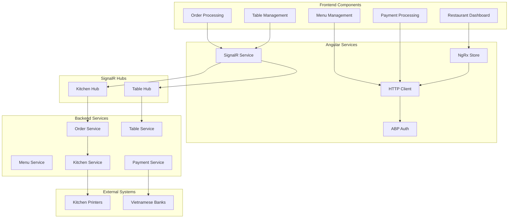
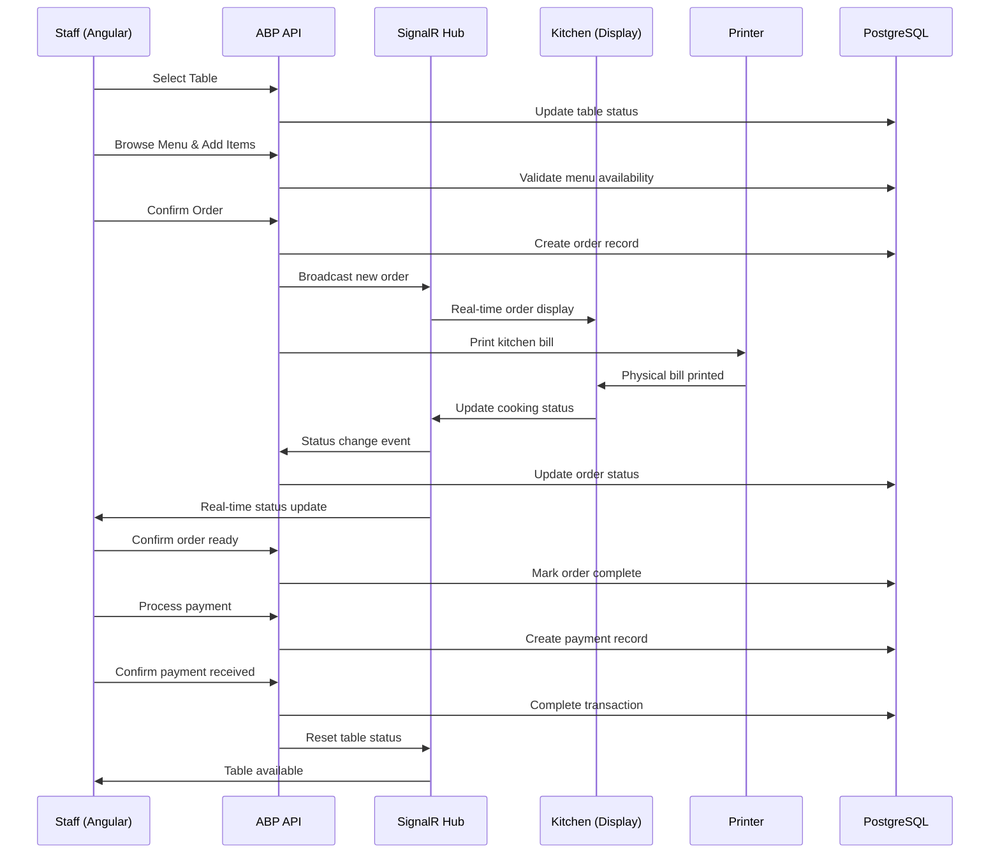
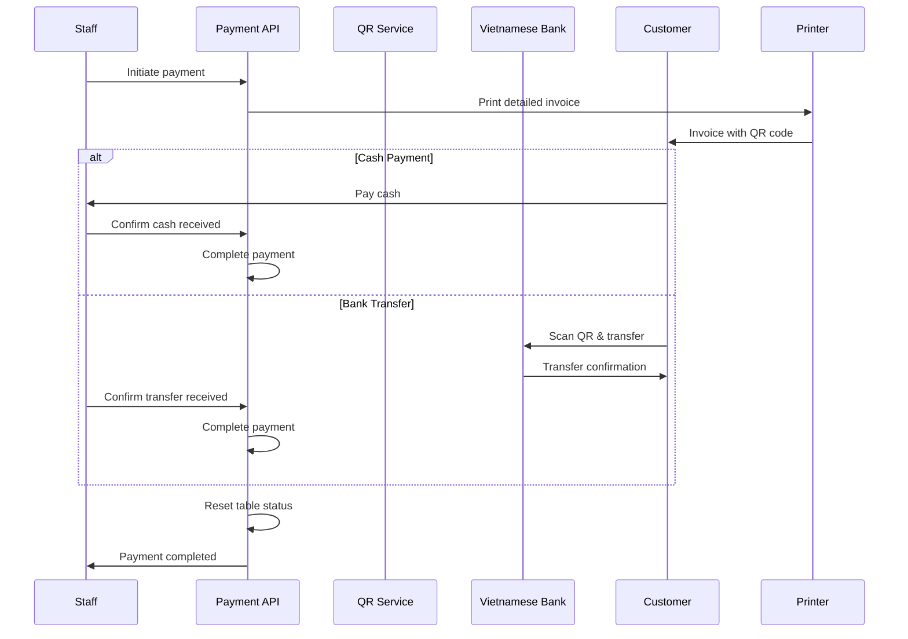
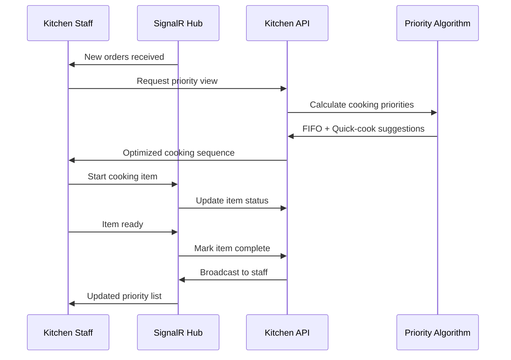
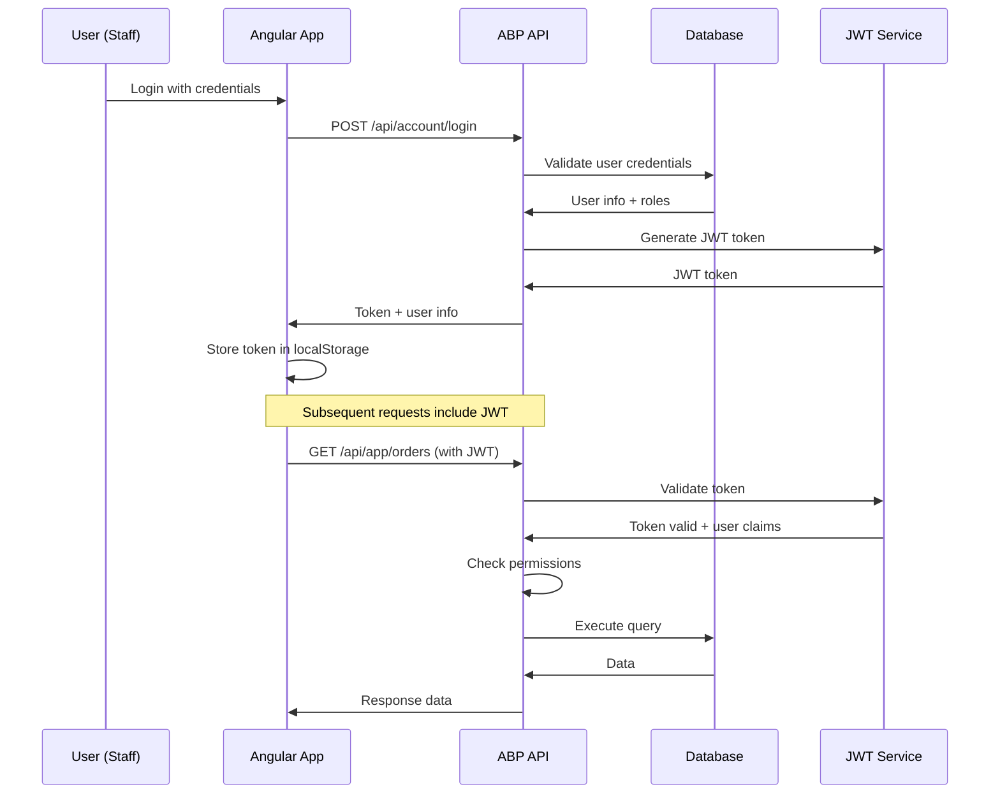
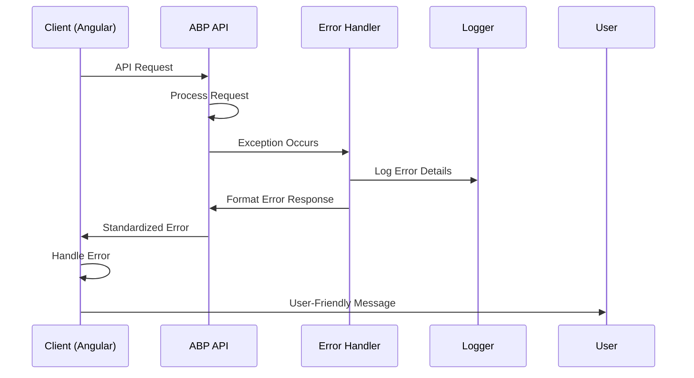

# Smart Restaurant Management System Fullstack Architecture Document (Tài liệu Kiến trúc Fullstack Hệ thống Quản lý Nhà hàng Thông minh)

## Introduction (Giới thiệu)

This document outlines the complete fullstack architecture for Smart Restaurant Management System, including backend systems, frontend implementation, and their integration. It serves as the single source of truth for AI-driven development, ensuring consistency across the entire technology stack (Tài liệu này mô tả kiến trúc fullstack hoàn chỉnh cho Hệ thống Quản lý Nhà hàng Thông minh, bao gồm hệ thống backend, triển khai frontend và việc tích hợp chúng. Đây là nguồn thông tin duy nhất cho việc phát triển hướng dẫn bởi AI, đảm bảo tính nhất quán trên toàn bộ ngăn xếp công nghệ).

This unified approach combines what would traditionally be separate backend and frontend architecture documents, streamlining the development process for modern fullstack applications where these concerns are increasingly intertwined (Cách tiếp cận thống nhất này kết hợp những gì truyền thống sẽ là các tài liệu kiến trúc backend và frontend riêng biệt, tối ưu hóa quy trình phát triển cho các ứng dụng fullstack hiện đại).

### Starter Template or Existing Project (Template Khởi đầu hoặc Dự án Hiện có)

**Existing Project** - System has been established with specific architecture (Dự án hiện có - Hệ thống đã được thiết lập với kiến trúc cụ thể):
- **Backend**: ABP Framework (.NET 8) with modular monolith pattern and Domain-Driven Design (ABP Framework (.NET 8) với mô hình modular monolith và thiết kế hướng miền)
- **Frontend**: Angular 19 with PrimeNG and Poseidon template (Angular 19 với PrimeNG và template Poseidon)
- **Mobile**: Flutter app for staff and customers (Ứng dụng Flutter cho nhân viên và khách hàng)
- **Database**: PostgreSQL with Vietnamese text search support (PostgreSQL với hỗ trợ tìm kiếm văn bản tiếng Việt)
- **Real-time**: SignalR for kitchen coordination (SignalR cho phối hợp bếp)
- **Deployment**: Docker containers, VPS deployment target (Containers Docker, mục tiêu triển khai VPS)

### Change Log (Nhật ký Thay đổi)

| Date (Ngày) | Version (Phiên bản) | Description (Mô tả) | Author (Tác giả) |
|-------------|---------------------|---------------------|------------------|
| 2025-08-17 | 1.0 | Initial fullstack architecture for Smart Restaurant Management System (Kiến trúc fullstack ban đầu cho Hệ thống Quản lý Nhà hàng Thông minh) | Winston - Architect |

## High Level Architecture (Kiến trúc Tổng quan)

### Technical Summary (Tóm tắt Kỹ thuật)

Smart Restaurant Management System uses **ABP Framework Modular Monolith** architecture with .NET 8 backend and Angular 19 frontend, deployed via Docker containers on VPS. The architecture focuses on real-time performance for restaurant operations with SignalR WebSocket connections, PostgreSQL with Vietnamese collation for menu search, and Redis caching for peak hours (11:30-13:30, 18:00-21:00). Frontend uses PrimeNG with Poseidon theme for tablet-friendly interface, while Flutter mobile app supports staff and customer workflows. The entire system is designed for Vietnamese payment methods and restaurant-specific workflows like two-level menu management and seasonal category control (Hệ thống Quản lý Nhà hàng Thông minh sử dụng kiến trúc ABP Framework Modular Monolith với backend .NET 8 và frontend Angular 19, được triển khai qua containers Docker trên VPS. Kiến trúc tập trung vào hiệu suất thời gian thực cho hoạt động nhà hàng với kết nối SignalR WebSocket, PostgreSQL với collation tiếng Việt để tìm kiếm menu, và Redis caching cho giờ cao điểm. Frontend sử dụng PrimeNG với theme Poseidon cho giao diện thân thiện với tablet, trong khi ứng dụng di động Flutter hỗ trợ quy trình làm việc của nhân viên và khách hàng).

### Platform and Infrastructure Choice (Lựa chọn Nền tảng và Hạ tầng)

**Platform:** VPS (Ubuntu 22.04 LTS) with Docker containerization (VPS (Ubuntu 22.04 LTS) với đóng gói Docker)
**Key Services:** Nginx reverse proxy, PostgreSQL 14+, Redis cache, .NET 8 Runtime, Angular static hosting (Các dịch vụ chính: Nginx reverse proxy, PostgreSQL 14+, Redis cache, .NET 8 Runtime, Angular static hosting)
**Deployment Host and Regions:** Single VPS deployment (Asia/Ho_Chi_Minh timezone) with horizontal scaling capability (Máy chủ và Khu vực triển khai: Triển khai VPS đơn lẻ với khả năng mở rộng ngang)

**Rationale (Lý do lựa chọn):**
- **Cost-effective**: VPS suitable for small restaurant budget ($20-50/month) (Hiệu quả chi phí: VPS phù hợp với ngân sách nhà hàng nhỏ)
- **Performance**: Local deployment reduces latency for real-time kitchen orders (Hiệu suất: Triển khai cục bộ giảm độ trễ cho đơn hàng bếp thời gian thực)
- **Control**: Full control over Vietnamese-specific configurations (Kiểm soát: Toàn quyền kiểm soát cấu hình đặc thù Việt Nam)
- **Scalability**: Can expand to multi-restaurant chain later (Khả năng mở rộng: Có thể mở rộng thành chuỗi nhiều nhà hàng sau này)

### Repository Structure (Cấu trúc Repository)

**Structure**: ABP CLI Generated Monorepo (Monorepo được tạo bởi ABP CLI)
**ABP Framework**: Standard Clean Architecture with Domain-Driven Design layers (Clean Architecture chuẩn với các lớp Domain-Driven Design)
**Package Organization**: Layer-based separation following ABP best practices (Tổ chức gói: Phân tách theo lớp tuân theo best practice ABP)

**Actual ABP CLI Generated Structure (Cấu trúc thực tế được tạo bởi ABP CLI):**
```
smart-restaurant/ (Current project: /Volumes/Work/data/source-code/SmartRestaurant/aspnet-core)
├── SmartRestaurant.sln              # Visual Studio solution file (File solution Visual Studio)
├── SmartRestaurant.sln.DotSettings  # ReSharper settings (Cài đặt ReSharper)
├── common.props                     # Common MSBuild properties (Thuộc tính MSBuild chung)
├── NuGet.Config                     # NuGet package sources (Nguồn package NuGet)
├── src/                             # Source code projects (Dự án mã nguồn)
│   ├── SmartRestaurant.Domain.Shared/           # Shared constants, enums, localization
│   ├── SmartRestaurant.Domain/                 # Domain entities, services, events
│   ├── SmartRestaurant.Application.Contracts/  # DTOs, interfaces, permissions
│   ├── SmartRestaurant.Application/            # Application services, business logic
│   ├── SmartRestaurant.EntityFrameworkCore/    # Data access, DbContext, repositories
│   ├── SmartRestaurant.HttpApi/                # Web API controllers
│   ├── SmartRestaurant.HttpApi.Host/           # Web host, configuration, startup
│   ├── SmartRestaurant.HttpApi.Client/         # HTTP client proxies
│   └── SmartRestaurant.DbMigrator/             # Database migration console app
├── test/                            # Test projects (Dự án kiểm thử)
│   ├── SmartRestaurant.TestBase/              # Test infrastructure
│   ├── SmartRestaurant.Domain.Tests/          # Domain unit tests
│   ├── SmartRestaurant.Application.Tests/     # Application service tests
│   ├── SmartRestaurant.EntityFrameworkCore.Tests/ # Data access tests
│   └── SmartRestaurant.HttpApi.Client.ConsoleTestApp/ # API client tests
../angular/                         # Angular frontend (ABP Angular template) - outside aspnet-core
│   ├── src/app/                    # Angular application with ABP integration
│   ├── package.json                # Dependencies with @abp/ng.* packages
│   └── dynamic-env.json            # ABP dynamic environment configuration
../docs/                            # Architecture documentation (Custom addition) - outside aspnet-core
```

### High Level Architecture Diagram (Sơ đồ Kiến trúc Tổng quan)



### Architectural Patterns (Các Mẫu Kiến trúc)

- **Modular Monolith (ABP Framework):** Domain-driven modules với clear boundaries - _Rationale:_ Easier deployment và maintenance cho restaurant operations, có thể extract thành microservices sau này
- **Event-Driven Architecture:** Domain events cho order status changes - _Rationale:_ Real-time updates cho kitchen staff và table management
- **Repository Pattern:** Abstract data access với Entity Framework Core - _Rationale:_ Testability và future database migration flexibility
- **CQRS Pattern:** Command Query Responsibility Segregation cho complex operations - _Rationale:_ Optimized reads cho reporting và analytics
- **API Gateway Pattern:** Nginx reverse proxy với centralized routing - _Rationale:_ Security, rate limiting, và SSL termination
- **Component-Based UI (Angular):** Reusable components với TypeScript - _Rationale:_ Maintainability cho large restaurant management interface
- **Progressive Web App (PWA):** Offline capability cho critical operations - _Rationale:_ Ensure restaurant operations continue during network issues

## Tech Stack (Ngăn xếp Công nghệ)

### Technology Stack Table (Bảng Ngăn xếp Công nghệ)

| Category (Danh mục) | Technology (Công nghệ) | Version (Phiên bản) | Purpose (Mục đích) | Rationale (Lý do) |
|----------|------------|---------|---------|-----------|
| Frontend Language | TypeScript | 5.0+ | Type-safe frontend development | Strong typing for large Angular applications, better IDE support |
| Frontend Framework | Angular | 19.x | Primary web framework | ABP integration, enterprise patterns, strong Vietnamese community |
| UI Component Library | PrimeNG | 17.x | Component library | Rich components, Poseidon theme, restaurant-friendly UI elements |
| State Management | NgRx | 17.x | Reactive state management | Complex restaurant workflows, real-time updates integration |
| Backend Language | C# | 12.0 | Backend development | .NET 8 features, strong typing, performance |
| Backend Framework | ABP Framework | 8.0 | Application framework | Domain-driven design, multitenancy, localization support |
| API Style | REST + SignalR | HTTP/1.1 + WebSocket | API communication | RESTful services + real-time kitchen updates |
| Database | PostgreSQL | 14+ | Primary data storage | Vietnamese text search, JSON support, reliability |
| Cache | Redis | 7.0+ | Session and performance caching | Fast access for menu data, session management |
| File Storage | Local File System | - | Menu images and documents | Simple VPS storage, future cloud migration path |
| Authentication | ABP Identity | 8.0 | User authentication and authorization | Built-in role management, Vietnamese user workflows |
| Frontend Testing | Jasmine + Karma | Latest | Unit and integration testing | Angular ecosystem standard |
| Backend Testing | xUnit + Moq | Latest | .NET testing framework | ABP Framework compatible testing |
| E2E Testing | Playwright | Latest | End-to-end testing | Restaurant workflow validation |
| Build Tool | Angular CLI + dotnet CLI | Latest | Build and development tooling | Framework-native tools |
| Bundler | Webpack (via Angular CLI) | Latest | Frontend asset bundling | Angular standard, optimized bundles |
| IaC Tool | Docker Compose | Latest | Infrastructure as code | VPS deployment, reproducible environments |
| CI/CD | GitHub Actions | Latest | Continuous integration/deployment | Free for public repos, Docker integration |
| Monitoring | Application Insights | Latest | Application monitoring | .NET integration, restaurant metrics |
| Logging | Serilog + ELK Stack | Latest | Structured logging | .NET integration, searchable logs |
| CSS Framework | PrimeNG Theme (Poseidon) | Latest | UI styling | Restaurant-optimized design system |

## Data Models (Các Mô hình Dữ liệu)

### Core Business Entities (Các Thực thể Kinh doanh Cốt lõi)

**ABP Code-First Approach (Phương pháp ABP Code-First):** The system uses ABP Framework's code-first approach where domain entities are defined in the backend, and TypeScript interfaces are automatically generated for the frontend using ABP CLI proxy generation (Hệ thống sử dụng phương pháp code-first của ABP Framework, trong đó các domain entity được định nghĩa ở backend, và các TypeScript interface được tự động tạo cho frontend bằng ABP CLI proxy generation).

Based on the PRD requirements, the key business entities for Vietnamese restaurant operations (Dựa trên yêu cầu PRD, các thực thể kinh doanh chính cho hoạt động nhà hàng Việt Nam):

#### Order (Đơn hàng)

**Purpose:** Central entity for customer orders with real-time status tracking (Mục đích: Thực thể trung tâm cho đơn hàng khách hàng với theo dõi trạng thái thời gian thực)

**Backend Entity (Entity Backend):**
```csharp
// src/SmartRestaurant.Domain/Entities/Orders/Order.cs
public class Order : FullAuditedAggregateRoot<Guid>
{
    /// <summary>Số đơn hàng hiển thị cho khách hàng (ví dụ: #001, #002)</summary>
    public string OrderNumber { get; set; }
    
    /// <summary>ID của bàn mà đơn hàng này được đặt</summary>
    public Guid TableId { get; set; }
    
    /// <summary>Loại đơn hàng: Ăn tại chỗ hoặc Mang về</summary>
    public OrderType OrderType { get; set; }
    
    /// <summary>Trạng thái hiện tại của đơn hàng</summary>
    public OrderStatus Status { get; set; }
    
    /// <summary>Tổng tiền của đơn hàng (VND)</summary>
    public decimal TotalAmount { get; set; }
    
    /// <summary>Ghi chú đặc biệt từ khách hàng (ví dụ: "Không cay", "Ít đường")</summary>
    public string Notes { get; set; }
    
    // Navigation properties (Thuộc tính điều hướng)
    /// <summary>Bàn ăn liên kết với đơn hàng này</summary>
    public virtual Table Table { get; set; }
    
    /// <summary>Danh sách các món ăn trong đơn hàng</summary>
    public virtual ICollection<OrderItem> OrderItems { get; set; }
}

/// <summary>Loại đơn hàng</summary>
public enum OrderType
{
    /// <summary>Ăn tại chỗ</summary>
    DineIn,
    
    /// <summary>Mang về</summary>
    Takeaway
}

/// <summary>Trạng thái đơn hàng</summary>
public enum OrderStatus
{
    /// <summary>Chờ xác nhận</summary>
    Pending,
    
    /// <summary>Đã xác nhận</summary>
    Confirmed,
    
    /// <summary>Đang chế biến</summary>
    Preparing,
    
    /// <summary>Sẵn sàng phục vụ</summary>
    Ready,
    
    /// <summary>Đã phục vụ</summary>
    Served,
    
    /// <summary>Đã thanh toán</summary>
    Paid
}
```

**Auto-Generated Frontend Interface (Interface Frontend tự động tạo):**
```typescript
// Generated by ABP CLI: abp generate-proxy -t ng
// Location: src/app/proxy/orders/models.ts
export interface OrderDto {
  /** ID đơn hàng */
  id: string;
  
  /** Số đơn hàng hiển thị cho khách hàng */
  orderNumber: string;
  
  /** ID của bàn */
  tableId: string;
  
  /** Loại đơn hàng */
  orderType: OrderType;
  
  /** Trạng thái đơn hàng */
  status: OrderStatus;
  
  /** Tổng tiền (VND) */
  totalAmount: number;
  
  /** Ghi chú từ khách hàng */
  notes?: string;
  
  /** Thời gian tạo đơn hàng */
  creationTime: string;
  
  /** ID nhân viên tạo đơn */
  creatorId?: string;
}

/** Loại đơn hàng */
export enum OrderType {
  /** Ăn tại chỗ */
  DineIn = 0,
  
  /** Mang về */
  Takeaway = 1
}

/** Trạng thái đơn hàng */
export enum OrderStatus {
  /** Chờ xác nhận */
  Pending = 0,
  
  /** Đã xác nhận */
  Confirmed = 1,
  
  /** Đang chế biến */
  Preparing = 2,
  
  /** Sẵn sàng phục vụ */
  Ready = 3,
  
  /** Đã phục vụ */
  Served = 4,
  
  /** Đã thanh toán */
  Paid = 5
}
```

**Relationships:**
- One-to-Many with OrderItem
- Many-to-One with Table
- Many-to-One with Customer (optional)

#### MenuItem (Món ăn)

**Purpose:** Two-level menu management with category and item-level control (Mục đích: Quản lý menu hai cấp với kiểm soát cấp danh mục và cấp món)

**Backend Entity (Entity Backend):**
```csharp
// src/SmartRestaurant.Domain/Entities/Menu/MenuItem.cs
public class MenuItem : FullAuditedEntity<Guid>
{
    /// <summary>ID danh mục menu (ví dụ: Khai vị, Món chính, Đồ uống)</summary>
    public Guid CategoryId { get; set; }
    
    /// <summary>Tên món ăn (ví dụ: "Phở Bò", "Cơm Tấm", "Chả Cá Lá Vọng")</summary>
    public string Name { get; set; }
    
    /// <summary>Mô tả chi tiết về món ăn</summary>
    public string Description { get; set; }
    
    /// <summary>Giá món ăn (VND)</summary>
    public decimal Price { get; set; }
    
    /// <summary>Món có sẵn để đặt hay không</summary>
    public bool IsAvailable { get; set; }
    
    /// <summary>Thời gian chế biến (phút)</summary>
    public int PreparationTime { get; set; }
    
    /// <summary>Khu vực bếp chế biến món này</summary>
    public KitchenStation KitchenStation { get; set; }
    
    /// <summary>URL hình ảnh món ăn</summary>
    public string ImageUrl { get; set; }
    
    // Navigation properties (Thuộc tính điều hướng)
    /// <summary>Danh mục menu chứa món ăn này</summary>
    public virtual MenuCategory Category { get; set; }
    
    /// <summary>Các lần món này được đặt trong đơn hàng</summary>
    public virtual ICollection<OrderItem> OrderItems { get; set; }
}

/// <summary>Khu vực bếp chế biến</summary>
public enum KitchenStation
{
    /// <summary>Khu vực chung</summary>
    General,
    
    /// <summary>Khu vực nấu lẩu</summary>
    Hotpot,
    
    /// <summary>Khu vực nướng</summary>
    Grilled,
    
    /// <summary>Khu vực pha chế đồ uống</summary>
    Drinking
}
```

**Auto-Generated Frontend Interface (Interface Frontend tự động tạo):**
```typescript
// Generated by ABP CLI: src/app/proxy/menu/models.ts
export interface MenuItemDto {
  /** ID món ăn */
  id: string;
  
  /** ID danh mục menu */
  categoryId: string;
  
  /** Tên món ăn */
  name: string;
  
  /** Mô tả món ăn */
  description: string;
  
  /** Giá món ăn (VND) */
  price: number;
  
  /** Món có sẵn hay không */
  isAvailable: boolean;
  
  /** Thời gian chế biến (phút) */
  preparationTime: number;
  
  /** Khu vực bếp chế biến */
  kitchenStation: KitchenStation;
  
  /** URL hình ảnh món ăn */
  imageUrl?: string;
}

/** Khu vực bếp chế biến */
export enum KitchenStation {
  /** Khu vực chung */
  General = 0,
  
  /** Khu vực nấu lẩu */
  Hotpot = 1,
  
  /** Khu vực nướng */
  Grilled = 2,
  
  /** Khu vực pha chế đồ uống */
  Drinking = 3
}
```

**Relationships:**
- Many-to-One with MenuCategory
- One-to-Many with OrderItem
- Many-to-Many with Ingredient

#### Table (Bàn ăn)

**Purpose:** Restaurant table management with real-time status (Mục đích: Quản lý bàn nhà hàng với trạng thái thời gian thực)

**Backend Entity (Entity Backend):**
```csharp
// src/SmartRestaurant.Domain/Entities/Tables/Table.cs
public class Table : FullAuditedEntity<Guid>
{
    /// <summary>Số bàn hiển thị (ví dụ: "B01", "B02", "VIP1")</summary>
    public string TableNumber { get; set; }
    
    /// <summary>Số ghế/người tối đa của bàn</summary>
    public int Capacity { get; set; }
    
    /// <summary>Trạng thái hiện tại của bàn</summary>
    public TableStatus Status { get; set; }
    
    /// <summary>Vị trí bàn (ví dụ: "Tầng 1", "Khu VIP", "Sân vườn")</summary>
    public string Location { get; set; }
    
    /// <summary>ID đơn hàng hiện tại đang sử dụng bàn (nếu có)</summary>
    public Guid? CurrentOrderId { get; set; }
    
    // Navigation properties (Thuộc tính điều hướng)
    /// <summary>Tất cả đơn hàng đã sử dụng bàn này</summary>
    public virtual ICollection<Order> Orders { get; set; }
    
    /// <summary>Các lần đặt bàn cho bàn này</summary>
    public virtual ICollection<Reservation> Reservations { get; set; }
}

/// <summary>Trạng thái bàn ăn</summary>
public enum TableStatus
{
    /// <summary>Bàn trống, sẵn sàng phục vụ</summary>
    Available,
    
    /// <summary>Bàn đang có khách</summary>
    Occupied,
    
    /// <summary>Bàn đã được đặt trước</summary>
    Reserved,
    
    /// <summary>Bàn đang được dọn dẹp</summary>
    Cleaning
}
```

**Auto-Generated Frontend Interface (Interface Frontend tự động tạo):**
```typescript
// Generated by ABP CLI: src/app/proxy/tables/models.ts
export interface TableDto {
  /** ID bàn ăn */
  id: string;
  
  /** Số bàn hiển thị */
  tableNumber: string;
  
  /** Số ghế tối đa */
  capacity: number;
  
  /** Trạng thái bàn */
  status: TableStatus;
  
  /** Vị trí bàn */
  location?: string;
  
  /** ID đơn hàng hiện tại */
  currentOrderId?: string;
}

/** Trạng thái bàn ăn */
export enum TableStatus {
  /** Bàn trống, sẵn sàng */
  Available = 0,
  
  /** Bàn đang có khách */
  Occupied = 1,
  
  /** Bàn đã đặt trước */
  Reserved = 2,
  
  /** Bàn đang dọn dẹp */
  Cleaning = 3
}
```

**Relationships:**
- One-to-Many with Order
- One-to-One with Reservation (optional)

#### Payment (Thanh toán)

**Purpose:** Vietnamese payment processing with staff confirmation (Mục đích: Xử lý thanh toán Việt Nam với xác nhận nhân viên)

**Backend Entity (Entity Backend):**
```csharp
// src/SmartRestaurant.Domain/Entities/Payments/Payment.cs
public class Payment : FullAuditedEntity<Guid>
{
    /// <summary>ID đơn hàng cần thanh toán</summary>
    public Guid OrderId { get; set; }
    
    /// <summary>Phương thức thanh toán</summary>
    public PaymentMethod PaymentMethod { get; set; }
    
    /// <summary>Số tiền thanh toán (VND)</summary>
    public decimal Amount { get; set; }
    
    /// <summary>Trạng thái thanh toán</summary>
    public PaymentStatus Status { get; set; }
    
    /// <summary>Dữ liệu mã QR cho chuyển khoản ngân hàng</summary>
    public string QRCodeData { get; set; }
    
    /// <summary>Số hóa đơn/biên lai</summary>
    public string ReceiptNumber { get; set; }
    
    /// <summary>ID nhân viên xác nhận thanh toán</summary>
    public Guid? ConfirmedBy { get; set; }
    
    /// <summary>Thời gian xác nhận thanh toán</summary>
    public DateTime? ConfirmedAt { get; set; }
    
    // Navigation properties (Thuộc tính điều hướng)
    /// <summary>Đơn hàng liên kết với thanh toán này</summary>
    public virtual Order Order { get; set; }
}

/// <summary>Phương thức thanh toán</summary>
public enum PaymentMethod
{
    /// <summary>Tiền mặt</summary>
    Cash,
    
    /// <summary>Chuyển khoản ngân hàng</summary>
    BankTransfer
}

/// <summary>Trạng thái thanh toán</summary>
public enum PaymentStatus
{
    /// <summary>Chờ thanh toán</summary>
    Pending,
    
    /// <summary>Đã xác nhận thanh toán</summary>
    Confirmed,
    
    /// <summary>Thanh toán thất bại</summary>
    Failed
}
```

**Auto-Generated Frontend Interface (Interface Frontend tự động tạo):**
```typescript
// Generated by ABP CLI: src/app/proxy/payments/models.ts
export interface PaymentDto {
  /** ID thanh toán */
  id: string;
  
  /** ID đơn hàng */
  orderId: string;
  
  /** Phương thức thanh toán */
  paymentMethod: PaymentMethod;
  
  /** Số tiền thanh toán (VND) */
  amount: number;
  
  /** Trạng thái thanh toán */
  status: PaymentStatus;
  
  /** Dữ liệu mã QR */
  qrCodeData?: string;
  
  /** Số hóa đơn */
  receiptNumber?: string;
  
  /** ID nhân viên xác nhận */
  confirmedBy?: string;
  
  /** Thời gian xác nhận */
  confirmedAt?: string;
}

/** Phương thức thanh toán */
export enum PaymentMethod {
  /** Tiền mặt */
  Cash = 0,
  
  /** Chuyển khoản ngân hàng */
  BankTransfer = 1
}

/** Trạng thái thanh toán */
export enum PaymentStatus {
  /** Chờ thanh toán */
  Pending = 0,
  
  /** Đã xác nhận */
  Confirmed = 1,
  
  /** Thất bại */
  Failed = 2
}
```

**Relationships:**
- Many-to-One with Order
- Many-to-One with User (staff confirmation)

## API Specification (Thông số kỹ thuật API)

### REST API Specification (Thông số kỹ thuật REST API)

**ABP Auto API Controllers (ABP Auto API Controllers):** ABP Framework automatically generates REST API controllers from Application Services without manual controller development. You only need to create Application Services, and ABP will automatically expose them as Web API endpoints (ABP Framework tự động tạo REST API controllers từ Application Services mà không cần phát triển controller thủ công. Bạn chỉ cần tạo Application Services, và ABP sẽ tự động expose chúng như Web API endpoints).

**Application Service Example (Ví dụ Application Service):**
```csharp
// src/SmartRestaurant.Application/Orders/OrderAppService.cs
public class OrderAppService : ApplicationService, IOrderAppService
{
    private readonly IOrderRepository _orderRepository;
    
    public async Task<PagedResultDto<OrderDto>> GetListAsync(GetOrdersInput input)
    {
        // Business logic implementation
        // ABP tự động tạo: GET /api/app/orders
    }
    
    public async Task<OrderDto> CreateAsync(CreateOrderDto input)
    {
        // Business logic implementation  
        // ABP tự động tạo: POST /api/app/order
    }
    
    public async Task UpdateStatusAsync(Guid id, UpdateOrderStatusDto input)
    {
        // Business logic implementation
        // ABP tự động tạo: PUT /api/app/order/{id}/status
    }
    
    public async Task DeleteAsync(Guid id)
    {
        // ABP tự động tạo: DELETE /api/app/order/{id}
    }
}

// src/SmartRestaurant.Application.Contracts/Orders/IOrderAppService.cs
public interface IOrderAppService : IApplicationService
{
    Task<PagedResultDto<OrderDto>> GetListAsync(GetOrdersInput input);
    Task<OrderDto> CreateAsync(CreateOrderDto input);
    Task UpdateStatusAsync(Guid id, UpdateOrderStatusDto input);
    Task DeleteAsync(Guid id);
}
```

**ABP Auto API Configuration (Cấu hình ABP Auto API):**
```csharp
// src/SmartRestaurant.HttpApi.Host/SmartRestaurantHttpApiHostModule.cs
[DependsOn(typeof(SmartRestaurantApplicationModule))]
public class SmartRestaurantHttpApiHostModule : AbpModule
{
    public override void ConfigureServices(ServiceConfigurationContext context)
    {
        // ABP tự động quét và tạo controllers từ Application Services
        Configure<AbpAspNetCoreMvcOptions>(options =>
        {
            options.ConventionalControllers.Create(typeof(SmartRestaurantApplicationModule).Assembly);
        });
    }
}
```

**Resulting OpenAPI Specification (Đặc tả OpenAPI được tạo):**
```yaml
openapi: 3.0.0
info:
  title: Smart Restaurant Management API
  version: 1.0.0
  description: ABP Framework REST API for Vietnamese restaurant operations
servers:
  - url: https://restaurant.example.com/api
    description: Production server
  - url: https://localhost:44391/api  
    description: Development server

paths:
  /orders:
    get:
      summary: Get orders with filtering
      parameters:
        - name: tableId
          in: query
          schema:
            type: string
        - name: status
          in: query
          schema:
            type: string
            enum: [Pending, Confirmed, Preparing, Ready, Served, Paid]
      responses:
        200:
          description: List of orders
          content:
            application/json:
              schema:
                type: array
                items:
                  $ref: '#/components/schemas/Order'
    post:
      summary: Create new order
      requestBody:
        required: true
        content:
          application/json:
            schema:
              $ref: '#/components/schemas/CreateOrderDto'
      responses:
        201:
          description: Order created
          content:
            application/json:
              schema:
                $ref: '#/components/schemas/Order'

  /orders/{id}/status:
    patch:
      summary: Update order status
      parameters:
        - name: id
          in: path
          required: true
          schema:
            type: string
      requestBody:
        required: true
        content:
          application/json:
            schema:
              type: object
              properties:
                status:
                  type: string
                  enum: [Confirmed, Preparing, Ready, Served]
      responses:
        200:
          description: Status updated

  /menu-items:
    get:
      summary: Get menu items with availability
      parameters:
        - name: categoryId
          in: query
          schema:
            type: string
        - name: search
          in: query
          schema:
            type: string
          description: Vietnamese text search
      responses:
        200:
          description: Menu items list
          content:
            application/json:
              schema:
                type: array
                items:
                  $ref: '#/components/schemas/MenuItem'

  /tables:
    get:
      summary: Get all tables with current status
      responses:
        200:
          description: Table list with real-time status
          content:
            application/json:
              schema:
                type: array
                items:
                  $ref: '#/components/schemas/Table'

  /payments:
    post:
      summary: Process payment
      requestBody:
        required: true
        content:
          application/json:
            schema:
              $ref: '#/components/schemas/CreatePaymentDto'
      responses:
        201:
          description: Payment initiated

  /payments/{id}/confirm:
    patch:
      summary: Staff confirm payment completion
      parameters:
        - name: id
          in: path
          required: true
          schema:
            type: string
      responses:
        200:
          description: Payment confirmed

components:
  schemas:
    Order:
      type: object
      properties:
        orderId:
          type: string
        tableId:
          type: string
        orderNumber:
          type: string
        orderType:
          type: string
          enum: [DineIn, Takeaway]
        status:
          type: string
          enum: [Pending, Confirmed, Preparing, Ready, Served, Paid]
        orderItems:
          type: array
          items:
            $ref: '#/components/schemas/OrderItem'
        totalAmount:
          type: number
        createdAt:
          type: string
          format: date-time
        notes:
          type: string
    
    MenuItem:
      type: object
      properties:
        menuItemId:
          type: string
        categoryId:
          type: string
        name:
          type: string
        description:
          type: string
        price:
          type: number
        isAvailable:
          type: boolean
        preparationTime:
          type: number
        kitchenStation:
          type: string
          enum: [Hotpot, Grilled, Drinking, General]
```

### SignalR Hubs (Các Hub SignalR)

**Real-time Communication for Restaurant Operations (Giao tiếp Thời gian Thực cho Hoạt động Nhà hàng):** SignalR provides instant updates between kitchen, serving staff, and management interfaces (SignalR cung cấp cập nhật tức thì giữa bếp, nhân viên phục vụ và giao diện quản lý).

**Backend Hub Implementation (Triển khai Hub Backend):**
```csharp
// src/SmartRestaurant.HttpApi.Host/Hubs/KitchenHub.cs
public class KitchenHub : AbpHub
{
    /// <summary>Tham gia nhóm bếp để nhận cập nhật đơn hàng</summary>
    public async Task JoinKitchenGroup()
    {
        await Groups.AddToGroupAsync(Context.ConnectionId, "Kitchen");
    }
    
    /// <summary>Cập nhật trạng thái đơn hàng từ bếp</summary>
    public async Task UpdateOrderStatus(string orderId, string status)
    {
        await Clients.All.SendAsync("OrderStatusChanged", orderId, status);
    }
    
    /// <summary>Đánh dấu món ăn đã sẵn sàng</summary>
    public async Task MarkItemReady(string orderId, string itemId)
    {
        await Clients.All.SendAsync("OrderItemReady", orderId, itemId);
    }
}

// src/SmartRestaurant.HttpApi.Host/Hubs/TableHub.cs
public class TableHub : AbpHub
{
    /// <summary>Tham gia nhóm quản lý bàn</summary>
    public async Task JoinTableGroup()
    {
        await Groups.AddToGroupAsync(Context.ConnectionId, "TableManagement");
    }
    
    /// <summary>Cập nhật trạng thái bàn</summary>
    public async Task UpdateTableStatus(string tableId, string status)
    {
        await Clients.Group("TableManagement").SendAsync("TableStatusChanged", tableId, status);
    }
}
```

**Frontend Hub Interface (Interface Hub Frontend):**
```typescript
// Kitchen Updates Hub (Hub Cập nhật Bếp)
interface KitchenHub {
  // Server to Client (Server gửi đến Client)
  /** Thông báo thay đổi trạng thái đơn hàng */
  OrderStatusChanged(orderId: string, status: string): void;
  
  /** Thông báo đơn hàng mới */
  NewOrderReceived(order: Order): void;
  
  /** Thông báo món ăn đã sẵn sàng */
  OrderItemReady(orderId: string, itemId: string): void;
  
  // Client to Server (Client gửi đến Server)
  /** Tham gia nhóm bếp */
  JoinKitchenGroup(): Promise<void>;
  
  /** Cập nhật trạng thái đơn hàng */
  UpdateOrderStatus(orderId: string, status: string): Promise<void>;
  
  /** Đánh dấu món đã sẵn sàng */
  MarkItemReady(orderId: string, itemId: string): Promise<void>;
}

// Table Management Hub (Hub Quản lý Bàn)
interface TableHub {
  // Server to Client (Server gửi đến Client)
  /** Thông báo thay đổi trạng thái bàn */
  TableStatusChanged(tableId: string, status: string): void;
  
  /** Thông báo cập nhật đơn hàng cho bàn */
  OrderUpdated(tableId: string, order: Order): void;
  
  // Client to Server (Client gửi đến Server)
  /** Tham gia nhóm quản lý bàn */
  JoinTableGroup(): Promise<void>;
  
  /** Cập nhật trạng thái bàn */
  UpdateTableStatus(tableId: string, status: string): Promise<void>;
}
```

## Components (Các Thành phần)

### Frontend Components (Angular) (Các Thành phần Frontend)

#### Restaurant Dashboard Component (Component Bảng điều khiển Nhà hàng)

**Responsibility (Trách nhiệm):** Main orchestration component for restaurant operations with real-time table status and order management (Component điều phối chính cho hoạt động nhà hàng với trạng thái bàn thời gian thực và quản lý đơn hàng)

**Key Interfaces (Giao diện Chính):**
- TableStatusService for real-time table updates (Dịch vụ cập nhật trạng thái bàn thời gian thực)
- OrderService for order lifecycle management (Dịch vụ quản lý vòng đời đơn hàng)
- SignalR connection for kitchen coordination (Kết nối SignalR để phối hợp bếp)

**Dependencies (Phụ thuộc):** NgRx store, SignalR service, ABP permission system

**Technology Stack (Ngăn xếp Công nghệ):** Angular 19, PrimeNG components, RxJS observables, TypeScript

#### Menu Management Component (Component Quản lý Menu)

**Responsibility (Trách nhiệm):** Two-level menu management with category and item-level enable/disable functionality (Quản lý menu hai cấp với chức năng bật/tắt cấp danh mục và cấp món)

**Key Interfaces (Giao diện Chính):**
- MenuCategoryService for category operations (Dịch vụ thao tác danh mục)
- MenuItemService for item CRUD operations (Dịch vụ thao tác CRUD món ăn)
- ImageUploadService for menu photos (Dịch vụ tải ảnh menu)

**Dependencies (Phụ thuộc):** ABP authorization, Vietnamese text search, PrimeNG DataTable

**Technology Stack (Ngăn xếp Công nghệ):** Angular Reactive Forms, PrimeNG FileUpload, Vietnamese text validation

#### Order Processing Component (Component Xử lý Đơn hàng)

**Responsibility (Trách nhiệm):** Complete order workflow from item selection to kitchen coordination (Quy trình đơn hàng hoàn chỉnh từ chọn món đến phối hợp bếp)

**Key Interfaces (Giao diện Chính):**
- TableSelectionService for table assignment (Dịch vụ chọn bàn)
- MenuBrowsingService for item selection (Dịch vụ duyệt menu)
- KitchenPrintService for bill printing (Dịch vụ in hóa đơn bếp)

**Dependencies (Phụ thuộc):** SignalR real-time updates, Payment processing service

**Technology Stack (Ngăn xếp Công nghệ):** Angular routing, PrimeNG components, SignalR client

#### Payment Processing Component (Component Xử lý Thanh toán)  

**Responsibility (Trách nhiệm):** Vietnamese payment methods with staff confirmation workflow (Phương thức thanh toán Việt Nam với quy trình xác nhận nhân viên)

**Key Interfaces (Giao diện Chính):**
- PaymentService for payment processing (Dịch vụ xử lý thanh toán)
- QRCodeService for bank transfer codes (Dịch vụ mã QR chuyển khoản)
- ReceiptService for invoice generation (Dịch vụ tạo hóa đơn)

**Dependencies (Phụ thuộc):** Vietnamese banking QR standards, Printer service

**Technology Stack (Ngăn xếp Công nghệ):** QR code generation, Vietnamese number formatting

### Backend Services (.NET ABP) (Các Dịch vụ Backend)

#### Order Management Service (Dịch vụ Quản lý Đơn hàng)

**Responsibility (Trách nhiệm):** Core business logic for order lifecycle management with real-time updates (Logic nghiệp vụ cốt lõi cho quản lý vòng đời đơn hàng với cập nhật thời gian thực)

**Key Interfaces (Giao diện Chính):**
- IOrderAppService for CRUD operations (Thao tác CRUD)
- IOrderDomainService for business rules (Quy tắc nghiệp vụ)
- IKitchenNotificationService for real-time updates (Thông báo bếp thời gian thực)

**Dependencies (Phụ thuộc):** Entity Framework Core, SignalR hub context, Domain events

**Technology Stack (Ngăn xếp Công nghệ):** ABP Application Services, AutoMapper, Domain-Driven Design patterns

#### Menu Management Service (Dịch vụ Quản lý Menu)

**Responsibility (Trách nhiệm):** Two-level menu hierarchy with seasonal availability control (Hệ thống phân cấp menu hai tầng với kiểm soát tính khả dụng theo mùa)

**Key Interfaces (Giao diện Chính):**
- IMenuCategoryAppService for category management (Quản lý danh mục)
- IMenuItemAppService for item operations (Thao tác món ăn)
- IMenuAvailabilityService for real-time availability (Tính khả dụng thời gian thực)

**Dependencies (Phụ thuộc):** PostgreSQL full-text search, File storage service, Caching service

**Technology Stack (Ngăn xếp Công nghệ):** ABP Framework, Entity Framework Core, PostgreSQL Vietnamese text search

#### Table Management Service (Dịch vụ Quản lý Bàn)

**Responsibility (Trách nhiệm):** Real-time table status management with reservation integration (Quản lý trạng thái bàn thời gian thực với tích hợp đặt bàn)

**Key Interfaces (Giao diện Chính):**
- ITableAppService for table operations (Thao tác bàn ăn)
- IReservationService for booking management (Quản lý đặt bàn)
- ITableStatusService for real-time updates (Cập nhật trạng thái thời gian thực)

**Dependencies (Phụ thuộc):** SignalR for status broadcasts, Domain events for state changes

**Technology Stack (Ngăn xếp Công nghệ):** ABP Domain Services, SignalR hub management, State machine pattern

#### Payment Processing Service (Dịch vụ Xử lý Thanh toán)

**Responsibility (Trách nhiệm):** Vietnamese payment workflow with manual staff confirmation (Quy trình thanh toán Việt Nam với xác nhận thủ công của nhân viên)

**Key Interfaces (Giao diện Chính):**
- IPaymentAppService for payment operations (Thao tác thanh toán)
- IQRPaymentService for bank transfer integration (Tích hợp chuyển khoản QR)
- IReceiptService for invoice generation (Tạo hóa đơn)

**Dependencies (Phụ thuộc):** Vietnamese banking APIs, Printer integration, ABP audit logging

**Technology Stack (Ngăn xếp Công nghệ):** ABP Framework, Integration services, Vietnamese formatting libraries

### Component Diagrams (Sơ đồ Thành phần)



## External APIs

### Vietnamese Banking QR Payment API (API Thanh toán QR Ngân hàng Việt Nam)

- **Purpose:** QR code generation for bank transfer payments
- **Documentation:** https://developer.vietqr.io/docs/api
- **Base URL(s):** https://api.vietqr.io/v2/
- **Authentication:** API Key authentication
- **Rate Limits:** 1000 requests per hour

**Key Endpoints Used:**
- `POST /generate` - Generate QR payment code
- `GET /banks` - Get supported Vietnamese banks list

**Integration Notes:** Vietnamese banking standard for QR payments, supports major banks (Vietcombank, BIDV, Techcombank, etc.), manual confirmation required by staff

### Kitchen Printer Integration (Tích hợp Máy in Bếp)

- **Purpose:** Direct printing to ESC/POS compatible kitchen printers
- **Documentation:** ESC/POS command specification
- **Base URL(s):** Local network printer IP addresses
- **Authentication:** Network printer access
- **Rate Limits:** Hardware-dependent

**Key Endpoints Used:**
- Direct socket connection for ESC/POS commands
- Print job management via network protocols

**Integration Notes:** Support for Vietnamese text encoding, kitchen station routing (Hotpot, Grilled, Drinking), receipt formatting for restaurant workflows

## Core Workflows

### Order Processing Workflow (Quy trình Xử lý Đơn hàng)



### Vietnamese Payment Workflow (Quy trình Thanh toán Việt Nam)



### Kitchen Priority Management Workflow (Quy trình Quản lý Ưu tiên Bếp)



## Database Management (Quản lý Cơ sở Dữ liệu)

### EF Core Code-First Approach (Phương pháp EF Core Code-First)

**Automatic Database Generation (Tự động Tạo Database):** ABP Framework with Entity Framework Core automatically generates database schema from C# entities, eliminating manual SQL scripts (ABP Framework với Entity Framework Core tự động tạo lược đồ database từ C# entities, loại bỏ các script SQL thủ công).

**Database Configuration (Cấu hình Database):**
```csharp
// src/SmartRestaurant.EntityFrameworkCore/SmartRestaurantDbContext.cs
public class SmartRestaurantDbContext : AbpDbContext<SmartRestaurantDbContext>
{
    public DbSet<Order> Orders { get; set; }
    public DbSet<MenuItem> MenuItems { get; set; }
    public DbSet<MenuCategory> MenuCategories { get; set; }
    public DbSet<Table> Tables { get; set; }
    public DbSet<Payment> Payments { get; set; }
    public DbSet<Reservation> Reservations { get; set; }

    public SmartRestaurantDbContext(DbContextOptions<SmartRestaurantDbContext> options)
        : base(options)
    {
    }

    protected override void OnModelCreating(ModelBuilder builder)
    {
        base.OnModelCreating(builder);

        /// <summary>Cấu hình cho tìm kiếm tiếng Việt</summary>
        builder.HasCollation("vietnamese", locale: "vi-VN", provider: "icu", deterministic: false);

        /// <summary>Cấu hình entity Order</summary>
        builder.Entity<Order>(b =>
        {
            b.ToTable(SmartRestaurantConsts.DbTablePrefix + "Orders", SmartRestaurantConsts.DbSchema);
            b.ConfigureByConvention();
            
            // Vietnamese currency (VND) - no decimal places
            b.Property(x => x.TotalAmount).HasColumnType("decimal(18,0)");
            b.Property(x => x.OrderNumber).IsRequired().HasMaxLength(20);
            b.Property(x => x.Notes).HasMaxLength(500);
            
            // Indexes for performance
            b.HasIndex(x => new { x.TableId, x.Status });
            b.HasIndex(x => x.CreationTime);
        });

        /// <summary>Cấu hình entity MenuItem với tìm kiếm tiếng Việt</summary>
        builder.Entity<MenuItem>(b =>
        {
            b.ToTable(SmartRestaurantConsts.DbTablePrefix + "MenuItems", SmartRestaurantConsts.DbSchema);
            b.ConfigureByConvention();
            
            b.Property(x => x.Name).IsRequired().HasMaxLength(200);
            b.Property(x => x.Description).HasMaxLength(500);
            b.Property(x => x.Price).HasColumnType("decimal(18,0)"); // VND
            b.Property(x => x.ImageUrl).HasMaxLength(500);
            
            // Vietnamese text search configuration
            b.HasIndex(x => x.Name).HasMethod("gin").HasOperators("gin_trgm_ops");
            b.HasIndex(x => x.Description).HasMethod("gin").HasOperators("gin_trgm_ops");
        });

        /// <summary>Cấu hình entity Table</summary>
        builder.Entity<Table>(b =>
        {
            b.ToTable(SmartRestaurantConsts.DbTablePrefix + "Tables", SmartRestaurantConsts.DbSchema);
            b.ConfigureByConvention();
            
            b.Property(x => x.TableNumber).IsRequired().HasMaxLength(10);
            b.Property(x => x.Location).HasMaxLength(100);
            
            b.HasIndex(x => x.TableNumber).IsUnique();
        });

        /// <summary>Cấu hình entity Payment</summary>
        builder.Entity<Payment>(b =>
        {
            b.ToTable(SmartRestaurantConsts.DbTablePrefix + "Payments", SmartRestaurantConsts.DbSchema);
            b.ConfigureByConvention();
            
            b.Property(x => x.Amount).HasColumnType("decimal(18,0)"); // VND
            b.Property(x => x.QRCodeData).HasColumnType("text");
            b.Property(x => x.ReceiptNumber).HasMaxLength(50);
            
            b.HasIndex(x => x.OrderId);
        });
    }
}
```

**Migration Commands (Lệnh Migration):**
```bash
# Create new migration (Tạo migration mới)
dotnet ef migrations add InitialCreate --project src/SmartRestaurant.EntityFrameworkCore

# Update database (Cập nhật database)
dotnet ef database update --project src/SmartRestaurant.EntityFrameworkCore

# Or use ABP DbMigrator (Hoặc sử dụng ABP DbMigrator)
dotnet run --project src/SmartRestaurant.DbMigrator
```

**Data Seeding (Khởi tạo Dữ liệu):**
```csharp
// src/SmartRestaurant.Domain/Data/SmartRestaurantDataSeedContributor.cs
public class SmartRestaurantDataSeedContributor : IDataSeedContributor, ITransientDependency
{
    private readonly IRepository<MenuCategory, Guid> _categoryRepository;
    private readonly IRepository<MenuItem, Guid> _menuItemRepository;
    private readonly IRepository<Table, Guid> _tableRepository;

    public SmartRestaurantDataSeedContributor(
        IRepository<MenuCategory, Guid> categoryRepository,
        IRepository<MenuItem, Guid> menuItemRepository,
        IRepository<Table, Guid> tableRepository)
    {
        _categoryRepository = categoryRepository;
        _menuItemRepository = menuItemRepository;
        _tableRepository = tableRepository;
    }

    public async Task SeedAsync(DataSeedContext context)
    {
        /// <summary>Tạo dữ liệu mẫu cho danh mục menu</summary>
        await SeedMenuCategoriesAsync();
        
        /// <summary>Tạo dữ liệu mẫu cho món ăn</summary>
        await SeedMenuItemsAsync();
        
        /// <summary>Tạo dữ liệu mẫu cho bàn ăn</summary>
        await SeedTablesAsync();
    }

    private async Task SeedMenuCategoriesAsync()
    {
        var categories = new[]
        {
            new MenuCategory { Name = "Khai vị", Description = "Các món khai vị", IsEnabled = true, DisplayOrder = 1 },
            new MenuCategory { Name = "Món chính", Description = "Các món ăn chính", IsEnabled = true, DisplayOrder = 2 },
            new MenuCategory { Name = "Lẩu", Description = "Các loại lẩu", IsEnabled = true, DisplayOrder = 3 },
            new MenuCategory { Name = "Nướng", Description = "Các món nướng", IsEnabled = true, DisplayOrder = 4 },
            new MenuCategory { Name = "Đồ uống", Description = "Các loại đồ uống", IsEnabled = true, DisplayOrder = 5 }
        };

        foreach (var category in categories)
        {
            await _categoryRepository.InsertAsync(category, autoSave: true);
        }
    }

    private async Task SeedMenuItemsAsync()
    {
        // Sample Vietnamese dishes
        var menuItems = new[]
        {
            new MenuItem { Name = "Phở Bò", Description = "Phở bò truyền thống", Price = 65000, KitchenStation = KitchenStation.General },
            new MenuItem { Name = "Cơm Tấm", Description = "Cơm tấm sườn nướng", Price = 70000, KitchenStation = KitchenStation.Grilled },
            new MenuItem { Name = "Lẩu Thái", Description = "Lẩu Thái chua cay", Price = 250000, KitchenStation = KitchenStation.Hotpot },
            new MenuItem { Name = "Bia Saigon", Description = "Bia Saigon lon", Price = 25000, KitchenStation = KitchenStation.Drinking }
        };

        foreach (var item in menuItems)
        {
            await _menuItemRepository.InsertAsync(item, autoSave: true);
        }
    }

    private async Task SeedTablesAsync()
    {
        var tables = new[]
        {
            new Table { TableNumber = "B01", Capacity = 4, Location = "Tầng 1" },
            new Table { TableNumber = "B02", Capacity = 6, Location = "Tầng 1" },
            new Table { TableNumber = "VIP1", Capacity = 8, Location = "Khu VIP" }
        };

        foreach (var table in tables)
        {
            await _tableRepository.InsertAsync(table, autoSave: true);
        }
    }
}
```

**Development Workflow (Quy trình Phát triển):**
```bash
# 1. Add new entity or modify existing entity (Thêm entity mới hoặc sửa entity hiện có)
# Edit: src/SmartRestaurant.Domain/Entities/

# 2. Add/Update DbSet in DbContext (Thêm/Cập nhật DbSet trong DbContext)
# Edit: src/SmartRestaurant.EntityFrameworkCore/SmartRestaurantDbContext.cs

# 3. Create migration (Tạo migration)
dotnet ef migrations add AddNewFeature --project src/SmartRestaurant.EntityFrameworkCore

# 4. Apply migration to database (Áp dụng migration vào database)
dotnet run --project src/SmartRestaurant.DbMigrator

# 5. Generate frontend proxies (Tạo proxy frontend)
npm run generate-proxy
```

**Vietnamese Text Search Configuration (Cấu hình Tìm kiếm Tiếng Việt):**
```csharp
// src/SmartRestaurant.EntityFrameworkCore/Extensions/DbContextExtensions.cs
public static class DbContextExtensions
{
    /// <summary>Cấu hình tìm kiếm tiếng Việt cho PostgreSQL</summary>
    public static void ConfigureVietnameseTextSearch(this ModelBuilder builder)
    {
        // Enable PostgreSQL extensions for Vietnamese text search
        builder.HasPostgresExtension("unaccent");
        builder.HasPostgresExtension("pg_trgm");
        
        // Configure Vietnamese collation
        builder.HasCollation("vietnamese", locale: "vi-VN", provider: "icu", deterministic: false);
    }
}

// Usage in DbContext
protected override void OnModelCreating(ModelBuilder builder)
{
    base.OnModelCreating(builder);
    builder.ConfigureVietnameseTextSearch();
    // ... other configurations
}
```

**Performance Monitoring (Giám sát Hiệu suất):**
```csharp
// src/SmartRestaurant.EntityFrameworkCore/Performance/PerformanceInterceptor.cs
public class PerformanceInterceptor : DbCommandInterceptor
{
    private readonly ILogger<PerformanceInterceptor> _logger;

    public PerformanceInterceptor(ILogger<PerformanceInterceptor> logger)
    {
        _logger = logger;
    }

    /// <summary>Theo dõi các truy vấn chậm (> 1 giây)</summary>
    public override ValueTask<DbDataReader> ReaderExecutedAsync(
        DbCommand command, 
        CommandExecutedEventData eventData, 
        DbDataReader result, 
        CancellationToken cancellationToken = default)
    {
        var elapsed = eventData.Duration;
        if (elapsed.TotalSeconds > 1)
        {
            _logger.LogWarning("Slow query detected: {SQL} - Duration: {Duration}ms", 
                command.CommandText, elapsed.TotalMilliseconds);
        }
        
        return base.ReaderExecutedAsync(command, eventData, result, cancellationToken);
    }
}

// Configuration in SmartRestaurantDbContext
protected override void OnConfiguring(DbContextOptionsBuilder optionsBuilder)
{
    optionsBuilder.AddInterceptors(new PerformanceInterceptor(_serviceProvider.GetService<ILogger<PerformanceInterceptor>>()));
}
```

## Frontend Architecture

### Component Architecture (Kiến trúc Thành phần)

#### ABP CLI Generated Structure (Cấu trúc được tạo bởi ABP CLI)

**Root Level Files (File cấp gốc):**
```
angular/
├── angular.json              # Angular workspace configuration (Cấu hình workspace Angular)
├── package.json             # Dependencies and scripts (Dependencies và scripts)
├── tsconfig.json            # TypeScript configuration (Cấu hình TypeScript)
├── tsconfig.app.json        # App-specific TypeScript config (Cấu hình TypeScript riêng cho app)
├── tsconfig.spec.json       # Test TypeScript config (Cấu hình TypeScript cho test)
├── karma.conf.js            # Test runner configuration (Cấu hình test runner)
├── nginx.conf               # Production nginx configuration (Cấu hình nginx production)
├── web.config               # IIS deployment configuration (Cấu hình triển khai IIS)
├── start.ps1                # PowerShell startup script (Script khởi động PowerShell)
├── common.props             # MSBuild properties (Thuộc tính MSBuild)
├── Dockerfile               # Docker containerization (Đóng gói Docker)
├── Dockerfile.local         # Local development Docker (Docker phát triển local)
├── dynamic-env.json         # Dynamic environment configuration (Cấu hình môi trường động)
├── e2e/                     # End-to-end tests (Kiểm thử end-to-end)
├── node_modules/            # Node.js dependencies (Dependencies Node.js)
├── README.md                # Project documentation (Tài liệu dự án)
├── src/                     # Source code (Mã nguồn)
└── yarn.lock                # Yarn lock file (File lock Yarn)
```

**Actual ABP Angular Generated Structure (Cấu trúc ABP Angular được tạo thực tế):**
```
angular/ (Current project: /Volumes/Work/data/source-code/SmartRestaurant/angular)
├── package.json                 # Real ABP Angular dependencies (Dependencies ABP Angular thực tế)
│   ├── @abp/ng.components: ~9.3.1      # ABP Angular components
│   ├── @abp/ng.core: ~9.3.1           # ABP Angular core
│   ├── @abp/ng.oauth: ~9.3.1          # OAuth integration
│   ├── @abp/ng.identity: ~9.3.1       # Identity management
│   ├── @abp/ng.tenant-management: ~9.3.1  # Multi-tenancy
│   ├── @abp/ng.theme.lepton-x: ~4.3.1    # LeptonX theme (not Poseidon)
│   └── @angular/*: ~20.0.0            # Angular 20.0.0 packages
├── angular.json                 # Angular CLI configuration
├── dynamic-env.json            # ABP dynamic environment configuration
├── src/
│   ├── app/                    # Angular application source
│   │   ├── app.module.ts       # Root module with ABP imports
│   │   ├── app.component.ts    # Root component
│   │   ├── app-routing.module.ts # Routing with ABP integration
│   │   ├── route.provider.ts   # ABP route provider configuration
│   │   ├── home/              # Default home module
│   │   │   ├── home.module.ts  # Home feature module
│   │   │   ├── home.component.ts # Home component
│   │   │   └── home-routing.module.ts # Home routing
│   │   └── shared/            # Shared module
│   │       └── shared.module.ts # Shared components and services
│   ├── assets/                # Static assets
│   │   └── images/           # Asset images including ABP branding
│   │       ├── getting-started/ # ABP getting started images
│   │       ├── login/         # Login page backgrounds
│   │       └── logo/          # Application logos
│   ├── environments/          # Environment configuration
│   │   ├── environment.ts     # Development settings
│   │   └── environment.prod.ts # Production settings
│   ├── styles.scss           # Global styles with ABP theme integration
│   ├── main.ts               # Application bootstrap
│   ├── polyfills.ts          # Browser compatibility
│   └── test.ts               # Testing configuration
├── e2e/                      # End-to-end tests
│   ├── protractor.conf.js    # E2E test configuration
│   └── src/                  # E2E test sources
├── karma.conf.js             # Unit test configuration
├── tsconfig.json             # TypeScript configuration
├── tsconfig.app.json         # App-specific TypeScript config
├── tsconfig.spec.json        # Test TypeScript config
├── Dockerfile                # Docker containerization
├── nginx.conf                # Production nginx configuration
├── web.config                # IIS deployment configuration
└── yarn.lock                 # Yarn dependency lock file
```

#### Poseidon Template Integration (Tích hợp Poseidon Template)

**Actual Poseidon Template Structure (Cấu trúc Poseidon Template Thực tế):**
Based on the source code at `/Volumes/Work/data/template/poseidon-ng-19.0.0`, the real Poseidon template has the following structure (Dựa trên mã nguồn tại `/Volumes/Work/data/template/poseidon-ng-19.0.0`, template Poseidon thực tế có cấu trúc như sau):

```
poseidon-ng-19.0.0/
├── package.json                    # Real dependencies (Dependencies thực tế)
├── angular.json                    # Angular workspace config
├── tailwind.config.js              # TailwindCSS configuration (Cấu hình TailwindCSS)
├── src/
│   ├── app/
│   │   ├── app.component.ts        # Root component (Component gốc)
│   │   ├── app.config.ts           # App configuration (Cấu hình app)
│   │   ├── app.routes.ts           # Route configuration (Cấu hình route)
│   │   ├── layout/                 # Layout system (Hệ thống layout)
│   │   │   ├── components/         # Layout components (Component layout)
│   │   │   │   ├── app.layout.ts   # Main layout wrapper (Wrapper layout chính)
│   │   │   │   ├── app.topbar.ts   # Top navigation bar (Thanh điều hướng trên)
│   │   │   │   ├── app.sidebar.ts  # Sidebar navigation (Điều hướng sidebar)
│   │   │   │   ├── app.menu.ts     # Menu component (Component menu)
│   │   │   │   ├── app.breadcrumb.ts # Breadcrumb navigation (Điều hướng breadcrumb)
│   │   │   │   ├── app.footer.ts   # Footer component (Component footer)
│   │   │   │   ├── app.configurator.ts # Theme configurator (Cấu hình theme)
│   │   │   │   ├── app.search.ts   # Search functionality (Chức năng tìm kiếm)
│   │   │   │   └── app.rightmenu.ts # Right side menu (Menu bên phải)
│   │   │   └── service/
│   │   │       └── layout.service.ts # Layout state management (Quản lý trạng thái layout)
│   │   ├── pages/                  # Page components (Component trang)
│   │   │   ├── dashboards/         # Dashboard variants (Biến thể dashboard)
│   │   │   │   ├── banking/        # Banking dashboard (Dashboard ngân hàng)
│   │   │   │   ├── ecommerce/      # E-commerce dashboard (Dashboard thương mại điện tử)
│   │   │   │   └── marketing/      # Marketing dashboard (Dashboard marketing)
│   │   │   ├── apps/               # Application modules (Module ứng dụng)
│   │   │   ├── auth/               # Authentication pages (Trang xác thực)
│   │   │   ├── uikit/              # UI components showcase (Trưng bày component UI)
│   │   │   └── service/            # Demo services (Dịch vụ demo)
│   │   └── types/                  # TypeScript interfaces (Interface TypeScript)
│   ├── assets/
│   │   ├── layout/                 # Layout SCSS files (File SCSS layout)
│   │   │   ├── layout.scss         # Main layout styles (Style layout chính)
│   │   │   ├── sidebar/            # Sidebar themes and variants (Theme và biến thể sidebar)
│   │   │   ├── topbar/             # Topbar themes (Theme topbar)
│   │   │   └── variables/          # CSS variables (Biến CSS)
│   │   └── demo/                   # Demo-specific styles (Style riêng cho demo)
│   ├── styles.scss                 # Global styles (Style toàn cục)
│   └── tailwind.css                # TailwindCSS utilities (Tiện ích TailwindCSS)
└── public/                         # Static assets (Tài nguyên tĩnh)
    ├── demo/                       # Demo data and images (Dữ liệu và hình ảnh demo)
    └── layout/                     # Layout assets (Tài nguyên layout)
```

**Real Dependencies from package.json (Dependencies Thực tế từ package.json):**
```json
{
  "dependencies": {
    "@angular/animations": "^19.0.0",
    "@angular/common": "^19.0.0",
    "@angular/compiler": "^19.0.0",
    "@angular/core": "^19.0.0",
    "@angular/forms": "^19.0.0",
    "@angular/platform-browser": "^19.0.0",
    "@angular/platform-browser-dynamic": "^19.0.0",
    "@angular/router": "^19.0.0",
    "@primeng/themes": "^19.0.2",
    "chart.js": "^4.3.0",
    "chartjs-adapter-date-fns": "^3.0.0",
    "chartjs-chart-matrix": "^2.0.1",
    "primeicons": "^7.0.0",
    "primeng": "^19.0.6",
    "quill": "^2.0.3",
    "rxjs": "~7.8.0",
    "tailwindcss-primeui": "^0.5.1",
    "tslib": "^2.3.0",
    "zone.js": "~0.15.0"
  }
}
```

**Integration into ABP Smart Restaurant (Tích hợp vào ABP Smart Restaurant):**
```bash
# Copy Poseidon template structure to ABP Angular project (Sao chép cấu trúc Poseidon template vào dự án ABP Angular)
cp -r /Volumes/Work/data/template/poseidon-ng-19.0.0/src/app/layout/ angular/src/app/
cp -r /Volumes/Work/data/template/poseidon-ng-19.0.0/src/assets/layout/ angular/src/assets/
cp /Volumes/Work/data/template/poseidon-ng-19.0.0/tailwind.config.js angular/
cp /Volumes/Work/data/template/poseidon-ng-19.0.0/src/tailwind.css angular/src/

# Install Poseidon dependencies (Cài đặt dependencies Poseidon)
cd angular/
npm install @primeng/themes chart.js chartjs-adapter-date-fns chartjs-chart-matrix primeicons primeng quill tailwindcss-primeui
```

**Poseidon Layout Service Integration (Tích hợp Poseidon Layout Service):**
```typescript
// angular/src/app/layout/service/layout.service.ts (Copied from Poseidon)
import { computed, effect, Injectable, signal } from '@angular/core';
import { Subject } from 'rxjs';

export interface layoutConfig {
    preset: string;
    primary: string;
    surface: string | undefined | null;
    darkTheme: boolean;
    menuMode: string; // 'static' | 'overlay' | 'slim' | 'horizontal' | 'compact' | 'reveal' | 'drawer'
}

@Injectable({
    providedIn: 'root'
})
export class LayoutService {
    _config: layoutConfig = {
        preset: 'Aura',
        primary: 'green',           // Vietnamese restaurant green theme (Theme xanh nhà hàng Việt Nam)
        surface: null,
        darkTheme: false,
        menuMode: 'static',         // Default static layout for restaurant (Layout tĩnh mặc định cho nhà hàng)
    };

    // Restaurant-specific color palette (Bảng màu riêng cho nhà hàng)
    bodyBackgroundPalette = {
        light: {
            green: 'linear-gradient(180deg, #e0f5e1 0%, rgba(170, 239, 172, 0.06) 111.26%)',
            blue: 'linear-gradient(180deg, #e0e7f5 0%, rgba(170, 194, 239, 0.06) 111.26%)',
            orange: 'linear-gradient(180deg, #f5e9e0 0%, rgba(239, 199, 170, 0.06) 111.26%)',
        },
        dark: {
            green: '#00231B',
            blue: '#000C23',
            orange: '#231500',
        }
    };

    layoutConfig = signal<layoutConfig>(this._config);
    layoutState = signal<any>({
        staticMenuDesktopInactive: false,
        overlayMenuActive: false,
        configSidebarVisible: false,
        staticMenuMobileActive: false,
        menuHoverActive: false,
        sidebarActive: false,
        anchored: false,
        overlaySubmenuActive: false,
        rightMenuVisible: false,
        searchBarActive: false,
    });

    // Layout mode computed properties (Thuộc tính computed cho chế độ layout)
    isStatic = computed(() => this.layoutConfig().menuMode === 'static');
    isOverlay = computed(() => this.layoutConfig().menuMode === 'overlay');
    isSlim = computed(() => this.layoutConfig().menuMode === 'slim');
    isHorizontal = computed(() => this.layoutConfig().menuMode === 'horizontal');
    isDarkTheme = computed(() => this.layoutConfig().darkTheme);
    
    // Restaurant operations (Hoạt động nhà hàng)
    onMenuToggle() {
        if (this.isOverlay()) {
            this.layoutState.update((prev: any) => ({
                ...prev,
                overlayMenuActive: !this.layoutState().overlayMenuActive
            }));
        } else {
            // Handle static menu for restaurant interface (Xử lý menu tĩnh cho giao diện nhà hàng)
            this.layoutState.update((prev: any) => ({
                ...prev,
                staticMenuDesktopInactive: !this.layoutState().staticMenuDesktopInactive
            }));
        }
    }

    updateBodyBackground(color: string) {
        const root = document.documentElement;
        const colorScheme: any = this.isDarkTheme() ? 
            this.bodyBackgroundPalette.dark : 
            this.bodyBackgroundPalette.light;
        root.style.setProperty('--surface-ground', colorScheme[color]);
    }
}
```

**Restaurant Layout Component using Poseidon (Component Layout Nhà hàng sử dụng Poseidon):**
```typescript
// angular/src/app/layout/components/restaurant.layout.ts
import { Component, computed, ViewChild } from '@angular/core';
import { CommonModule } from '@angular/common';
import { RouterModule } from '@angular/router';
import { AppTopbar } from './app.topbar';
import { AppSidebar } from './app.sidebar';
import { LayoutService } from '../service/layout.service';
import { AppBreadcrumb } from './app.breadcrumb';
import { AppFooter } from './app.footer';

@Component({
    selector: 'app-restaurant-layout',
    standalone: true,
    imports: [CommonModule, AppTopbar, AppSidebar, RouterModule, AppBreadcrumb, AppFooter],
    template: `
        <div class="layout-wrapper restaurant-layout" [ngClass]="containerClass()">
            <!-- Restaurant Sidebar (Sidebar nhà hàng) -->
            <div app-sidebar [menuItems]="restaurantMenuItems"></div>
            
            <!-- Main Content Area (Khu vực nội dung chính) -->
            <div class="layout-content-wrapper">
                <div class="layout-content-wrapper-inside">
                    <!-- Restaurant Topbar (Topbar nhà hàng) -->
                    <div app-topbar [title]="'Smart Restaurant Management'"></div>
                    
                    <!-- Content with Breadcrumb (Nội dung với breadcrumb) -->
                    <div class="layout-content">
                        <div app-breadcrumb></div>
                        <router-outlet></router-outlet>
                    </div>
                    
                    <!-- Footer (Footer) -->
                    <div app-footer></div>
                </div>
            </div>
            
            <!-- Layout Mask (Lớp phủ layout) -->
            <div class="layout-mask animate-fadein"></div>
        </div>
    `,
    styleUrls: ['../../../assets/layout/layout.scss']
})
export class RestaurantLayout {
    @ViewChild(AppSidebar) appSidebar!: AppSidebar;
    @ViewChild(AppTopbar) appTopBar!: AppTopbar;

    constructor(public layoutService: LayoutService) {
        // Set restaurant-specific theme (Đặt theme riêng cho nhà hàng)
        this.layoutService.layoutConfig.update(config => ({
            ...config,
            primary: 'green',
            menuMode: 'static'
        }));
        
        // Apply Vietnamese restaurant styling (Áp dụng style nhà hàng Việt Nam)
        this.layoutService.updateBodyBackground('green');
    }

    /// <summary>Menu items cho nhà hàng Việt Nam</summary>
    restaurantMenuItems = [
        {
            label: 'Bảng điều khiển',
            icon: 'pi pi-home',
            routerLink: '/dashboard'
        },
        {
            label: 'Quản lý đơn hàng',
            icon: 'pi pi-shopping-cart',
            items: [
                {
                    label: 'Đơn hàng mới',
                    icon: 'pi pi-plus-circle',
                    routerLink: '/orders/new'
                },
                {
                    label: 'Đơn hàng đang xử lý',
                    icon: 'pi pi-clock',
                    routerLink: '/orders/processing'
                },
                {
                    label: 'Lịch sử đơn hàng',
                    icon: 'pi pi-history',
                    routerLink: '/orders/history'
                }
            ]
        },
        {
            label: 'Quản lý menu',
            icon: 'pi pi-list',
            items: [
                {
                    label: 'Danh mục món ăn',
                    icon: 'pi pi-th-large',
                    routerLink: '/menu/categories'
                },
                {
                    label: 'Món ăn',
                    icon: 'pi pi-heart',
                    routerLink: '/menu/items'
                },
                {
                    label: 'Quản lý giá',
                    icon: 'pi pi-dollar',
                    routerLink: '/menu/pricing'
                }
            ]
        },
        {
            label: 'Quản lý bàn ăn',
            icon: 'pi pi-table',
            items: [
                {
                    label: 'Sơ đồ bàn',
                    icon: 'pi pi-map',
                    routerLink: '/tables/layout'
                },
                {
                    label: 'Trạng thái bàn',
                    icon: 'pi pi-circle',
                    routerLink: '/tables/status'
                },
                {
                    label: 'Đặt bàn',
                    icon: 'pi pi-calendar',
                    routerLink: '/tables/reservations'
                }
            ]
        },
        {
            label: 'Bếp & Phục vụ',
            icon: 'pi pi-wrench',
            items: [
                {
                    label: 'Màn hình bếp',
                    icon: 'pi pi-desktop',
                    routerLink: '/kitchen/display'
                },
                {
                    label: 'Trạng thái món ăn',
                    icon: 'pi pi-check-circle',
                    routerLink: '/kitchen/orders'
                },
                {
                    label: 'Ưu tiên đơn hàng',
                    icon: 'pi pi-sort-up',
                    routerLink: '/kitchen/priority'
                }
            ]
        },
        {
            label: 'Thanh toán',
            icon: 'pi pi-credit-card',
            items: [
                {
                    label: 'Xử lý thanh toán',
                    icon: 'pi pi-money-bill',
                    routerLink: '/payments/process'
                },
                {
                    label: 'Lịch sử thanh toán',
                    icon: 'pi pi-file',
                    routerLink: '/payments/history'
                },
                {
                    label: 'Báo cáo doanh thu',
                    icon: 'pi pi-chart-line',
                    routerLink: '/payments/reports'
                }
            ]
        },
        {
            label: 'Báo cáo & Thống kê',
            icon: 'pi pi-chart-bar',
            items: [
                {
                    label: 'Doanh thu',
                    icon: 'pi pi-chart-pie',
                    routerLink: '/reports/revenue'
                },
                {
                    label: 'Món ăn bán chạy',
                    icon: 'pi pi-star',
                    routerLink: '/reports/popular-items'
                },
                {
                    label: 'Hiệu suất nhân viên',
                    icon: 'pi pi-users',
                    routerLink: '/reports/staff'
                }
            ]
        },
        {
            label: 'Cài đặt',
            icon: 'pi pi-cog',
            items: [
                {
                    label: 'Cài đặt nhà hàng',
                    icon: 'pi pi-building',
                    routerLink: '/settings/restaurant'
                },
                {
                    label: 'Quản lý nhân viên',
                    icon: 'pi pi-user-edit',
                    routerLink: '/settings/staff'
                },
                {
                    label: 'Máy in bếp',
                    icon: 'pi pi-print',
                    routerLink: '/settings/printers'
                }
            ]
        }
    ];

    containerClass = computed(() => {
        const layoutConfig = this.layoutService.layoutConfig();
        const layoutState = this.layoutService.layoutState();

        return {
            'layout-static': layoutConfig.menuMode === 'static',
            'layout-overlay': layoutConfig.menuMode === 'overlay',
            'layout-overlay-active': layoutState.overlayMenuActive,
            'layout-mobile-active': layoutState.staticMenuMobileActive,
            'layout-static-inactive': layoutState.staticMenuDesktopInactive && layoutConfig.menuMode === 'static',
            // Restaurant-specific classes (Class riêng cho nhà hàng)
            'restaurant-theme': true,
            'vietnamese-restaurant': true,
            'green-theme': layoutConfig.primary === 'green'
        };
    });
}
```

**Vietnamese Restaurant Dashboard using Poseidon Components (Dashboard Nhà hàng Việt Nam sử dụng Component Poseidon):**
```typescript
// angular/src/app/restaurant-features/dashboard/restaurant-dashboard.component.ts
import { Component, OnInit, inject } from '@angular/core';
import { CommonModule } from '@angular/common';
import { Subject, takeUntil } from 'rxjs';

// Poseidon components (Component Poseidon)
import { ButtonModule } from 'primeng/button';
import { CardModule } from 'primeng/card';
import { ChartModule } from 'primeng/chart';
import { TableModule } from 'primeng/table';
import { TagModule } from 'primeng/tag';
import { MessageService } from 'primeng/api';
import { ToastModule } from 'primeng/toast';

// ABP services (Dịch vụ ABP)
import { OrderService, OrderDto } from '../../../proxy/orders';
import { TableService, TableDto } from '../../../proxy/tables';
import { MenuItemService, MenuItemDto } from '../../../proxy/menu-items';

@Component({
    selector: 'app-restaurant-dashboard',
    standalone: true,
    imports: [CommonModule, ButtonModule, CardModule, ChartModule, TableModule, TagModule, ToastModule],
    template: `
        <div class="restaurant-dashboard">
            <!-- Dashboard Header (Header dashboard) -->
            <div class="grid mb-6">
                <div class="col-12">
                    <h1 class="text-3xl font-bold text-900 mb-2">
                        Bảng điều khiển nhà hàng
                    </h1>
                    <p class="text-600 m-0">
                        Tổng quan hoạt động nhà hàng hôm nay
                    </p>
                </div>
            </div>

            <!-- Key Metrics Cards (Thẻ chỉ số chính) -->
            <div class="grid mb-6">
                <div class="col-12 md:col-6 lg:col-3">
                    <p-card class="stats-card">
                        <div class="flex align-items-center">
                            <div class="flex-1">
                                <span class="text-500 font-medium">Đơn hàng hôm nay</span>
                                <div class="text-900 font-medium text-xl">{{ todayOrders }}</div>
                            </div>
                            <div class="w-3rem h-3rem bg-blue-100 border-circle flex align-items-center justify-content-center">
                                <i class="pi pi-shopping-cart text-blue-500 text-xl"></i>
                            </div>
                        </div>
                    </p-card>
                </div>

                <div class="col-12 md:col-6 lg:col-3">
                    <p-card class="stats-card">
                        <div class="flex align-items-center">
                            <div class="flex-1">
                                <span class="text-500 font-medium">Doanh thu hôm nay</span>
                                <div class="text-900 font-medium text-xl">{{ todayRevenue | currency:'VND':'symbol':'1.0-0' }}</div>
                            </div>
                            <div class="w-3rem h-3rem bg-green-100 border-circle flex align-items-center justify-content-center">
                                <i class="pi pi-dollar text-green-500 text-xl"></i>
                            </div>
                        </div>
                    </p-card>
                </div>

                <div class="col-12 md:col-6 lg:col-3">
                    <p-card class="stats-card">
                        <div class="flex align-items-center">
                            <div class="flex-1">
                                <span class="text-500 font-medium">Bàn đang phục vụ</span>
                                <div class="text-900 font-medium text-xl">{{ occupiedTables }}/{{ totalTables }}</div>
                            </div>
                            <div class="w-3rem h-3rem bg-orange-100 border-circle flex align-items-center justify-content-center">
                                <i class="pi pi-table text-orange-500 text-xl"></i>
                            </div>
                        </div>
                    </p-card>
                </div>

                <div class="col-12 md:col-6 lg:col-3">
                    <p-card class="stats-card">
                        <div class="flex align-items-center">
                            <div class="flex-1">
                                <span class="text-500 font-medium">Đơn hàng chờ</span>
                                <div class="text-900 font-medium text-xl">{{ pendingOrders }}</div>
                            </div>
                            <div class="w-3rem h-3rem bg-red-100 border-circle flex align-items-center justify-content-center">
                                <i class="pi pi-clock text-red-500 text-xl"></i>
                            </div>
                        </div>
                    </p-card>
                </div>
            </div>

            <!-- Recent Orders Table (Bảng đơn hàng gần đây) -->
            <div class="grid">
                <div class="col-12 lg:col-8">
                    <p-card>
                        <ng-template pTemplate="header">
                            <div class="flex align-items-center justify-content-between">
                                <h3 class="m-0">Đơn hàng gần đây</h3>
                                <p-button 
                                    label="Xem tất cả" 
                                    icon="pi pi-external-link" 
                                    [text]="true"
                                    routerLink="/orders">
                                </p-button>
                            </div>
                        </ng-template>
                        
                        <p-table [value]="recentOrders" [rows]="5" responsiveLayout="scroll">
                            <ng-template pTemplate="header">
                                <tr>
                                    <th>Đơn hàng</th>
                                    <th>Bàn</th>
                                    <th>Trạng thái</th>
                                    <th>Tổng tiền</th>
                                    <th>Thời gian</th>
                                </tr>
                            </ng-template>
                            <ng-template pTemplate="body" let-order>
                                <tr>
                                    <td>{{ order.orderNumber }}</td>
                                    <td>{{ order.tableName }}</td>
                                    <td>
                                        <p-tag 
                                            [value]="getOrderStatusLabel(order.status)" 
                                            [severity]="getOrderStatusSeverity(order.status)">
                                        </p-tag>
                                    </td>
                                    <td>{{ order.totalAmount | currency:'VND':'symbol':'1.0-0' }}</td>
                                    <td>{{ order.creationTime | date:'HH:mm' }}</td>
                                </tr>
                            </ng-template>
                        </p-table>
                    </p-card>
                </div>

                <!-- Revenue Chart (Biểu đồ doanh thu) -->
                <div class="col-12 lg:col-4">
                    <p-card>
                        <ng-template pTemplate="header">
                            <h3 class="m-0">Doanh thu tuần này</h3>
                        </ng-template>
                        
                        <p-chart 
                            type="line" 
                            [data]="revenueChartData" 
                            [options]="revenueChartOptions"
                            height="300px">
                        </p-chart>
                    </p-card>
                </div>
            </div>
        </div>
    `,
    styleUrls: ['./restaurant-dashboard.component.scss'],
    providers: [MessageService]
})
export class RestaurantDashboardComponent implements OnInit {
    private destroy$ = new Subject<void>();
    
    // Services injection (Injection dịch vụ)
    private orderService = inject(OrderService);
    private tableService = inject(TableService);
    private menuItemService = inject(MenuItemService);
    private messageService = inject(MessageService);

    // Dashboard data (Dữ liệu dashboard)
    todayOrders = 0;
    todayRevenue = 0;
    occupiedTables = 0;
    totalTables = 0;
    pendingOrders = 0;
    recentOrders: any[] = [];
    
    // Chart data (Dữ liệu biểu đồ)
    revenueChartData: any;
    revenueChartOptions: any;

    ngOnInit(): void {
        this.loadDashboardData();
        this.setupRevenueChart();
    }

    ngOnDestroy(): void {
        this.destroy$.next();
        this.destroy$.complete();
    }

    /// <summary>Tải dữ liệu dashboard</summary>
    private loadDashboardData(): void {
        // Load today's statistics (Tải thống kê hôm nay)
        this.orderService.getTodayStatistics()
            .pipe(takeUntil(this.destroy$))
            .subscribe({
                next: (stats) => {
                    this.todayOrders = stats.totalOrders;
                    this.todayRevenue = stats.totalRevenue;
                    this.pendingOrders = stats.pendingOrders;
                },
                error: () => {
                    this.messageService.add({
                        severity: 'error',
                        summary: 'Lỗi',
                        detail: 'Không thể tải thống kê hôm nay'
                    });
                }
            });

        // Load table status (Tải trạng thái bàn)
        this.tableService.getTableStatus()
            .pipe(takeUntil(this.destroy$))
            .subscribe({
                next: (status) => {
                    this.occupiedTables = status.occupied;
                    this.totalTables = status.total;
                }
            });

        // Load recent orders (Tải đơn hàng gần đây)
        this.orderService.getRecent(5)
            .pipe(takeUntil(this.destroy$))
            .subscribe({
                next: (orders) => {
                    this.recentOrders = orders;
                }
            });
    }

    /// <summary>Thiết lập biểu đồ doanh thu</summary>
    private setupRevenueChart(): void {
        this.revenueChartData = {
            labels: ['T2', 'T3', 'T4', 'T5', 'T6', 'T7', 'CN'],
            datasets: [
                {
                    label: 'Doanh thu (₫)',
                    data: [2500000, 3200000, 2800000, 4100000, 3900000, 4500000, 3300000],
                    fill: false,
                    borderColor: '#4CAF50',
                    backgroundColor: 'rgba(76, 175, 80, 0.1)',
                    tension: 0.4
                }
            ]
        };

        this.revenueChartOptions = {
            plugins: {
                legend: {
                    display: false
                }
            },
            scales: {
                y: {
                    beginAtZero: true,
                    ticks: {
                        callback: function(value: any) {
                            return new Intl.NumberFormat('vi-VN', {
                                style: 'currency',
                                currency: 'VND'
                            }).format(value);
                        }
                    }
                }
            }
        };
    }

    /// <summary>Lấy nhãn trạng thái đơn hàng</summary>
    getOrderStatusLabel(status: string): string {
        const statusMap: { [key: string]: string } = {
            'Pending': 'Chờ xử lý',
            'Confirmed': 'Đã xác nhận',
            'Preparing': 'Đang chuẩn bị',
            'Ready': 'Sẵn sàng',
            'Served': 'Đã phục vụ',
            'Paid': 'Đã thanh toán'
        };
        return statusMap[status] || status;
    }

    /// <summary>Lấy màu sắc trạng thái đơn hàng</summary>
    getOrderStatusSeverity(status: string): string {
        const severityMap: { [key: string]: string } = {
            'Pending': 'warning',
            'Confirmed': 'info',
            'Preparing': 'info',
            'Ready': 'success',
            'Served': 'success',
            'Paid': 'success'
        };
        return severityMap[status] || 'info';
    }
}
```

#### ABP Feature Module Organization (Tổ chức Module Tính năng ABP)

**Feature-Based Structure (Cấu trúc Dựa trên Tính năng):**
```
angular/src/app/
├── app.component.ts             # Root component (Component gốc)
├── app.module.ts               # Root module (Module gốc)
├── app-routing.module.ts       # Root routing (Routing gốc)
├── route.provider.ts           # ABP route provider (Provider route ABP)
├── proxy/                      # ABP generated proxies (Proxy được tạo bởi ABP)
│   ├── orders/                # Order service proxies
│   │   ├── order.service.ts   # Auto-generated order service
│   │   ├── models.ts          # Order DTOs and interfaces
│   │   └── index.ts           # Barrel exports
│   ├── menu-items/            # Menu item service proxies
│   ├── tables/                # Table service proxies
│   ├── payments/              # Payment service proxies
│   └── volo/                  # ABP framework services
└── restaurant-features/        # Custom restaurant modules (Module nhà hàng tùy chỉnh)
    ├── dashboard/             # Dashboard module
    │   ├── dashboard.module.ts
    │   ├── dashboard-routing.module.ts
    │   ├── dashboard.component.ts
    │   ├── dashboard.component.html
    │   └── dashboard.component.scss
    ├── order-management/       # Order management module
    │   ├── order-management.module.ts
    │   ├── order-management-routing.module.ts
    │   ├── components/
    │   │   ├── order-list/
    │   │   ├── order-create/
    │   │   ├── order-detail/
    │   │   └── kitchen-display/
    │   └── services/
    │       └── order-state.service.ts
    ├── menu-management/        # Menu management module
    │   ├── menu-management.module.ts
    │   ├── menu-management-routing.module.ts
    │   ├── components/
    │   │   ├── menu-category-list/
    │   │   ├── menu-item-list/
    │   │   ├── menu-item-form/
    │   │   └── menu-availability/
    │   └── services/
    └── table-management/       # Table management module
        ├── table-management.module.ts
        ├── table-management-routing.module.ts
        ├── components/
        │   ├── table-layout/
        │   ├── table-status/
        │   ├── reservation-form/
        │   └── table-assignment/
        └── services/
```

**Restaurant Component Examples (Ví dụ Component Nhà hàng):**

#### Order Processing Component (Component Xử lý Đơn hàng)

```typescript
// angular/src/app/restaurant-features/order-management/components/order-create/order-create.component.ts
import { Component, OnInit, OnDestroy, inject } from '@angular/core';
import { Subject, takeUntil } from 'rxjs';
import { MessageService, ConfirmationService } from 'primeng/api';

// ABP auto-generated services (Dịch vụ tự động tạo bởi ABP)
import { OrderService, CreateOrderDto, OrderDto } from '../../../../proxy/orders';
import { MenuItemService, MenuItemDto } from '../../../../proxy/menu-items';
import { TableService, TableDto } from '../../../../proxy/tables';

@Component({
  selector: 'app-order-create',
  templateUrl: './order-create.component.html',
  styleUrls: ['./order-create.component.scss'],
  providers: [MessageService, ConfirmationService]
})
export class OrderCreateComponent implements OnInit, OnDestroy {
  private destroy$ = new Subject<void>();
  
  // ABP service injection (Injection dịch vụ ABP)
  private orderService = inject(OrderService);
  private menuItemService = inject(MenuItemService);
  private tableService = inject(TableService);
  private messageService = inject(MessageService);
  private confirmationService = inject(ConfirmationService);

  // Component state (Trạng thái component)
  selectedTable: TableDto | null = null;
  availableTables: TableDto[] = [];
  menuItems: MenuItemDto[] = [];
  orderItems: any[] = [];
  loading = false;

  ngOnInit(): void {
    this.loadTables();
    this.loadMenuItems();
  }

  ngOnDestroy(): void {
    this.destroy$.next();
    this.destroy$.complete();
  }

  /// <summary>Tải danh sách bàn trống</summary>
  private loadTables(): void {
    this.tableService.getAvailable()
      .pipe(takeUntil(this.destroy$))
      .subscribe({
        next: (tables) => {
          this.availableTables = tables;
        },
        error: (error) => {
          this.messageService.add({
            severity: 'error',
            summary: 'Lỗi',
            detail: 'Không thể tải danh sách bàn'
          });
        }
      });
  }

  /// <summary>Tải menu theo danh mục đang hoạt động</summary>
  private loadMenuItems(): void {
    this.menuItemService.getAvailable()
      .pipe(takeUntil(this.destroy$))
      .subscribe({
        next: (items) => {
          this.menuItems = items;
        },
        error: (error) => {
          this.messageService.add({
            severity: 'error',
            summary: 'Lỗi',
            detail: 'Không thể tải menu'
          });
        }
      });
  }

  /// <summary>Thêm món vào đơn hàng</summary>
  addMenuItem(menuItem: MenuItemDto, quantity: number): void {
    const existingItem = this.orderItems.find(item => item.menuItemId === menuItem.id);
    
    if (existingItem) {
      existingItem.quantity += quantity;
      existingItem.subtotal = existingItem.quantity * existingItem.price;
    } else {
      this.orderItems.push({
        menuItemId: menuItem.id,
        menuItemName: menuItem.name,
        quantity: quantity,
        price: menuItem.price,
        subtotal: quantity * menuItem.price,
        notes: ''
      });
    }
  }

  /// <summary>Tính tổng tiền đơn hàng</summary>
  get totalAmount(): number {
    return this.orderItems.reduce((total, item) => total + item.subtotal, 0);
  }

  /// <summary>Xác nhận và tạo đơn hàng</summary>
  confirmOrder(): void {
    if (!this.selectedTable || this.orderItems.length === 0) {
      this.messageService.add({
        severity: 'warn',
        summary: 'Cảnh báo',
        detail: 'Vui lòng chọn bàn và thêm món'
      });
      return;
    }

    this.confirmationService.confirm({
      message: `Xác nhận tạo đơn hàng cho bàn ${this.selectedTable.tableNumber}?`,
      header: 'Xác nhận đơn hàng',
      icon: 'pi pi-question-circle',
      acceptLabel: 'Xác nhận',
      rejectLabel: 'Hủy',
      accept: () => {
        this.createOrder();
      }
    });
  }

  /// <summary>Gọi API tạo đơn hàng</summary>
  private createOrder(): void {
    const createOrderDto: CreateOrderDto = {
      tableId: this.selectedTable!.id,
      orderItems: this.orderItems.map(item => ({
        menuItemId: item.menuItemId,
        quantity: item.quantity,
        price: item.price,
        notes: item.notes
      })),
      notes: ''
    };

    this.loading = true;
    this.orderService.create(createOrderDto)
      .pipe(takeUntil(this.destroy$))
      .subscribe({
        next: (order: OrderDto) => {
          this.messageService.add({
            severity: 'success',
            summary: 'Thành công',
            detail: `Đã tạo đơn hàng #${order.orderNumber}`
          });
          this.resetForm();
        },
        error: (error) => {
          this.messageService.add({
            severity: 'error',
            summary: 'Lỗi',
            detail: 'Không thể tạo đơn hàng'
          });
        },
        complete: () => {
          this.loading = false;
        }
      });
  }

  /// <summary>Reset form sau khi tạo đơn thành công</summary>
  private resetForm(): void {
    this.selectedTable = null;
    this.orderItems = [];
  }
}
```

### State Management Architecture (Kiến trúc Quản lý Trạng thái)

#### State Structure (Cấu trúc Trạng thái)

```typescript
// NgRx State Structure
interface AppState {
  auth: AuthState;
  orders: OrderState;
  menu: MenuState;
  tables: TableState;
  payments: PaymentState;
  ui: UIState;
}

interface OrderState {
  orders: Order[];
  selectedOrder: Order | null;
  currentTableOrders: Order[];
  loading: boolean;
  error: string | null;
}

interface MenuState {
  categories: MenuCategory[];
  items: MenuItem[];
  selectedCategory: MenuCategory | null;
  searchResults: MenuItem[];
  loading: boolean;
}

interface TableState {
  tables: Table[];
  selectedTable: Table | null;
  reservations: Reservation[];
  realTimeUpdates: boolean;
}

// Actions
export const OrderActions = createActionGroup({
  source: 'Order',
  events: {
    'Load Orders': emptyProps(),
    'Load Orders Success': props<{ orders: Order[] }>(),
    'Load Orders Failure': props<{ error: string }>(),
    'Create Order': props<{ order: CreateOrderDto }>(),
    'Update Order Status': props<{ orderId: string; status: OrderStatus }>(),
    'Real Time Order Update': props<{ order: Order }>()
  }
});

// Selectors
export const OrderSelectors = {
  selectAllOrders: createSelector(
    (state: AppState) => state.orders,
    (orderState) => orderState.orders
  ),
  selectOrdersByTable: (tableId: string) => createSelector(
    OrderSelectors.selectAllOrders,
    (orders) => orders.filter(order => order.tableId === tableId)
  ),
  selectPendingOrders: createSelector(
    OrderSelectors.selectAllOrders,
    (orders) => orders.filter(order => order.status === 'Pending')
  )
};
```

#### State Management Patterns (Các Mẫu Quản lý Trạng thái)

- **Feature State Modules:** Each restaurant feature (orders, menu, tables) has dedicated state slice
- **Entity State Management:** Use @ngrx/entity for normalized data storage and efficient updates
- **Real-time State Sync:** SignalR events automatically dispatch NgRx actions for state updates
- **Optimistic Updates:** UI updates immediately, rollback on server error
- **Caching Strategy:** Store menu data and table configurations in state for offline capability

### Routing Architecture (Kiến trúc Định tuyến)

#### Route Organization (Tổ chức Định tuyến)

```
/dashboard                  # Main restaurant dashboard
├── /tables                # Table management view
├── /orders                # Order processing
│   ├── /new              # Create new order
│   ├── /:id              # Order details
│   └── /:id/payment      # Payment processing
├── /menu                  # Menu management
│   ├── /categories       # Category management
│   └── /items            # Item management
├── /kitchen               # Kitchen display
├── /reservations          # Reservation management
├── /reports               # Analytics and reporting
├── /staff                 # Staff management
│   └── /leaves           # Leave management
└── /settings              # System settings
```

#### Protected Route Pattern (Mẫu Định tuyến Được bảo vệ)

```typescript
// ABP Permission-based Route Guard
import { Injectable } from '@angular/core';
import { CanActivate, Router } from '@angular/router';
import { PermissionService } from '@abp/ng.core';

@Injectable()
export class PermissionGuard implements CanActivate {
  constructor(
    private permissionService: PermissionService,
    private router: Router
  ) {}

  async canActivate(route: ActivatedRouteSnapshot): Promise<boolean> {
    const requiredPermission = route.data['permission'];
    
    if (!requiredPermission) {
      return true;
    }

    const hasPermission = await this.permissionService
      .getGrantedPolicy(requiredPermission);

    if (!hasPermission) {
      this.router.navigate(['/access-denied']);
      return false;
    }

    return true;
  }
}

// Route configuration
const routes: Routes = [
  {
    path: 'orders',
    loadChildren: () => import('./features/orders/orders.module')
      .then(m => m.OrdersModule),
    canActivate: [PermissionGuard],
    data: { permission: 'SmartRestaurant.Orders' }
  },
  {
    path: 'menu',
    loadChildren: () => import('./features/menu/menu.module')
      .then(m => m.MenuModule),
    canActivate: [PermissionGuard],
    data: { permission: 'SmartRestaurant.Menu.Manage' }
  }
];
```

### Frontend Services Layer (Lớp Dịch vụ Frontend)

#### ABP Auto-Generated Service Proxies (Service Proxy Tự động tạo bởi ABP)

**Step 1: Generate Proxies (Bước 1: Tạo Proxy)**
```bash
# From angular/ directory (Từ thư mục angular/)
abp generate-proxy -t ng -u https://localhost:44391

# Or using npm script (Hoặc sử dụng npm script)
npm run generate-proxy
```

**Step 2: Auto-Generated Service (Bước 2: Service Tự động tạo)**
```typescript
// Auto-generated by ABP CLI in src/app/proxy/orders/order.service.ts
// (Tự động tạo bởi ABP CLI)
import { Injectable } from '@angular/core';
import { RestService } from '@abp/ng.core';
import { Observable } from 'rxjs';
import type { GetOrdersInput, OrderDto, CreateOrderDto, UpdateOrderStatusDto } from './models';

@Injectable({
  providedIn: 'root',
})
export class OrderService {
  apiName = 'Default';

  constructor(private restService: RestService) {}

  create = (input: CreateOrderDto): Observable<OrderDto> =>
    this.restService.request<any, OrderDto>({
      method: 'POST',
      url: '/api/app/orders',
      body: input,
    }, { apiName: this.apiName });

  getList = (input: GetOrdersInput): Observable<PagedResultDto<OrderDto>> =>
    this.restService.request<any, PagedResultDto<OrderDto>>({
      method: 'GET',
      url: '/api/app/orders',
      params: { ...input },
    }, { apiName: this.apiName });

  updateStatus = (id: string, input: UpdateOrderStatusDto): Observable<void> =>
    this.restService.request<any, void>({
      method: 'PUT',
      url: `/api/app/orders/${id}/status`,
      body: input,
    }, { apiName: this.apiName });
}
```

**Step 3: Usage in Components (Bước 3: Sử dụng trong Component)**
```typescript
// Import auto-generated service and models
import { OrderService } from '@proxy/orders';
import { OrderDto, CreateOrderDto } from '@proxy/orders/models';

@Component({...})
export class OrderProcessingComponent {
  constructor(private orderService: OrderService) {}

  async createOrder(orderData: CreateOrderDto): Promise<void> {
    try {
      // Type-safe API call with auto-completion
      const createdOrder = await this.orderService.create(orderData).toPromise();
      console.log('Order created:', createdOrder);
    } catch (error) {
      console.error('Order creation failed:', error);
    }
  }
}
```

#### Service Example (Ví dụ Dịch vụ)

```typescript
// SignalR Service for Real-time Updates
import { Injectable } from '@angular/core';
import { HubConnection, HubConnectionBuilder } from '@microsoft/signalr';
import { BehaviorSubject, Observable } from 'rxjs';
import { Store } from '@ngrx/store';
import { OrderActions } from '@store/orders/order.actions';

@Injectable({
  providedIn: 'root'
})
export class SignalRService {
  private hubConnection: HubConnection;
  private connectionState$ = new BehaviorSubject<boolean>(false);

  // Observable streams for real-time events
  public orderStatusChanged$ = new BehaviorSubject<{orderId: string, status: string}>(null);
  public newOrderReceived$ = new BehaviorSubject<Order>(null);
  public tableStatusChanged$ = new BehaviorSubject<{tableId: string, status: string}>(null);

  constructor(private store: Store) {
    this.initializeConnection();
  }

  private initializeConnection(): void {
    this.hubConnection = new HubConnectionBuilder()
      .withUrl('/signalr/kitchen')
      .withAutomaticReconnect()
      .build();

    this.setupEventHandlers();
    this.startConnection();
  }

  private setupEventHandlers(): void {
    // Kitchen Hub Events
    this.hubConnection.on('OrderStatusChanged', (orderId: string, status: string) => {
      this.orderStatusChanged$.next({ orderId, status });
      this.store.dispatch(OrderActions.realTimeOrderUpdate({ 
        orderId, 
        status: status as OrderStatus 
      }));
    });

    this.hubConnection.on('NewOrderReceived', (order: Order) => {
      this.newOrderReceived$.next(order);
      this.store.dispatch(OrderActions.realTimeOrderUpdate({ order }));
    });

    // Table Hub Events
    this.hubConnection.on('TableStatusChanged', (tableId: string, status: string) => {
      this.tableStatusChanged$.next({ tableId, status });
    });
  }

  private async startConnection(): Promise<void> {
    try {
      await this.hubConnection.start();
      this.connectionState$.next(true);
      
      // Join appropriate groups based on user role
      await this.hubConnection.invoke('JoinKitchenGroup');
      await this.hubConnection.invoke('JoinTableGroup');
    } catch (error) {
      console.error('SignalR connection error:', error);
      this.connectionState$.next(false);
    }
  }

  // Send updates to server
  async updateOrderStatus(orderId: string, status: string): Promise<void> {
    if (this.hubConnection.state === 'Connected') {
      await this.hubConnection.invoke('UpdateOrderStatus', orderId, status);
    }
  }

  async updateTableStatus(tableId: string, status: string): Promise<void> {
    if (this.hubConnection.state === 'Connected') {
      await this.hubConnection.invoke('UpdateTableStatus', tableId, status);
    }
  }

  isConnected(): Observable<boolean> {
    return this.connectionState$.asObservable();
  }
}
```

## Backend Architecture

### Service Architecture (Kiến trúc Dịch vụ)

#### Traditional Server Architecture (ABP Framework) (Kiến trúc Server Truyền thống)

##### ABP Auto API Controllers (ABP Auto API Controllers)

**No Manual Controllers Required (Không cần Controller thủ công)**: ABP Framework automatically generates Web API controllers from Application Services. You only need to create Application Services (ABP Framework tự động tạo Web API controllers từ Application Services. Bạn chỉ cần tạo Application Services).

```
src/SmartRestaurant.Application/
├── Orders/
│   ├── OrderAppService.cs           # Auto-generates /api/app/order endpoints
│   └── IOrderAppService.cs          # Interface (in Contracts layer)
├── Menu/
│   ├── MenuAppService.cs            # Auto-generates /api/app/menu endpoints
│   └── MenuItemAppService.cs        # Auto-generates /api/app/menu-item endpoints
├── Tables/
│   ├── TableAppService.cs           # Auto-generates /api/app/table endpoints
│   └── ReservationAppService.cs     # Auto-generates /api/app/reservation endpoints
├── Payments/
│   └── PaymentAppService.cs         # Auto-generates /api/app/payment endpoints
└── SmartRestaurantApplicationModule.cs # Module configuration

src/SmartRestaurant.HttpApi/
├── Hubs/                           # Only manual components needed
│   ├── KitchenHub.cs               # Kitchen real-time updates
│   └── TableManagementHub.cs       # Table status updates
└── SmartRestaurantHttpApiModule.cs # Module configuration for auto API
```

##### Application Service Template (Mẫu Application Service)

**ABP automatically converts Application Services to REST API controllers (ABP tự động chuyển đổi Application Services thành REST API controllers)**:

```csharp
// src/SmartRestaurant.Application/Orders/OrderAppService.cs
using Volo.Abp.Application.Services;
using Volo.Abp.Application.Dtos;
using Volo.Abp.Authorization;

namespace SmartRestaurant.Orders
{
    [Authorize] // ABP tự động áp dụng authorization cho tất cả API endpoints
    public class OrderAppService : ApplicationService, IOrderAppService
    {
        private readonly IOrderRepository _orderRepository;
        private readonly IOrderDomainService _orderDomainService;

        public OrderAppService(
            IOrderRepository orderRepository,
            IOrderDomainService orderDomainService)
        {
            _orderRepository = orderRepository;
            _orderDomainService = orderDomainService;
        }

        /// <summary>ABP tự động tạo: GET /api/app/order</summary>
        public async Task<PagedResultDto<OrderDto>> GetListAsync(GetOrdersInput input)
        {
            var query = await _orderRepository.GetQueryableAsync();
            
            // Filter by status (Lọc theo trạng thái)
            if (input.Status.HasValue)
            {
                query = query.Where(o => o.Status == input.Status.Value);
            }
            
            // Filter by table (Lọc theo bàn)
            if (input.TableId.HasValue)
            {
                query = query.Where(o => o.TableId == input.TableId.Value);
            }

            var totalCount = await AsyncExecuter.CountAsync(query);
            var orders = await AsyncExecuter.ToListAsync(query.PageBy(input));

            return new PagedResultDto<OrderDto>
            {
                TotalCount = totalCount,
                Items = ObjectMapper.Map<List<Order>, List<OrderDto>>(orders)
            };
        }

        /// <summary>ABP tự động tạo: POST /api/app/order</summary>
        [Authorize(SmartRestaurantPermissions.Orders.Create)]
        public async Task<OrderDto> CreateAsync(CreateOrderDto input)
        {
            // Validate table availability (Kiểm tra bàn có sẵn)
            await _orderDomainService.ValidateTableAvailabilityAsync(input.TableId);
            
            // Create order entity (Tạo entity đơn hàng)
            var order = new Order(
                GuidGenerator.Create(),
                input.TableId,
                input.OrderType,
                input.Notes
            );

            // Add order items (Thêm món vào đơn hàng)
            foreach (var item in input.OrderItems)
            {
                order.AddOrderItem(
                    item.MenuItemId,
                    item.Quantity,
                    item.Price,
                    item.Notes
                );
            }

            await _orderRepository.InsertAsync(order);
            
            // Trigger kitchen notification (Thông báo bếp)
            await _orderDomainService.NotifyKitchenAsync(order.Id);
            
            return ObjectMapper.Map<Order, OrderDto>(order);
        }

        /// <summary>ABP tự động tạo: PUT /api/app/order/{id}/status</summary>
        [Authorize(SmartRestaurantPermissions.Orders.Edit)]
        public async Task UpdateStatusAsync(Guid id, UpdateOrderStatusDto input)
        {
            var order = await _orderRepository.GetAsync(id);
            order.UpdateStatus(input.Status, input.Notes);
            await _orderRepository.UpdateAsync(order);
        }

        /// <summary>ABP tự động tạo: POST /api/app/order/{id}/print-kitchen-bill</summary>
        [Authorize(SmartRestaurantPermissions.Kitchen.PrintBills)]
        public async Task PrintKitchenBillAsync(Guid id)
        {
            await _orderDomainService.PrintKitchenBillAsync(id);
        }

        /// <summary>ABP tự động tạo: POST /api/app/order/{id}/payment</summary>
        [Authorize(SmartRestaurantPermissions.Payments.Process)]
        public async Task<PaymentDto> InitiatePaymentAsync(Guid id, InitiatePaymentDto input)
        {
            var order = await _orderRepository.GetAsync(id);
            var payment = await _orderDomainService.InitiatePaymentAsync(order, input);
            return ObjectMapper.Map<Payment, PaymentDto>(payment);
        }
    }
}
```

**ABP Auto API Configuration (Cấu hình ABP Auto API):**
```csharp
// src/SmartRestaurant.HttpApi.Host/SmartRestaurantHttpApiHostModule.cs
public override void ConfigureServices(ServiceConfigurationContext context)
{
    // ABP tự động tạo controllers từ Application Services
    Configure<AbpAspNetCoreMvcOptions>(options =>
    {
        options.ConventionalControllers.Create(typeof(SmartRestaurantApplicationModule).Assembly);
    });
}
```

### Database Architecture (Kiến trúc Cơ sở dữ liệu)

#### Schema Design (Thiết kế Lược đồ)

```sql
-- ABP Framework base tables already included in schema above
-- Additional ABP-specific considerations:

-- ABP Audit Logging for restaurant operations
CREATE INDEX idx_auditlogs_restaurant ON AbpAuditLogs(EntityId) 
WHERE EntityTypeFullName LIKE '%Order%' OR EntityTypeFullName LIKE '%Payment%';

-- ABP Permission system for restaurant roles
-- Permissions will be defined in code as:
-- SmartRestaurant.Orders (view orders)
-- SmartRestaurant.Orders.Create (create orders)  
-- SmartRestaurant.Orders.Update (modify orders)
-- SmartRestaurant.Menu.Manage (manage menu)
-- SmartRestaurant.Tables.Manage (manage tables)
-- SmartRestaurant.Payments.Process (process payments)
-- SmartRestaurant.Kitchen.View (kitchen display access)
-- SmartRestaurant.Reports.View (view reports)

-- ABP Settings for restaurant configuration
INSERT INTO AbpSettings (Id, Name, Value, ProviderName, ProviderKey) VALUES
(NEWID(), 'SmartRestaurant.RestaurantName', 'Nhà Hàng Thông Minh', 'Global', NULL),
(NEWID(), 'SmartRestaurant.Currency', 'VND', 'Global', NULL),
(NEWID(), 'SmartRestaurant.Timezone', 'Asia/Ho_Chi_Minh', 'Global', NULL),
(NEWID(), 'SmartRestaurant.PeakHours.Lunch', '11:30-13:30', 'Global', NULL),
(NEWID(), 'SmartRestaurant.PeakHours.Dinner', '18:00-21:00', 'Global', NULL);
```

#### Data Access Layer (Lớp Truy cập Dữ liệu)

```csharp
// Repository Pattern with ABP Framework
using Volo.Abp.Domain.Repositories.EntityFrameworkCore;
using Volo.Abp.EntityFrameworkCore;
using Microsoft.EntityFrameworkCore;

namespace SmartRestaurant.Orders
{
    public class OrderRepository : EfCoreRepository<SmartRestaurantDbContext, Order, Guid>, IOrderRepository
    {
        public OrderRepository(IDbContextProvider<SmartRestaurantDbContext> dbContextProvider) 
            : base(dbContextProvider)
        {
        }

        // Vietnamese-specific queries
        public async Task<List<Order>> GetOrdersByTableAsync(Guid tableId)
        {
            var dbContext = await GetDbContextAsync();
            return await dbContext.Orders
                .Include(o => o.OrderItems)
                    .ThenInclude(oi => oi.MenuItem)
                .Where(o => o.TableId == tableId && o.Status != OrderStatus.Paid)
                .OrderBy(o => o.CreatedAt)
                .ToListAsync();
        }

        public async Task<List<Order>> GetKitchenOrdersAsync()
        {
            var dbContext = await GetDbContextAsync();
            return await dbContext.Orders
                .Include(o => o.OrderItems)
                    .ThenInclude(oi => oi.MenuItem)
                .Where(o => o.Status == OrderStatus.Confirmed || o.Status == OrderStatus.Preparing)
                .OrderBy(o => o.CreatedAt) // FIFO for kitchen
                .ToListAsync();
        }

        public async Task<List<Order>> GetTakeawayOrdersAsync()
        {
            var dbContext = await GetDbContextAsync();
            return await dbContext.Orders
                .Include(o => o.OrderItems)
                .Where(o => o.OrderType == OrderType.Takeaway && 
                           o.Status != OrderStatus.Paid)
                .OrderBy(o => o.CreatedAt)
                .ToListAsync();
        }

        // Vietnamese text search for orders by customer info
        public async Task<List<Order>> SearchOrdersAsync(string searchTerm)
        {
            var dbContext = await GetDbContextAsync();
            return await dbContext.Orders
                .FromSqlRaw(@"
                    SELECT o.* FROM Orders o 
                    WHERE to_tsvector('vietnamese', unaccent(COALESCE(o.Notes, ''))) 
                    @@ plainto_tsquery('vietnamese', unaccent({0}))", searchTerm)
                .Include(o => o.OrderItems)
                .ToListAsync();
        }
    }

    // Menu Repository with Vietnamese search
    public class MenuItemRepository : EfCoreRepository<SmartRestaurantDbContext, MenuItem, Guid>, IMenuItemRepository
    {
        public MenuItemRepository(IDbContextProvider<SmartRestaurantDbContext> dbContextProvider) 
            : base(dbContextProvider)
        {
        }

        public async Task<List<MenuItem>> SearchMenuItemsAsync(string searchTerm)
        {
            var dbContext = await GetDbContextAsync();
            return await dbContext.MenuItems
                .FromSqlRaw(@"
                    SELECT m.* FROM MenuItems m 
                    WHERE m.IsAvailable = true 
                    AND m.SearchVector @@ plainto_tsquery('vietnamese', unaccent({0}))
                    ORDER BY ts_rank(m.SearchVector, plainto_tsquery('vietnamese', unaccent({0}))) DESC", 
                    searchTerm)
                .Include(m => m.Category)
                .ToListAsync();
        }

        public async Task<List<MenuItem>> GetAvailableMenuItemsAsync(Guid? categoryId = null)
        {
            var dbContext = await GetDbContextAsync();
            var query = dbContext.MenuItems
                .Include(m => m.Category)
                .Where(m => m.IsAvailable && m.Category.IsEnabled);

            if (categoryId.HasValue)
            {
                query = query.Where(m => m.CategoryId == categoryId.Value);
            }

            return await query
                .OrderBy(m => m.Category.DisplayOrder)
                .ThenBy(m => m.Name)
                .ToListAsync();
        }
    }
}
```

### Authentication and Authorization (Xác thực và Phân quyền)

#### Auth Flow (Luồng Xác thực)



#### Middleware/Guards (Middleware/Bảo vệ)

```csharp
// ABP Authorization Middleware
using Microsoft.AspNetCore.Authorization;
using Volo.Abp.Authorization.Permissions;

namespace SmartRestaurant.Authorization
{
    public static class SmartRestaurantPermissions
    {
        public const string GroupName = "SmartRestaurant";

        public static class Orders
        {
            public const string Default = GroupName + ".Orders";
            public const string Create = Default + ".Create";
            public const string Update = Default + ".Update";
            public const string Delete = Default + ".Delete";
        }

        public static class Menu
        {
            public const string Default = GroupName + ".Menu";
            public const string Manage = Default + ".Manage";
        }

        public static class Kitchen
        {
            public const string Default = GroupName + ".Kitchen";
            public const string View = Default + ".View";
        }

        public static class Payments
        {
            public const string Default = GroupName + ".Payments";
            public const string Process = Default + ".Process";
        }
    }

    public class SmartRestaurantPermissionDefinitionProvider : PermissionDefinitionProvider
    {
        public override void Define(IPermissionDefinitionContext context)
        {
            var smartRestaurantGroup = context.AddGroup(SmartRestaurantPermissions.GroupName, 
                L("Permission:SmartRestaurant"));

            var ordersPermission = smartRestaurantGroup.AddPermission(SmartRestaurantPermissions.Orders.Default, 
                L("Permission:Orders"));
            ordersPermission.AddChild(SmartRestaurantPermissions.Orders.Create, L("Permission:Orders.Create"));
            ordersPermission.AddChild(SmartRestaurantPermissions.Orders.Update, L("Permission:Orders.Update"));

            var menuPermission = smartRestaurantGroup.AddPermission(SmartRestaurantPermissions.Menu.Default, 
                L("Permission:Menu"));
            menuPermission.AddChild(SmartRestaurantPermissions.Menu.Manage, L("Permission:Menu.Manage"));

            smartRestaurantGroup.AddPermission(SmartRestaurantPermissions.Kitchen.View, 
                L("Permission:Kitchen.View"));

            smartRestaurantGroup.AddPermission(SmartRestaurantPermissions.Payments.Process, 
                L("Permission:Payments.Process"));
        }

        private static LocalizableString L(string name)
        {
            return LocalizableString.Create<SmartRestaurantResource>(name);
        }
    }

    // Usage in Application Service
    [Authorize(SmartRestaurantPermissions.Orders.Create)]
    public async Task<OrderDto> CreateAsync(CreateOrderDto input)
    {
        // Implementation
    }
}
```

## Unified Project Structure

```
smart-restaurant/
├── .github/                        # CI/CD workflows  
│   └── workflows/
│       ├── ci.yaml                 # Build and test pipeline
│       └── deploy.yaml             # VPS deployment pipeline
├── src/                            # ABP Framework backend source projects
│   ├── SmartRestaurant.Domain/     # Domain entities and business logic
│   │   ├── Entities/               # Order, MenuItem, Table, Payment
│   │   ├── Services/               # Domain services
│   │   └── Events/                 # Domain events
│   ├── SmartRestaurant.Application/ # Application services
│   │   ├── Orders/                 # Order management services
│   │   ├── Menu/                   # Menu management services
│   │   ├── Tables/                 # Table management services
│   │   ├── Payments/               # Payment processing services
│   │   └── Kitchen/                # Kitchen coordination services
│   ├── SmartRestaurant.EntityFrameworkCore/ # EF Core implementation
│   │   ├── Configurations/         # Entity configurations
│   │   ├── Repositories/           # Repository implementations
│   │   └── Migrations/             # Database migrations
│   ├── SmartRestaurant.HttpApi/    # Auto-generated API controllers
│   │   └── Hubs/                   # SignalR hubs (manual)
│   └── SmartRestaurant.HttpApi.Host/ # Web host application
│       ├── appsettings.json        # Configuration
│       └── Program.cs              # Application entry point
├── test/                           # Backend test projects
│   ├── SmartRestaurant.Domain.Tests/
│   ├── SmartRestaurant.Application.Tests/
│   └── SmartRestaurant.HttpApi.Tests/
├── SmartRestaurant.sln             # Solution file
├── angular/                        # Angular 19 frontend
│   ├── src/
│   │   ├── app/
│   │   │   ├── core/               # Singleton services
│   │   │   │   ├── auth/           # ABP authentication
│   │   │   │   ├── signalr/        # Real-time connections
│   │   │   │   └── interceptors/   # HTTP interceptors
│   │   │   ├── shared/             # Shared components
│   │   │   │   ├── components/     # Reusable UI components
│   │   │   │   ├── pipes/          # Vietnamese formatting pipes
│   │   │   │   ├── services/       # Shared services
│   │   │   │   └── models/         # TypeScript interfaces
│   │   │   ├── features/           # Feature modules
│   │   │   │   ├── dashboard/      # Restaurant dashboard
│   │   │   │   ├── orders/         # Order management
│   │   │   │   ├── menu/           # Menu management
│   │   │   │   ├── tables/         # Table management
│   │   │   │   ├── payments/       # Payment processing
│   │   │   │   ├── kitchen/        # Kitchen displays
│   │   │   │   └── reservations/   # Reservation management
│   │   │   ├── layout/             # App layout
│   │   │   └── store/              # NgRx state management
│   │   │       ├── orders/         # Order state
│   │   │       ├── menu/           # Menu state
│   │   │       └── tables/         # Table state
│   │   ├── assets/                 # Static assets
│   │   │   ├── images/             # Menu images, logos
│   │   │   └── i18n/               # Vietnamese translations
│   │   └── environments/           # Environment configurations
│   ├── tests/                      # Frontend tests
│   │   ├── unit/                   # Component unit tests
│   │   ├── integration/            # Service integration tests
│   │   └── e2e/                    # End-to-end tests
│   ├── angular.json                # Angular configuration
│   ├── package.json                # Dependencies
│   └── tsconfig.json               # TypeScript configuration
├── flutter/                        # Flutter mobile apps
│   ├── lib/
│   │   ├── features/               # Feature-based organization
│   │   │   ├── orders/             # Order management
│   │   │   ├── menu/               # Menu browsing
│   │   │   ├── tables/             # Table management
│   │   │   └── kitchen/            # Kitchen display
│   │   ├── shared/                 # Shared code
│   │   │   ├── models/             # Data models
│   │   │   ├── services/           # API services
│   │   │   ├── widgets/            # Reusable widgets
│   │   │   └── utils/              # Utilities
│   │   └── main.dart               # App entry point
│   ├── test/                       # Flutter tests
│   ├── pubspec.yaml                # Flutter dependencies
│   └── android/                    # Android-specific code
├── shared/                         # Shared TypeScript definitions
│   ├── src/
│   │   ├── types/                  # TypeScript interfaces
│   │   │   ├── order.types.ts      # Order-related types
│   │   │   ├── menu.types.ts       # Menu-related types
│   │   │   ├── table.types.ts      # Table-related types
│   │   │   └── payment.types.ts    # Payment-related types
│   │   ├── constants/              # Shared constants
│   │   │   ├── order-status.ts     # Order status enum
│   │   │   ├── payment-methods.ts  # Payment method enum
│   │   │   └── kitchen-stations.ts # Kitchen station enum
│   │   └── utils/                  # Shared utilities
│   │       ├── currency.ts         # Vietnamese currency formatting
│   │       ├── datetime.ts         # Date/time utilities
│   │       └── validation.ts       # Common validation rules
│   └── package.json                # Shared package definition
├── infrastructure/                 # Docker & deployment
│   ├── docker/
│   │   ├── docker-compose.dev.yml  # Development environment
│   │   ├── docker-compose.prod.yml # Production environment
│   │   ├── Dockerfile.api          # Backend container
│   │   ├── Dockerfile.web          # Frontend container
│   │   └── nginx.conf              # Nginx configuration
│   ├── scripts/
│   │   ├── deploy.sh               # Deployment script
│   │   ├── backup.sh               # Database backup script
│   │   └── restore.sh              # Database restore script
│   └── monitoring/
│       ├── prometheus.yml          # Metrics configuration
│       └── grafana/                # Dashboard configurations
├── docs/                           # Documentation
│   ├── prd.md                      # Product Requirements Document
│   ├── architecture.md             # This document
│   ├── deployment.md               # Deployment guide
│   ├── api-docs/                   # API documentation
│   └── user-guides/                # User manuals
├── .env.example                    # Environment template
├── package.json                    # Root package.json (npm workspaces)
├── nx.json                         # Nx workspace configuration  
├── tsconfig.base.json              # Base TypeScript configuration
└── README.md                       # Project overview
```

**Root Package.json Scripts for ABP Workflow (Script Package.json Gốc cho ABP Workflow):**
```json
{
  "scripts": {
    "dev": "concurrently \"npm run dev:api\" \"npm run dev:web\"",
    "dev:api": "cd aspnet-core && dotnet run --project src/SmartRestaurant.HttpApi.Host",
    "dev:web": "cd angular && npm start",
    "dev:mobile": "cd flutter && flutter run",
    "generate-proxy": "cd angular && abp generate-proxy -t ng -u https://localhost:44391",
    "install-libs": "cd angular && abp install-libs",
    "migrate": "cd aspnet-core && dotnet run --project src/SmartRestaurant.DbMigrator",
    "test": "npm run test:backend && npm run test:frontend",
    "test:backend": "cd aspnet-core && dotnet test SmartRestaurant.sln",
    "test:frontend": "cd angular && npm test",
    "build:prod": "npm run build:backend && npm run build:frontend",
    "build:backend": "cd aspnet-core && dotnet publish -c Release",
    "build:frontend": "cd angular && npm run build:prod"
  }
}
```

## Development Workflow

### Local Development Setup (Thiết lập Phát triển Cục bộ)

#### Prerequisites (Điều kiện Tiên quyết)

```bash
# Install required software
# Node.js 18+ for Angular and tooling
curl -fsSL https://nodejs.org/dist/v18.17.0/node-v18.17.0-linux-x64.tar.xz
# .NET 8 SDK for backend development
wget https://dotnet.microsoft.com/en-us/download/dotnet/8.0
# Docker for local database and services
curl -fsSL https://get.docker.com -o get-docker.sh && sh get-docker.sh
# PostgreSQL client for database management
sudo apt-get install postgresql-client-14
```

#### Initial Setup (Thiết lập Ban đầu)

```bash
# Clone repository
git clone https://github.com/your-org/smart-restaurant.git
cd smart-restaurant

# Install root dependencies and setup workspaces
npm install

# Setup backend dependencies
cd aspnet-core
dotnet restore SmartRestaurant.sln

# Setup frontend dependencies  
cd ../angular
npm install

# Setup Flutter dependencies
cd ../flutter
flutter pub get

# Setup shared package
cd ../shared
npm install && npm run build

# Return to root and start local development environment
cd ..
docker-compose -f infrastructure/docker/docker-compose.dev.yml up -d
```

#### Development Commands (Lệnh Phát triển)

```bash
# Start all services concurrently
npm run dev

# Start frontend only (Angular development server)
npm run dev:web
# Equivalent to: cd angular && npm start

# Start backend only (.NET development server)
npm run dev:api
# Equivalent to: cd aspnet-core && dotnet run --project src/SmartRestaurant.HttpApi.Host

# Start Flutter mobile app
npm run dev:mobile
# Equivalent to: cd flutter && flutter run

# Generate ABP service proxies (Tạo ABP service proxy)
npm run generate-proxy
# Equivalent to: cd angular && abp generate-proxy -t ng -u https://localhost:44391

# Install ABP frontend libraries (Cài đặt thư viện ABP frontend)
npm run install-libs
# Equivalent to: cd angular && abp install-libs

# Run database migrations (Chạy migration database)
npm run migrate
# Equivalent to: cd aspnet-core && dotnet run --project src/SmartRestaurant.DbMigrator

# Run all tests
npm run test
# Runs backend tests, frontend tests, and Flutter tests

# Build for production
npm run build:prod
```

**ABP Development Workflow (Quy trình Phát triển ABP):**
```bash
# 1. Make changes to backend entities or application services
#    (Thực hiện thay đổi backend entities hoặc application services)

# 2. Run database migration if entities changed
#    (Chạy migration nếu có thay đổi entity)
dotnet ef migrations add AddNewProperty --project src/SmartRestaurant.EntityFrameworkCore
npm run migrate

# 3. Generate frontend proxies to sync with backend changes
#    (Tạo proxy frontend để đồng bộ với thay đổi backend)
npm run generate-proxy

# 4. Use updated types and services in frontend
#    (Sử dụng types và services đã cập nhật trong frontend)
```

### Environment Configuration (Cấu hình Môi trường)

#### Required Environment Variables (Biến Môi trường Bắt buộc)

```bash
# Frontend (.env.local in angular/)
NEXT_PUBLIC_API_URL=https://localhost:44391
NEXT_PUBLIC_SIGNALR_URL=https://localhost:44391/signalr
NEXT_PUBLIC_APP_NAME=Smart Restaurant Management
NEXT_PUBLIC_DEFAULT_CULTURE=vi-VN
NEXT_PUBLIC_DEFAULT_CURRENCY=VND

# Backend (.env in src/SmartRestaurant.HttpApi.Host/)
ConnectionStrings__Default=Host=localhost;Database=SmartRestaurant;Username=postgres;Password=yourpassword
Redis__Configuration=localhost:6379
Auth__JwtBearer__Authority=https://localhost:44391
Auth__JwtBearer__Audience=SmartRestaurant
FileManagement__DefaultPhysicalPath=/app/files
SmartRestaurant__RestaurantName=Nhà Hàng Thông Minh
SmartRestaurant__Currency=VND
SmartRestaurant__Timezone=Asia/Ho_Chi_Minh

# Shared (for all environments)
DATABASE_PROVIDER=PostgreSQL
DEFAULT_CULTURE=vi-VN
DEFAULT_UI_CULTURE=vi-VN
ASPNETCORE_ENVIRONMENT=Development
```

## Deployment Architecture

### Deployment Strategy (Chiến lược Triển khai)

**Frontend Deployment:**
- **Platform:** Nginx static file serving on VPS
- **Build Command:** `cd angular && npm run build:prod`
- **Output Directory:** `angular/dist/`
- **CDN/Edge:** Nginx with gzip compression and caching headers

**Backend Deployment:**
- **Platform:** Docker container on VPS
- **Build Command:** `cd aspnet-core && dotnet publish -c Release`
- **Deployment Method:** Docker container with health checks

### CI/CD Pipeline (Đường ống CI/CD)

**Comprehensive GitHub Actions Workflow for ABP Framework Deployment (Quy trình GitHub Actions toàn diện cho triển khai ABP Framework)**

The CI/CD pipeline is designed specifically for ABP Framework applications with automated testing, multi-environment configuration, and VPS deployment automation (Đường ống CI/CD được thiết kế đặc biệt cho ứng dụng ABP Framework với kiểm thử tự động, cấu hình đa môi trường và tự động hóa triển khai VPS).

#### Main Deployment Workflow (Quy trình Triển khai Chính)

```yaml
# .github/workflows/deploy.yaml
name: Deploy Smart Restaurant to VPS

on:
  push:
    branches: [main, develop]
  pull_request:
    branches: [main]

env:
  DOTNET_VERSION: '8.0.x'
  NODE_VERSION: '18'
  REGISTRY: ghcr.io
  IMAGE_NAME: smart-restaurant

jobs:
  test:
    name: Run Tests
    runs-on: ubuntu-latest
    
    services:
      postgres:
        image: postgres:14
        env:
          POSTGRES_PASSWORD: postgres
          POSTGRES_DB: SmartRestaurant_Test
        options: >-
          --health-cmd pg_isready
          --health-interval 10s
          --health-timeout 5s
          --health-retries 5
        ports:
          - 5432:5432
          
      redis:
        image: redis:7-alpine
        options: >-
          --health-cmd "redis-cli ping"
          --health-interval 10s
          --health-timeout 5s
          --health-retries 5
        ports:
          - 6379:6379
    
    steps:
    - name: Checkout code
      uses: actions/checkout@v4
      
    - name: Setup .NET
      uses: actions/setup-dotnet@v4
      with:
        dotnet-version: ${{ env.DOTNET_VERSION }}
        
    - name: Setup Node.js
      uses: actions/setup-node@v4
      with:
        node-version: ${{ env.NODE_VERSION }}
        cache: 'npm'
        cache-dependency-path: angular/package-lock.json
        
    - name: Cache .NET packages
      uses: actions/cache@v3
      with:
        path: ~/.nuget/packages
        key: ${{ runner.os }}-nuget-${{ hashFiles('**/*.csproj') }}
        restore-keys: |
          ${{ runner.os }}-nuget-
        
    - name: Restore .NET dependencies
      run: |
        dotnet restore SmartRestaurant.sln
        
    - name: Install npm dependencies
      run: |
        cd angular
        npm ci
        
    - name: Run Backend Unit Tests
      run: |
        dotnet test test/SmartRestaurant.Domain.Tests/ --no-restore --logger trx --results-directory TestResults/
        dotnet test test/SmartRestaurant.Application.Tests/ --no-restore --logger trx --results-directory TestResults/
        
    - name: Run Backend Integration Tests
      env:
        ConnectionStrings__Default: "Host=localhost;Database=SmartRestaurant_Test;Username=postgres;Password=postgres;"
        Redis__Configuration: "localhost:6379"
      run: |
        dotnet test test/SmartRestaurant.EntityFrameworkCore.Tests/ --no-restore --logger trx --results-directory TestResults/
        
    - name: Run Frontend Unit Tests
      run: |
        cd angular
        npm run test:ci
        
    - name: Run Frontend E2E Tests
      run: |
        cd angular
        npm run e2e:ci
        
    - name: Upload Test Results
      uses: actions/upload-artifact@v3
      if: always()
      with:
        name: test-results
        path: TestResults/

  build:
    name: Build and Push Images
    runs-on: ubuntu-latest
    needs: test
    if: github.ref == 'refs/heads/main' || github.ref == 'refs/heads/develop'
    
    permissions:
      contents: read
      packages: write
    
    steps:
    - name: Checkout code
      uses: actions/checkout@v4
      
    - name: Setup .NET
      uses: actions/setup-dotnet@v4
      with:
        dotnet-version: ${{ env.DOTNET_VERSION }}
        
    - name: Setup Node.js
      uses: actions/setup-node@v4
      with:
        node-version: ${{ env.NODE_VERSION }}
        cache: 'npm'
        cache-dependency-path: angular/package-lock.json
        
    - name: Restore and Build Backend
      run: |
        dotnet restore SmartRestaurant.sln
        dotnet publish src/SmartRestaurant.HttpApi.Host/SmartRestaurant.HttpApi.Host.csproj \
          -c Release -o ./publish --no-restore
          
    - name: Build Frontend
      run: |
        cd angular
        npm ci
        npm run build:prod
        
    - name: Log in to Container Registry
      uses: docker/login-action@v3
      with:
        registry: ${{ env.REGISTRY }}
        username: ${{ github.actor }}
        password: ${{ secrets.GITHUB_TOKEN }}
        
    - name: Extract metadata
      id: meta
      uses: docker/metadata-action@v5
      with:
        images: ${{ env.REGISTRY }}/${{ github.repository }}
        tags: |
          type=ref,event=branch
          type=sha
          
    - name: Build and push API image
      uses: docker/build-push-action@v5
      with:
        context: .
        file: infrastructure/docker/Dockerfile.api
        push: true
        tags: ${{ steps.meta.outputs.tags }}-api
        labels: ${{ steps.meta.outputs.labels }}
        
    - name: Build and push Web image
      uses: docker/build-push-action@v5
      with:
        context: .
        file: infrastructure/docker/Dockerfile.web
        push: true
        tags: ${{ steps.meta.outputs.tags }}-web
        labels: ${{ steps.meta.outputs.labels }}

  deploy-staging:
    name: Deploy to Staging
    runs-on: ubuntu-latest
    needs: build
    if: github.ref == 'refs/heads/develop'
    environment: staging
    
    steps:
    - name: Deploy to Staging VPS
      uses: appleboy/ssh-action@v0.1.7
      with:
        host: ${{ secrets.STAGING_VPS_HOST }}
        username: ${{ secrets.VPS_USERNAME }}
        key: ${{ secrets.VPS_SSH_KEY }}
        script: |
          cd /opt/smart-restaurant-staging
          docker-compose down
          docker pull ${{ env.REGISTRY }}/${{ github.repository }}:develop-api
          docker pull ${{ env.REGISTRY }}/${{ github.repository }}:develop-web
          export API_IMAGE=${{ env.REGISTRY }}/${{ github.repository }}:develop-api
          export WEB_IMAGE=${{ env.REGISTRY }}/${{ github.repository }}:develop-web
          docker-compose -f docker-compose.staging.yml up -d
          docker system prune -f

  deploy-production:
    name: Deploy to Production
    runs-on: ubuntu-latest
    needs: build
    if: github.ref == 'refs/heads/main'
    environment: production
    
    steps:
    - name: Deploy to Production VPS
      uses: appleboy/ssh-action@v0.1.7
      with:
        host: ${{ secrets.PROD_VPS_HOST }}
        username: ${{ secrets.VPS_USERNAME }}
        key: ${{ secrets.VPS_SSH_KEY }}
        script: |
          cd /opt/smart-restaurant
          docker-compose down
          docker pull ${{ env.REGISTRY }}/${{ github.repository }}:main-api
          docker pull ${{ env.REGISTRY }}/${{ github.repository }}:main-web
          export API_IMAGE=${{ env.REGISTRY }}/${{ github.repository }}:main-api
          export WEB_IMAGE=${{ env.REGISTRY }}/${{ github.repository }}:main-web
          docker-compose -f docker-compose.prod.yml up -d
          docker system prune -f
          
    - name: Run Health Checks
      run: |
        sleep 30
        curl -f ${{ secrets.PROD_API_URL }}/health || exit 1
        curl -f ${{ secrets.PROD_WEB_URL }}/health || exit 1
```

#### Environment-Specific Configuration Management (Quản lý Cấu hình theo Môi trường)

**Development Environment Configuration (Cấu hình Môi trường Phát triển):**
```yaml
# .github/workflows/dev-environment.yaml
name: Development Environment Setup

on:
  workflow_dispatch:
  
jobs:
  setup-dev:
    runs-on: ubuntu-latest
    steps:
    - name: Setup Development Environment
      uses: appleboy/ssh-action@v0.1.7
      with:
        host: ${{ secrets.DEV_VPS_HOST }}
        username: ${{ secrets.VPS_USERNAME }}
        key: ${{ secrets.VPS_SSH_KEY }}
        script: |
          cd /opt/smart-restaurant-dev
          docker-compose -f docker-compose.dev.yml down
          docker-compose -f docker-compose.dev.yml pull
          docker-compose -f docker-compose.dev.yml up -d
          
          # Seed Vietnamese test data
          docker exec smart-restaurant-api dotnet SmartRestaurant.DbMigrator.dll --seed-vietnamese-data
```

**Configuration Files per Environment (File Cấu hình theo Môi trường):**
```bash
# Development
export ASPNETCORE_ENVIRONMENT=Development
export ConnectionStrings__Default="Host=postgres-dev;Database=SmartRestaurant_Dev;Username=dev_user;Password=${DEV_DB_PASSWORD};"
export Redis__Configuration="redis-dev:6379"
export App__SelfUrl="https://dev-api.restaurant.local"
export App__CorsOrigins="https://dev.restaurant.local"

# Staging
export ASPNETCORE_ENVIRONMENT=Staging
export ConnectionStrings__Default="Host=postgres-staging;Database=SmartRestaurant_Staging;Username=staging_user;Password=${STAGING_DB_PASSWORD};"
export Redis__Configuration="redis-staging:6379"
export App__SelfUrl="https://staging-api.restaurant.com"
export App__CorsOrigins="https://staging.restaurant.com"

# Production
export ASPNETCORE_ENVIRONMENT=Production
export ConnectionStrings__Default="Host=postgres-prod;Database=SmartRestaurant_Prod;Username=prod_user;Password=${PROD_DB_PASSWORD};"
export Redis__Configuration="redis-prod:6379"
export App__SelfUrl="https://api.restaurant.com"
export App__CorsOrigins="https://restaurant.com"
```

#### VPS Deployment Automation Setup (Thiết lập Tự động hóa Triển khai VPS)

**VPS Server Preparation Script (Script Chuẩn bị Máy chủ VPS):**
```bash
#!/bin/bash
# infrastructure/scripts/vps-setup.sh

# Update system
sudo apt update && sudo apt upgrade -y

# Install Docker
curl -fsSL https://get.docker.com -o get-docker.sh
sh get-docker.sh
sudo usermod -aG docker $USER

# Install Docker Compose
sudo curl -L "https://github.com/docker/compose/releases/latest/download/docker-compose-$(uname -s)-$(uname -m)" -o /usr/local/bin/docker-compose
sudo chmod +x /usr/local/bin/docker-compose

# Setup application directories
sudo mkdir -p /opt/smart-restaurant
sudo mkdir -p /opt/smart-restaurant/data
sudo mkdir -p /opt/smart-restaurant/logs
sudo chown -R $USER:$USER /opt/smart-restaurant

# Setup Nginx for reverse proxy
sudo apt install nginx -y
sudo systemctl enable nginx

# Configure firewall
sudo ufw allow ssh
sudo ufw allow 80
sudo ufw allow 443
sudo ufw --force enable

# Install Vietnamese locale support
sudo locale-gen vi_VN.UTF-8
sudo update-locale LC_ALL=vi_VN.UTF-8 LANG=vi_VN.UTF-8

echo "VPS setup completed for Smart Restaurant deployment"
```

**Automated Testing Pipeline Integration (Tích hợp Đường ống Kiểm thử Tự động):**
```yaml
# .github/workflows/test-pipeline.yaml
name: Comprehensive Test Pipeline

on:
  pull_request:
    branches: [main, develop]

jobs:
  unit-tests:
    runs-on: ubuntu-latest
    strategy:
      matrix:
        test-type: [domain, application, frontend]
    steps:
    - uses: actions/checkout@v4
    - name: Run ${{ matrix.test-type }} tests
      run: |
        case ${{ matrix.test-type }} in
          domain)
            dotnet test test/SmartRestaurant.Domain.Tests/ --logger trx
            ;;
          application)
            dotnet test test/SmartRestaurant.Application.Tests/ --logger trx
            ;;
          frontend)
            cd angular && npm ci && npm run test:ci
            ;;
        esac

  integration-tests:
    runs-on: ubuntu-latest
    services:
      postgres:
        image: postgres:14
        env:
          POSTGRES_PASSWORD: postgres
          POSTGRES_DB: SmartRestaurant_Test
        options: --health-cmd pg_isready --health-interval 10s --health-timeout 5s --health-retries 5
        ports:
          - 5432:5432
    steps:
    - uses: actions/checkout@v4
    - name: Run Integration Tests with Vietnamese Data
      env:
        ConnectionStrings__Default: "Host=localhost;Database=SmartRestaurant_Test;Username=postgres;Password=postgres;"
      run: |
        dotnet test test/SmartRestaurant.EntityFrameworkCore.Tests/ --logger trx
        
  e2e-tests:
    runs-on: ubuntu-latest
    steps:
    - uses: actions/checkout@v4
    - name: Run E2E Tests
      run: |
        docker-compose -f docker-compose.test.yml up -d
        cd angular
        npm ci
        npm run e2e:ci
        docker-compose -f docker-compose.test.yml down
```

### Test Environment Setup (Thiết lập Môi trường Kiểm thử)

**Vietnamese Test Data Seeding Procedures (Quy trình Tạo Dữ liệu Kiểm thử Tiếng Việt)**

The test environment requires Vietnamese-specific data for accurate testing of restaurant operations (Môi trường kiểm thử yêu cầu dữ liệu đặc thù Việt Nam để kiểm thử chính xác các hoạt động nhà hàng).

#### Vietnamese Test Data Seeder (Bộ tạo Dữ liệu Kiểm thử Tiếng Việt)

```csharp
// src/SmartRestaurant.DbMigrator/VietnameseTestDataSeeder.cs
public class VietnameseTestDataSeeder : IDataSeedContributor, ITransientDependency
{
    private readonly IRepository<MenuCategory, Guid> _categoryRepository;
    private readonly IRepository<MenuItem, Guid> _menuItemRepository;
    private readonly IRepository<Table, Guid> _tableRepository;
    
    public async Task SeedAsync(DataSeedContext context)
    {
        if (await _categoryRepository.GetCountAsync() > 0)
            return; // Already seeded
            
        await SeedVietnameseMenuCategories();
        await SeedVietnameseMenuItems();
        await SeedRestaurantTables();
    }
    
    private async Task SeedVietnameseMenuCategories()
    {
        var categories = new[]
        {
            new MenuCategory { Name = "Khai vị", Description = "Các món khai vị truyền thống Việt Nam", IsActive = true },
            new MenuCategory { Name = "Món chính", Description = "Các món ăn chính phong phú", IsActive = true },
            new MenuCategory { Name = "Lẩu", Description = "Các loại lẩu cho 2-6 người", IsActive = true },
            new MenuCategory { Name = "Nướng", Description = "Đồ nướng BBQ theo kg", IsActive = true },
            new MenuCategory { Name = "Đồ uống", Description = "Bia, nước ngọt, nước suối", IsActive = true },
            new MenuCategory { Name = "Tráng miệng", Description = "Chè, bánh flan, trái cây", IsActive = false } // Seasonal
        };
        
        await _categoryRepository.InsertManyAsync(categories);
    }
    
    private async Task SeedVietnameseMenuItems()
    {
        var menuItems = new[]
        {
            // Khai vị
            new MenuItem { Name = "Gỏi cuốn tôm thịt", Price = 45000, Description = "2 cuốn với tôm tươi và thịt ba chỉ", PreparationTime = 10 },
            new MenuItem { Name = "Chả cá Lá Vọng", Price = 85000, Description = "Đặc sản Hà Nội với bún và rau thơm", PreparationTime = 15 },
            
            // Món chính  
            new MenuItem { Name = "Phở bò tái", Price = 65000, Description = "Phở bò truyền thống với tái chín", PreparationTime = 8 },
            new MenuItem { Name = "Cơm tấm sườn nướng", Price = 75000, Description = "Cơm tấm với sườn nướng và chả trứng", PreparationTime = 12 },
            new MenuItem { Name = "Bún chả Hà Nội", Price = 70000, Description = "Bún chả với thịt nướng than hoa", PreparationTime = 15 },
            
            // Lẩu
            new MenuItem { Name = "Lẩu thái chua cay", Price = 350000, Description = "Lẩu thái cho 4-6 người", PreparationTime = 20 },
            new MenuItem { Name = "Lẩu cá kèo lá giang", Price = 320000, Description = "Đặc sản miền Tây cho 4 người", PreparationTime = 25 },
            
            // Nướng
            new MenuItem { Name = "Thịt ba chỉ nướng", Price = 180000, Description = "500g thịt ba chỉ nướng than hoa", PreparationTime = 18 },
            new MenuItem { Name = "Tôm sú nướng", Price = 280000, Description = "6 con tôm sú nướng muối ớt", PreparationTime = 12 },
            
            // Đồ uống
            new MenuItem { Name = "Bia Saigon Special", Price = 25000, Description = "Lon 330ml", PreparationTime = 2 },
            new MenuItem { Name = "Nước dừa tươi", Price = 35000, Description = "Trái dừa tươi nguyên vỏ", PreparationTime = 3 },
            new MenuItem { Name = "Trà đá", Price = 8000, Description = "Trà đá truyền thống", PreparationTime = 1 }
        };
        
        await _menuItemRepository.InsertManyAsync(menuItems);
    }
    
    private async Task SeedRestaurantTables()
    {
        var tables = new[]
        {
            // Tầng trệt
            new Table { TableNumber = "B01", Capacity = 4, Location = "Tầng trệt", Status = TableStatus.Available },
            new Table { TableNumber = "B02", Capacity = 6, Location = "Tầng trệt", Status = TableStatus.Available },
            new Table { TableNumber = "B03", Capacity = 2, Location = "Tầng trệt", Status = TableStatus.Available },
            
            // Khu VIP
            new Table { TableNumber = "VIP1", Capacity = 8, Location = "Khu VIP tầng 2", Status = TableStatus.Available },
            new Table { TableNumber = "VIP2", Capacity = 10, Location = "Khu VIP tầng 2", Status = TableStatus.Available },
            
            // Sân vườn
            new Table { TableNumber = "SV01", Capacity = 6, Location = "Sân vườn", Status = TableStatus.Available },
            new Table { TableNumber = "SV02", Capacity = 4, Location = "Sân vườn", Status = TableStatus.Available }
        };
        
        await _tableRepository.InsertManyAsync(tables);
    }
}
```

#### Mock Services Configuration for External APIs (Cấu hình Mock Services cho API Bên ngoài)

```csharp
// test/SmartRestaurant.TestBase/MockServices/MockVietnameseBankingService.cs
public class MockVietnameseBankingService : IVietnameseBankingService
{
    public async Task<QrPaymentResult> GenerateQrCodeAsync(decimal amount, string orderNumber)
    {
        // Mock Vietnamese banking QR code generation
        return new QrPaymentResult
        {
            QrCodeBase64 = "iVBORw0KGgoAAAANSUhEUgAA...", // Mock QR code
            TransactionId = $"VN{DateTime.Now:yyyyMMddHHmmss}",
            ExpiryTime = DateTime.Now.AddMinutes(15),
            Amount = amount,
            BankName = "Vietcombank",
            AccountNumber = "0123456789"
        };
    }
    
    public async Task<PaymentStatus> CheckPaymentStatusAsync(string transactionId)
    {
        // Mock payment verification
        await Task.Delay(500); // Simulate API call
        
        return new PaymentStatus
        {
            TransactionId = transactionId,
            Status = PaymentStatusEnum.Completed,
            PaidAmount = 150000,
            PaidAt = DateTime.Now,
            BankReference = $"REF{transactionId}"
        };
    }
}

// test/SmartRestaurant.TestBase/MockServices/MockKitchenPrinterService.cs
public class MockKitchenPrinterService : IKitchenPrinterService
{
    private readonly List<PrintedOrder> _printedOrders = new();
    
    public async Task PrintOrderToKitchenAsync(Order order, KitchenStation station)
    {
        // Mock kitchen printing
        _printedOrders.Add(new PrintedOrder
        {
            OrderId = order.Id,
            Station = station,
            PrintedAt = DateTime.Now,
            Items = order.OrderItems.Select(oi => $"{oi.Quantity}x {oi.MenuItem.Name}").ToList()
        });
        
        await Task.Delay(100); // Simulate printer delay
    }
    
    public List<PrintedOrder> GetPrintedOrders() => _printedOrders;
}
```

#### Test Database Setup with Vietnamese Collation (Thiết lập Cơ sở Dữ liệu Kiểm thử với Collation Tiếng Việt)

```sql
-- infrastructure/sql/test-db-setup.sql
CREATE DATABASE "SmartRestaurant_Test" 
WITH 
    ENCODING = 'UTF8'
    LC_COLLATE = 'vi_VN.UTF-8'
    LC_CTYPE = 'vi_VN.UTF-8'
    TEMPLATE = template0;

-- Connect to test database
\c SmartRestaurant_Test;

-- Create Vietnamese text search configuration
CREATE TEXT SEARCH CONFIGURATION vietnamese (COPY = simple);

-- Create function for Vietnamese text normalization
CREATE OR REPLACE FUNCTION normalize_vietnamese(text)
RETURNS text AS $$
BEGIN
    RETURN translate(
        lower($1),
        'àáảãạâầấẩẫậăằắẳẵặèéẻẽẹêềếểễệìíỉĩịòóỏõọôồốổỗộơờớởỡợùúủũụưừứửữựỳýỷỹỵđ',
        'aaaaaaaaaaaaaaaaaeeeeeeeeeeeiiiiiooooooooooooooooouuuuuuuuuuuyyyyyd'
    );
END;
$$ LANGUAGE plpgsql IMMUTABLE;

-- Create indexes for Vietnamese search
CREATE INDEX idx_menu_item_name_vietnamese 
ON menu_items USING gin(normalize_vietnamese(name) gin_trgm_ops);

CREATE INDEX idx_menu_item_description_vietnamese 
ON menu_items USING gin(normalize_vietnamese(description) gin_trgm_ops);
```

#### Automated Test Environment Provisioning (Tự động Cung cấp Môi trường Kiểm thử)

```yaml
# docker-compose.test.yml
version: '3.8'

services:
  postgres-test:
    image: postgres:14
    environment:
      POSTGRES_DB: SmartRestaurant_Test
      POSTGRES_USER: postgres
      POSTGRES_PASSWORD: postgres
      POSTGRES_INITDB_ARGS: "--encoding=UTF-8 --lc-collate=vi_VN.UTF-8 --lc-ctype=vi_VN.UTF-8"
    ports:
      - "5433:5432"
    volumes:
      - ./infrastructure/sql/test-db-setup.sql:/docker-entrypoint-initdb.d/01-setup.sql
      - postgres_test_data:/var/lib/postgresql/data
    command: [
      "postgres",
      "-c", "shared_preload_libraries=pg_trgm",
      "-c", "log_statement=all"
    ]
      
  redis-test:
    image: redis:7-alpine
    ports:
      - "6380:6379"
    volumes:
      - redis_test_data:/data
      
  api-test:
    build:
      context: .
      dockerfile: infrastructure/docker/Dockerfile.api.test
    environment:
      ASPNETCORE_ENVIRONMENT: Test
      ConnectionStrings__Default: "Host=postgres-test;Database=SmartRestaurant_Test;Username=postgres;Password=postgres;"
      Redis__Configuration: "redis-test:6379"
      App__SelfUrl: "http://localhost:5000"
    ports:
      - "5000:80"
    depends_on:
      - postgres-test
      - redis-test
    volumes:
      - ./test-logs:/app/logs
      
  web-test:
    build:
      context: .
      dockerfile: infrastructure/docker/Dockerfile.web.test
    environment:
      NODE_ENV: test
      API_BASE_URL: "http://api-test"
    ports:
      - "4201:80"
    depends_on:
      - api-test

volumes:
  postgres_test_data:
  redis_test_data:
```

**Test Environment Management Script (Script Quản lý Môi trường Kiểm thử):**
```bash
#!/bin/bash
# scripts/test-env.sh

set -e

command="$1"

case $command in
  "start")
    echo "Starting test environment with Vietnamese data..."
    docker-compose -f docker-compose.test.yml up -d
    
    echo "Waiting for services to be ready..."
    sleep 15
    
    echo "Seeding Vietnamese test data..."
    docker exec smart-restaurant-api-test dotnet SmartRestaurant.DbMigrator.dll --seed-vietnamese-data
    
    echo "Test environment ready at:"
    echo "  API: http://localhost:5000"
    echo "  Web: http://localhost:4201"
    echo "  DB: localhost:5433"
    ;;
    
  "stop")
    echo "Stopping test environment..."
    docker-compose -f docker-compose.test.yml down
    ;;
    
  "reset")
    echo "Resetting test environment..."
    docker-compose -f docker-compose.test.yml down -v
    docker-compose -f docker-compose.test.yml up -d
    sleep 15
    docker exec smart-restaurant-api-test dotnet SmartRestaurant.DbMigrator.dll --seed-vietnamese-data
    ;;
    
  "logs")
    docker-compose -f docker-compose.test.yml logs -f
    ;;
    
  *)
    echo "Usage: $0 {start|stop|reset|logs}"
    exit 1
    ;;
esac
```

### Environments (Môi trường)

| Environment (Môi trường) | Frontend URL | Backend URL | Database | Purpose (Mục đích) |
|-------------|--------------|-------------|----------|---------|  
| Development | http://localhost:4200 | https://localhost:44391 | SmartRestaurant_Dev | Local development with hot reload |
| Test | http://localhost:4201 | http://localhost:5000 | SmartRestaurant_Test | Automated testing with Vietnamese data |
| Staging | https://staging.restaurant.com | https://staging-api.restaurant.com | SmartRestaurant_Staging | Pre-production testing and UAT |
| Production | https://restaurant.com | https://api.restaurant.com | SmartRestaurant_Prod | Live environment for restaurant operations |

## Security and Performance

### Security Requirements (Yêu cầu Bảo mật)

**Frontend Security:**
- CSP Headers: `default-src 'self'; script-src 'self' 'unsafe-inline'; style-src 'self' 'unsafe-inline'; img-src 'self' data: https:;`
- XSS Prevention: Angular's built-in sanitization + CSP headers + input validation
- Secure Storage: JWT tokens in httpOnly cookies, sensitive data not in localStorage

**Backend Security:**
- Input Validation: ABP Framework automatic validation + custom Vietnamese-specific validators
- Rate Limiting: 100 requests per minute per IP, 1000 requests per minute per authenticated user
- CORS Policy: Restrict to frontend domain only, credentials allowed for same-origin

**Authentication Security:**
- Token Storage: JWT in httpOnly cookies with secure flag and SameSite=Strict
- Session Management: ABP Framework session management with Redis backing store
- Password Policy: Minimum 8 characters, require uppercase, lowercase, numbers for admin accounts

### Performance Optimization (Tối ưu hóa Hiệu suất)

**Frontend Performance:**
- Bundle Size Target: < 500KB main bundle, < 100KB per lazy-loaded route
- Loading Strategy: Lazy loading for feature modules, preloading strategy for critical routes
- Caching Strategy: Service worker for offline capability, HTTP caching for static assets

**Backend Performance:**
- Response Time Target: < 200ms for menu queries, < 500ms for order processing
- Database Optimization: Indexes on frequently queried columns, Vietnamese text search optimization
- Caching Strategy: Redis for menu data (5 min TTL), table status (real-time), user sessions

## Testing Strategy

### Testing Pyramid (Kim tự tháp Kiểm thử)

```
              E2E Tests (Playwright)
             /                    \
    Integration Tests (xUnit + Testcontainers)
           /                            \
  Frontend Unit (Jest)      Backend Unit (xUnit)
```

### Test Organization (Tổ chức Kiểm thử)

#### Frontend Tests (Kiểm thử Frontend)

```
angular/tests/
├── unit/                           # Component and service unit tests
│   ├── components/
│   │   ├── order-processing.component.spec.ts
│   │   ├── menu-management.component.spec.ts
│   │   └── payment-processing.component.spec.ts
│   ├── services/
│   │   ├── order.service.spec.ts
│   │   ├── signalr.service.spec.ts
│   │   └── menu.service.spec.ts
│   └── pipes/
│       ├── vietnamese-currency.pipe.spec.ts
│       └── vietnamese-date.pipe.spec.ts
├── integration/                    # Service integration tests
│   ├── order-workflow.integration.spec.ts
│   ├── payment-workflow.integration.spec.ts
│   └── kitchen-signalr.integration.spec.ts
└── mocks/                         # Test data and mocks
    ├── order.mock.ts
    ├── menu.mock.ts
    └── signalr.mock.ts
```

#### Backend Tests (Kiểm thử Backend)

```
test/
├── SmartRestaurant.Domain.Tests/
│   ├── Orders/
│   │   ├── OrderManager_Tests.cs
│   │   └── OrderDomainService_Tests.cs
│   ├── Menu/
│   │   ├── MenuItemManager_Tests.cs
│   │   └── MenuAvailabilityService_Tests.cs
│   └── Payments/
│       └── PaymentDomainService_Tests.cs
├── SmartRestaurant.Application.Tests/
│   ├── Orders/
│   │   ├── OrderAppService_Tests.cs
│   │   └── OrderCreation_Tests.cs
│   ├── Menu/
│   │   ├── MenuItemAppService_Tests.cs
│   │   └── VietnameseTextSearch_Tests.cs
│   └── Payments/
│       └── PaymentAppService_Tests.cs
└── SmartRestaurant.HttpApi.Tests/
    ├── Controllers/
    │   ├── OrderController_Tests.cs
    │   └── PaymentController_Tests.cs
    └── SignalR/
        ├── KitchenHub_Tests.cs
        └── TableHub_Tests.cs
```

#### E2E Tests (Kiểm thử E2E)

```
tests/e2e/
├── order-processing.e2e.ts        # Complete order workflow
├── payment-processing.e2e.ts      # Vietnamese payment flow
├── kitchen-workflow.e2e.ts        # Kitchen display and updates
├── menu-management.e2e.ts         # Menu CRUD operations
├── table-management.e2e.ts        # Table status management
└── reservation-workflow.e2e.ts    # Phone reservation process
```

### Test Examples (Ví dụ Kiểm thử)

#### Frontend Component Test (Kiểm thử Component Frontend)

```typescript
// order-processing.component.spec.ts
import { ComponentFixture, TestBed } from '@angular/core/testing';
import { MockStore, provideMockStore } from '@ngrx/store/testing';
import { OrderProcessingComponent } from './order-processing.component';
import { OrderService } from '@shared/services/order.service';
import { SignalRService } from '@core/signalr/signalr.service';

describe('OrderProcessingComponent', () => {
  let component: OrderProcessingComponent;
  let fixture: ComponentFixture<OrderProcessingComponent>;
  let store: MockStore;
  let orderService: jasmine.SpyObj<OrderService>;
  let signalRService: jasmine.SpyObj<SignalRService>;

  const initialState = {
    orders: {
      orders: [],
      selectedOrder: null,
      loading: false
    },
    tables: {
      tables: [
        { tableId: '1', tableNumber: 'B01', capacity: 4, status: 'Available' }
      ]
    }
  };

  beforeEach(async () => {
    const orderServiceSpy = jasmine.createSpyObj('OrderService', 
      ['createOrder', 'getAvailableMenuItems']);
    const signalRServiceSpy = jasmine.createSpyObj('SignalRService', 
      ['updateOrderStatus']);

    await TestBed.configureTestingModule({
      declarations: [OrderProcessingComponent],
      providers: [
        provideMockStore({ initialState }),
        { provide: OrderService, useValue: orderServiceSpy },
        { provide: SignalRService, useValue: signalRServiceSpy }
      ]
    }).compileComponents();

    store = TestBed.inject(MockStore);
    orderService = TestBed.inject(OrderService) as jasmine.SpyObj<OrderService>;
    signalRService = TestBed.inject(SignalRService) as jasmine.SpyObj<SignalRService>;

    fixture = TestBed.createComponent(OrderProcessingComponent);
    component = fixture.componentInstance;
  });

  it('should create order when table selected and items added', async () => {
    // Arrange
    const table = { tableId: '1', tableNumber: 'B01', capacity: 4, status: 'Available' };
    const menuItem = { 
      menuItemId: '1', 
      name: 'Phở Bò', 
      price: 65000, 
      isAvailable: true 
    };
    orderService.createOrder.and.returnValue(Promise.resolve({ orderId: '123' }));

    // Act
    component.onTableSelected(table);
    component.onMenuItemSelected(menuItem, 2);
    await component.confirmOrder();

    // Assert
    expect(orderService.createOrder).toHaveBeenCalledWith(
      jasmine.objectContaining({
        tableId: '1',
        orderItems: jasmine.arrayContaining([
          jasmine.objectContaining({
            menuItemId: '1',
            quantity: 2
          })
        ])
      })
    );
  });

  it('should handle Vietnamese currency formatting', () => {
    // Test Vietnamese dong formatting
    component.currentOrder = {
      orderId: '1',
      totalAmount: 150000,
      orderItems: []
    };
    
    fixture.detectChanges();
    
    const totalElement = fixture.debugElement.query(By.css('.total-amount'));
    expect(totalElement.nativeElement.textContent).toContain('150.000 ₫');
  });
});
```

#### Backend API Test (Kiểm thử API Backend)

```csharp
// OrderAppService_Tests.cs
using Xunit;
using Shouldly;
using System.Threading.Tasks;
using SmartRestaurant.Orders;
using SmartRestaurant.Tables;

namespace SmartRestaurant.Application.Tests.Orders
{
    public class OrderAppService_Tests : SmartRestaurantApplicationTestBase
    {
        private readonly IOrderAppService _orderAppService;
        private readonly ITableAppService _tableAppService;

        public OrderAppService_Tests()
        {
            _orderAppService = GetRequiredService<IOrderAppService>();
            _tableAppService = GetRequiredService<ITableAppService>();
        }

        [Fact]
        public async Task Should_Create_Order_With_Vietnamese_Items()
        {
            // Arrange
            var table = await CreateTestTableAsync();
            var menuItems = await CreateTestMenuItemsAsync();
            
            var createOrderDto = new CreateOrderDto
            {
                TableId = table.Id,
                OrderType = OrderType.DineIn,
                OrderItems = new List<CreateOrderItemDto>
                {
                    new CreateOrderItemDto
                    {
                        MenuItemId = menuItems[0].Id, // Phở Bò
                        Quantity = 2,
                        ItemNotes = "Không hành"
                    },
                    new CreateOrderItemDto
                    {
                        MenuItemId = menuItems[1].Id, // Cơm Tấm
                        Quantity = 1
                    }
                }
            };

            // Act
            var result = await _orderAppService.CreateAsync(createOrderDto);

            // Assert
            result.ShouldNotBeNull();
            result.TableId.ShouldBe(table.Id);
            result.OrderType.ShouldBe(OrderType.DineIn);
            result.OrderItems.Count.ShouldBe(2);
            result.TotalAmount.ShouldBe(195000); // 65000*2 + 65000
            result.OrderNumber.ShouldNotBeNullOrEmpty();
            
            // Verify table status updated
            var updatedTable = await _tableAppService.GetAsync(table.Id);
            updatedTable.Status.ShouldBe(TableStatus.Occupied);
        }

        [Fact]
        public async Task Should_Process_Vietnamese_Payment_Workflow()
        {
            // Arrange
            var order = await CreateTestOrderAsync();
            
            var paymentDto = new InitiatePaymentDto
            {
                PaymentMethod = PaymentMethod.BankTransfer,
                Amount = order.TotalAmount
            };

            // Act - Initiate payment
            var payment = await _orderAppService.InitiatePaymentAsync(order.Id, paymentDto);
            
            // Assert payment created
            payment.ShouldNotBeNull();
            payment.Status.ShouldBe(PaymentStatus.Pending);
            payment.QRCodeData.ShouldNotBeNullOrEmpty();

            // Act - Confirm payment (staff confirmation)
            await _orderAppService.ConfirmPaymentAsync(payment.Id);
            
            // Assert payment confirmed and table reset
            var confirmedPayment = await GetPaymentAsync(payment.Id);
            confirmedPayment.Status.ShouldBe(PaymentStatus.Confirmed);
            confirmedPayment.ConfirmedBy.ShouldNotBeNull();
            
            var updatedOrder = await _orderAppService.GetAsync(order.Id);
            updatedOrder.Status.ShouldBe(OrderStatus.Paid);
            
            var table = await _tableAppService.GetAsync(order.TableId);
            table.Status.ShouldBe(TableStatus.Available);
        }

        private async Task<TableDto> CreateTestTableAsync()
        {
            return await _tableAppService.CreateAsync(new CreateTableDto
            {
                TableNumber = "B01",
                Capacity = 4,
                Location = "Tầng 1"
            });
        }

        private async Task<List<MenuItemDto>> CreateTestMenuItemsAsync()
        {
            var category = await CreateTestCategoryAsync("Món chính");
            
            return new List<MenuItemDto>
            {
                await CreateTestMenuItemAsync("Phở Bò", 65000, category.Id),
                await CreateTestMenuItemAsync("Cơm Tấm", 65000, category.Id),
                await CreateTestMenuItemAsync("Bún Bò Huế", 70000, category.Id)
            };
        }
    }
}
```

#### E2E Test (Kiểm thử E2E)

```typescript
// order-processing.e2e.ts
import { test, expect } from '@playwright/test';

test.describe('Restaurant Order Processing', () => {
  test.beforeEach(async ({ page }) => {
    // Login as restaurant staff
    await page.goto('/login');
    await page.fill('[data-test="username"]', 'staff@restaurant.com');
    await page.fill('[data-test="password"]', 'Staff123!');
    await page.click('[data-test="login-button"]');
    await page.waitForURL('/dashboard');
  });

  test('complete order workflow: table selection to payment', async ({ page }) => {
    // Step 1: Select available table
    await page.click('[data-test="table-B01"]');
    await expect(page.locator('[data-test="selected-table"]')).toContainText('Bàn B01');

    // Step 2: Browse menu and add items
    await page.click('[data-test="menu-tab"]');
    await page.click('[data-test="category-mon-chinh"]');
    
    // Add Phở Bò (2 servings)
    await page.click('[data-test="menu-item-pho-bo"]');
    await page.fill('[data-test="quantity-input"]', '2');
    await page.fill('[data-test="item-notes"]', 'Không hành');
    await page.click('[data-test="add-to-order"]');

    // Add Cơm Tấm (1 serving)
    await page.click('[data-test="menu-item-com-tam"]');
    await page.click('[data-test="add-to-order"]');

    // Verify order summary
    await expect(page.locator('[data-test="order-total"]')).toContainText('195.000 ₫');

    // Step 3: Confirm order
    await page.click('[data-test="confirm-order"]');
    await expect(page.locator('[data-test="order-status"]')).toContainText('Đã xác nhận');

    // Verify kitchen bill printed (mock check)
    await expect(page.locator('[data-test="kitchen-notification"]')).toBeVisible();

    // Step 4: Simulate order preparation
    // Switch to kitchen view
    await page.goto('/kitchen');
    await page.click(`[data-test="order-item-preparing"]`);
    await page.click(`[data-test="mark-ready"]`);

    // Step 5: Return to order management and process payment
    await page.goto('/dashboard');
    await page.click('[data-test="table-B01"]');
    await page.click('[data-test="payment-button"]');

    // Auto-print invoice
    await expect(page.locator('[data-test="invoice-printed"]')).toBeVisible();

    // Staff confirms cash payment
    await page.click('[data-test="cash-payment"]');
    await page.click('[data-test="payment-completed"]');

    // Verify table reset to available
    await expect(page.locator('[data-test="table-B01-status"]')).toContainText('Khả dụng');
  });

  test('takeaway order workflow', async ({ page }) => {
    // Start takeaway order (no table selection)
    await page.click('[data-test="takeaway-order"]');

    // Add menu items
    await page.click('[data-test="menu-item-pho-bo"]');
    await page.fill('[data-test="quantity-input"]', '3');
    await page.click('[data-test="add-to-order"]');

    // Confirm order
    await page.click('[data-test="confirm-order"]');

    // Verify kitchen display shows "MANG VỀ" marking
    await page.goto('/kitchen');
    await expect(page.locator('[data-test="takeaway-marker"]')).toContainText('MANG VỀ');

    // Complete takeaway workflow
    await page.click('[data-test="mark-ready"]');
    await page.goto('/dashboard');
    await page.click('[data-test="complete-takeaway"]');
  });

  test('Vietnamese payment methods', async ({ page }) => {
    // Create order first
    await createTestOrder(page);

    // Test bank transfer payment
    await page.click('[data-test="bank-transfer-payment"]');
    await expect(page.locator('[data-test="qr-code"]')).toBeVisible();
    await expect(page.locator('[data-test="payment-amount"]')).toContainText('₫');

    // Staff confirms bank transfer received
    await page.click('[data-test="confirm-bank-transfer"]');
    await expect(page.locator('[data-test="payment-completed"]')).toBeVisible();
  });

  async function createTestOrder(page) {
    await page.click('[data-test="table-B02"]');
    await page.click('[data-test="menu-item-pho-bo"]');
    await page.click('[data-test="add-to-order"]');
    await page.click('[data-test="confirm-order"]');
  }
});
```

## Coding Standards

### Critical Fullstack Rules (Quy tắc Fullstack Quan trọng)

**ABP Code-First Development Rules (Quy tắc Phát triển ABP Code-First):**
- **Entity Definition:** Always define entities in Domain layer using ABP base classes (FullAuditedEntity, etc.) - never create POCOs (Luôn định nghĩa entity trong Domain layer sử dụng ABP base classes)
- **Type Generation:** Use ABP proxy generation for frontend types - never manually create TypeScript interfaces that duplicate backend DTOs (Sử dụng ABP proxy generation cho frontend types)
- **API Calls:** Always use auto-generated ABP service proxies - never make direct HTTP calls or manually create API clients (Luôn sử dụng ABP service proxy tự động tạo)
- **Database Access:** Use ABP repositories and Entity Framework Core - never write raw SQL in application services (Sử dụng ABP repositories và Entity Framework Core)
- **Application Services:** Implement IApplicationService for auto-API generation - never create manual controllers (Implement IApplicationService để tự động tạo API)
- **DTOs:** Define DTOs in Application layer for auto-proxy generation - never use entities directly in frontend (Định nghĩa DTO trong Application layer để tự động tạo proxy)
- **Validation:** Use ABP/DataAnnotations validation - never implement custom validation without ABP integration (Sử dụng ABP/DataAnnotations validation)
- **Authorization:** Use ABP authorization attributes and permission system - never implement custom authorization (Sử dụng ABP authorization attributes và permission system)
- **Localization:** Use ABP localization system for Vietnamese text - never hardcode Vietnamese strings (Sử dụng ABP localization system cho tiếng Việt)
- **Configuration:** Access settings through ABP configuration system - never use process.env directly in backend (Truy cập setting qua ABP configuration system)

**Frontend Integration Rules (Quy tắc Tích hợp Frontend):**
- **State Updates:** Never mutate NgRx state directly - use proper actions and reducers (Không bao giờ mutate NgRx state trực tiếp)
- **SignalR Connections:** Always use centralized SignalRService - never create direct hub connections in components (Luôn sử dụng SignalRService tập trung)
- **Error Handling:** Use ABP's built-in error handling and localization (Sử dụng error handling tích hợp của ABP)
- **Proxy Regeneration:** Always regenerate proxies after backend changes - never manually update frontend types (Luôn tạo lại proxy sau khi thay đổi backend)

### Naming Conventions (Quy ước Đặt tên)

| Element (Phần tử) | Frontend | Backend | Example (Ví dụ) |
|---------|----------|---------|---------|
| Components | PascalCase | - | `OrderProcessingComponent` |
| Services | PascalCase with Service | PascalCase with AppService | `OrderService` / `OrderAppService` |
| API Routes | - | kebab-case | `/api/app/menu-items` |
| Database Tables | - | PascalCase (ABP convention) | `Orders`, `MenuItems` |
| Domain Events | - | PascalCase with Event suffix | `OrderStatusChangedEvent` |
| NgRx Actions | PascalCase with Action suffix | - | `LoadOrdersAction` |
| SignalR Methods | camelCase | PascalCase | `orderStatusChanged` / `OrderStatusChanged` |

## Error Handling Strategy

### Error Flow (Luồng Lỗi)



### Error Response Format (Định dạng Phản hồi Lỗi)

```typescript
interface ApiError {
  error: {
    code: string;
    message: string;
    details?: Record<string, any>;
    timestamp: string;
    requestId: string;
    validationErrors?: ValidationError[];
  };
}

interface ValidationError {
  message: string;
  members: string[];
}

// Vietnamese error messages
const VietnameseErrorMessages = {
  'OrderNotFound': 'Không tìm thấy đơn hàng',
  'TableNotAvailable': 'Bàn không khả dụng',
  'MenuItemNotAvailable': 'Món ăn hiện không có sẵn',
  'PaymentFailed': 'Thanh toán thất bại',
  'InvalidQuantity': 'Số lượng không hợp lệ'
};
```

### Frontend Error Handling (Xử lý Lỗi Frontend)

```typescript
// Global Error Handler
import { Injectable } from '@angular/core';
import { HttpErrorResponse } from '@angular/common/http';
import { MessageService } from 'primeng/api';
import { Store } from '@ngrx/store';

@Injectable()
export class GlobalErrorHandler {
  constructor(
    private messageService: MessageService,
    private store: Store
  ) {}

  handleError(error: HttpErrorResponse): void {
    const apiError = error.error as ApiError;
    
    // Log error for debugging
    console.error('API Error:', apiError);
    
    // Display user-friendly Vietnamese message
    const message = this.getVietnameseMessage(apiError.error.code) || 
                   apiError.error.message || 
                   'Đã xảy ra lỗi. Vui lòng thử lại.';

    this.messageService.add({
      severity: 'error',
      summary: 'Lỗi',
      detail: message,
      life: 5000
    });

    // Handle specific error types
    switch (apiError.error.code) {
      case 'Unauthorized':
        this.store.dispatch(AuthActions.logout());
        break;
      case 'TableNotAvailable':
        this.store.dispatch(TableActions.refreshTableStatus());
        break;
      case 'MenuItemNotAvailable':
        this.store.dispatch(MenuActions.refreshMenuItems());
        break;
    }
  }

  private getVietnameseMessage(code: string): string {
    const messages = {
      'OrderNotFound': 'Không tìm thấy đơn hàng',
      'TableNotAvailable': 'Bàn không khả dụng',
      'MenuItemNotAvailable': 'Món ăn hiện không có sẵn',
      'PaymentFailed': 'Thanh toán thất bại',
      'InvalidQuantity': 'Số lượng không hợp lệ',
      'NetworkError': 'Lỗi kết nối mạng'
    };
    return messages[code];
  }
}

// HTTP Interceptor for automatic error handling
@Injectable()
export class ErrorInterceptor implements HttpInterceptor {
  constructor(private errorHandler: GlobalErrorHandler) {}

  intercept(req: HttpRequest<any>, next: HttpHandler): Observable<HttpEvent<any>> {
    return next.handle(req).pipe(
      catchError((error: HttpErrorResponse) => {
        this.errorHandler.handleError(error);
        return throwError(() => error);
      })
    );
  }
}
```

### Backend Error Handling (Xử lý Lỗi Backend)

```csharp
// Custom Business Exception for Restaurant Operations
using Volo.Abp;

namespace SmartRestaurant.Exceptions
{
    public class RestaurantBusinessException : BusinessException
    {
        public RestaurantBusinessException(string code, string message) 
            : base(code, message)
        {
        }

        public static RestaurantBusinessException TableNotAvailable(string tableNumber)
        {
            return new RestaurantBusinessException(
                "SmartRestaurant:TableNotAvailable",
                $"Table {tableNumber} is not available for ordering."
            );
        }

        public static RestaurantBusinessException MenuItemNotAvailable(string itemName)
        {
            return new RestaurantBusinessException(
                "SmartRestaurant:MenuItemNotAvailable", 
                $"Menu item '{itemName}' is currently not available."
            );
        }

        public static RestaurantBusinessException PaymentAlreadyProcessed(string orderNumber)
        {
            return new RestaurantBusinessException(
                "SmartRestaurant:PaymentAlreadyProcessed",
                $"Payment for order {orderNumber} has already been processed."
            );
        }
    }
}

// Global Exception Filter
using Microsoft.AspNetCore.Mvc.Filters;
using Volo.Abp.AspNetCore.Mvc.ExceptionHandling;

namespace SmartRestaurant.Web
{
    public class RestaurantExceptionFilter : IExceptionFilter
    {
        private readonly ILogger<RestaurantExceptionFilter> _logger;
        private readonly IStringLocalizer _localizer;

        public RestaurantExceptionFilter(
            ILogger<RestaurantExceptionFilter> logger,
            IStringLocalizer<RestaurantResource> localizer)
        {
            _logger = logger;
            _localizer = localizer;
        }

        public void OnException(ExceptionContext context)
        {
            var exception = context.Exception;
            
            // Log exception with restaurant context
            _logger.LogError(exception, 
                "Restaurant operation failed: {ExceptionType} - {Message}", 
                exception.GetType().Name, 
                exception.Message);

            // Handle specific restaurant business exceptions
            if (exception is RestaurantBusinessException businessException)
            {
                context.Result = new ObjectResult(new
                {
                    error = new
                    {
                        code = businessException.Code,
                        message = _localizer[businessException.Code, businessException.Details],
                        timestamp = DateTime.UtcNow,
                        requestId = Activity.Current?.Id ?? Guid.NewGuid().ToString()
                    }
                })
                {
                    StatusCode = 400
                };
                
                context.ExceptionHandled = true;
            }
        }
    }
}

// Domain Service with Error Handling
public class OrderDomainService : DomainService, IOrderDomainService
{
    public async Task ValidateTableAvailabilityAsync(Guid tableId)
    {
        var table = await _tableRepository.GetAsync(tableId);
        
        if (table.Status != TableStatus.Available)
        {
            throw RestaurantBusinessException.TableNotAvailable(table.TableNumber);
        }
    }

    public async Task ValidateMenuItemAvailabilityAsync(List<CreateOrderItemDto> orderItems)
    {
        foreach (var item in orderItems)
        {
            var menuItem = await _menuItemRepository.GetAsync(item.MenuItemId);
            
            if (!menuItem.IsAvailable || !menuItem.Category.IsEnabled)
            {
                throw RestaurantBusinessException.MenuItemNotAvailable(menuItem.Name);
            }
        }
    }
}
```

## Monitoring and Observability (Giám sát và Quan sát Hệ thống)

### Monitoring Stack (Hệ thống Giám sát)

- **Frontend Monitoring (Giám sát Frontend):** Application Insights với các chỉ số chuyên biệt cho nhà hàng như tỷ lệ hoàn thành đơn hàng, thời gian luân chuyển bàn
- **Backend Monitoring (Giám sát Backend):** Application Insights + Serilog để ghi log có cấu trúc cho các hoạt động nhà hàng
- **Error Tracking (Theo dõi Lỗi):** Application Insights để phát hiện và phân loại lỗi theo tiếng Việt
- **Performance Monitoring (Giám sát Hiệu suất):** Application Insights với các chỉ số KPI chuyên biệt cho nhà hàng như thời gian xử lý đơn trung bình, hiệu suất trong giờ đông khách

### Key Metrics (Các Chỉ số Chính)

**Frontend Metrics (Chỉ số Frontend):**
- Core Web Vitals (LCP < 2.5s, FID < 100ms, CLS < 0.1) (Chỉ số Web cốt lõi)
- JavaScript errors categorized by restaurant feature (orders, menu, payments) (Lỗi JavaScript phân loại theo chức năng nhà hàng: đơn hàng, thực đơn, thanh toán)
- API response times for critical paths (menu loading, order submission) (Thời gian phản hồi API cho các luồng quan trọng: tải thực đơn, gửi đơn hàng)
- User interactions (table selections, menu searches, payment completions) (Tương tác người dùng: chọn bàn, tìm kiếm thực đơn, hoàn tất thanh toán)

**Backend Metrics (Chỉ số Backend):**
- Request rate (orders per minute during peak hours) (Tần suất yêu cầu: số đơn hàng/phút trong giờ đông khách)
- Error rate (< 1% for order processing, < 0.1% for payments) (Tỷ lệ lỗi: < 1% xử lý đơn hàng, < 0.1% thanh toán)
- Response time (< 200ms for menu queries, < 500ms for order processing) (Thời gian phản hồi: < 200ms truy vấn thực đơn, < 500ms xử lý đơn hàng)
- Database query performance (Vietnamese text search performance, concurrent order handling) (Hiệu suất cơ sở dữ liệu: tìm kiếm tiếng Việt, xử lý đồng thời nhiều đơn hàng)

**Restaurant-Specific Metrics (Chỉ số Riêng cho Nhà hàng):**
- Table turnover rate (tables per hour) (Tốc độ luân chuyển bàn: số bàn/giờ)
- Order completion time (order creation to payment) (Thời gian hoàn thành đơn: từ tạo đơn đến thanh toán)
- Kitchen efficiency (order preparation time by dish category) (Hiệu quả bếp: thời gian chuẩn bị theo từng loại món)
- Payment method distribution (cash vs bank transfer usage) (Phân bố phương thức thanh toán: tiền mặt vs chuyển khoản)
- Peak hour performance (system responsiveness during 11:30-13:30, 18:00-21:00) (Hiệu suất giờ đông khách: khả năng đáp ứng trong khung 11:30-13:30, 18:00-21:00)

### Logging Strategy (Chiến lược Ghi nhận)

**Structured Logging with Serilog (Ghi nhận có cấu trúc với Serilog):**
```csharp
// src/SmartRestaurant.HttpApi.Host/Program.cs
Log.Logger = new LoggerConfiguration()
    .MinimumLevel.Information()
    .MinimumLevel.Override("Microsoft", LogEventLevel.Warning)
    .Enrich.FromLogContext()
    .Enrich.WithProperty("Application", "SmartRestaurant")
    .Enrich.WithProperty("Environment", Environment.GetEnvironmentVariable("ASPNETCORE_ENVIRONMENT"))
    .WriteTo.Console()
    .WriteTo.ApplicationInsights(services.GetRequiredService<TelemetryConfiguration>(), TelemetryConverter.Traces)
    .WriteTo.File("logs/smartrestaurant-.txt", 
        rollingInterval: RollingInterval.Day,
        retainedFileCountLimit: 7,
        shared: true)
    .CreateLogger();
```

**Restaurant-Specific Log Events (Các sự kiện ghi nhận riêng cho nhà hàng):**
```csharp
// Order processing logs (Ghi nhận quá trình xử lý đơn hàng)
_logger.LogInformation("Order {OrderNumber} created for table {TableNumber} with {ItemCount} items and total {TotalAmount:C}", 
    order.OrderNumber, table.TableNumber, order.OrderItems.Count, order.TotalAmount);

// Kitchen workflow logs (Ghi nhận luồng làm việc bếp)
_logger.LogInformation("Kitchen received order {OrderNumber} - dishes: {DishNames}", 
    order.OrderNumber, string.Join(", ", order.OrderItems.Select(oi => oi.MenuItem.Name)));

// Payment processing logs (Ghi nhận quá trình thanh toán)
_logger.LogInformation("Payment {PaymentId} completed for order {OrderNumber} using {PaymentMethod} - amount: {Amount:C}", 
    payment.Id, order.OrderNumber, payment.PaymentMethod, payment.Amount);

// Performance monitoring logs (Ghi nhận giám sát hiệu suất)
_logger.LogWarning("Slow query detected: {QueryType} took {Duration}ms - threshold exceeded", 
    "MenuItemSearch", duration.TotalMilliseconds);
```

### Application Insights Configuration (Thiết lập Application Insights)

**Custom Telemetry for Restaurant Operations (Theo dõi tùy chỉnh cho hoạt động nhà hàng):**
```csharp
// src/SmartRestaurant.Application/Orders/OrderAppService.cs
public class OrderAppService : ApplicationService, IOrderAppService
{
    private readonly TelemetryClient _telemetryClient;

    public async Task<OrderDto> CreateAsync(CreateOrderDto input)
    {
        var stopwatch = Stopwatch.StartNew();
        
        try
        {
            var order = await CreateOrderInternalAsync(input);
            
            // Track successful order creation (Theo dõi việc tạo đơn hàng thành công)
            _telemetryClient.TrackEvent("OrderCreated", new Dictionary<string, string>
            {
                ["OrderId"] = order.Id.ToString(),
                ["TableNumber"] = order.Table.TableNumber,
                ["OrderType"] = order.OrderType.ToString(),
                ["ItemCount"] = order.OrderItems.Count.ToString(),
                ["TotalAmount"] = order.TotalAmount.ToString("C")
            });
            
            return order;
        }
        catch (Exception ex)
        {
            // Track order creation failures (Theo dõi lỗi khi tạo đơn hàng)
            _telemetryClient.TrackException(ex, new Dictionary<string, string>
            {
                ["Operation"] = "OrderCreation",
                ["TableId"] = input.TableId.ToString(),
                ["ErrorCategory"] = "BusinessLogic"
            });
            throw;
        }
        finally
        {
            // Track operation duration (Theo dõi thời gian xử lý)
            _telemetryClient.TrackDependency("Database", "CreateOrder", 
                DateTime.UtcNow.Subtract(TimeSpan.FromMilliseconds(stopwatch.ElapsedMilliseconds)), 
                stopwatch.Elapsed, true);
        }
    }
}
```

### Health Checks (Kiểm tra tình trạng hệ thống)

**Comprehensive Health Monitoring (Giám sát tình trạng toàn diện):**
```csharp
// src/SmartRestaurant.HttpApi.Host/HealthChecks/RestaurantHealthCheck.cs
public class RestaurantHealthCheck : IHealthCheck
{
    private readonly SmartRestaurantDbContext _dbContext;
    private readonly IOrderRepository _orderRepository;

    public async Task<HealthCheckResult> CheckHealthAsync(HealthCheckContext context, CancellationToken cancellationToken = default)
    {
        try
        {
            // Check database connectivity (Kiểm tra kết nối cơ sở dữ liệu)
            await _dbContext.Database.CanConnectAsync(cancellationToken);
            
            // Check recent order processing (Kiểm tra việc xử lý đơn hàng gần đây)
            var recentOrdersCount = await _orderRepository.CountAsync(o => o.CreationTime >= DateTime.UtcNow.AddMinutes(-5));
            
            // Check for system overload (Kiểm tra tình trạng quá tải hệ thống)
            var pendingOrdersCount = await _orderRepository.CountAsync(o => o.Status == OrderStatus.Pending);
            
            if (pendingOrdersCount > 50) // Too many pending orders (Quá nhiều đơn hàng đang chờ xử lý)
            {
                return HealthCheckResult.Degraded($"High number of pending orders: {pendingOrdersCount}");
            }
            
            return HealthCheckResult.Healthy($"Restaurant system operational. Recent orders: {recentOrdersCount}, Pending: {pendingOrdersCount}");
        }
        catch (Exception ex)
        {
            return HealthCheckResult.Unhealthy($"Restaurant health check failed: {ex.Message}", ex);
        }
    }
}

// Program.cs registration (Khai báo trong Program.cs)
builder.Services.AddHealthChecks()
    .AddCheck<RestaurantHealthCheck>("restaurant")
    .AddDbContextCheck<SmartRestaurantDbContext>("database")
    .AddCheck("external-payment-api", () => 
    {
        // Check payment gateway availability (Kiểm tra hoạt động của cổng thanh toán)
        return HealthCheckResult.Healthy("Payment gateway responsive");
    });
```

### Performance Dashboards (Bảng điều khiển hiệu suất)

**Custom Restaurant Metrics Dashboard (Bảng điều khiển chỉ số tùy chỉnh cho nhà hàng):**
- **Order Flow Metrics (Chỉ số luồng đơn hàng):** Order creation rate, completion time, cancellation rate (Tốc độ tạo đơn, thời gian hoàn thành, tỷ lệ hủy đơn)
- **Kitchen Performance (Hiệu suất bếp):** Average preparation time by dish category, kitchen queue length (Thời gian chuẩn bị trung bình theo loại món, số lượng đơn đang chờ trong bếp)
- **Table Management (Quản lý bàn):** Table occupancy rate, turnover time, reservation accuracy (Tỷ lệ sử dụng bàn, thời gian luân chuyển bàn, độ chính xác khi đặt bàn)
- **Payment Analytics (Phân tích thanh toán):** Payment method distribution, transaction success rate, average transaction value (Phân bố phương thức thanh toán, tỷ lệ giao dịch thành công, giá trị giao dịch trung bình)
- **System Health (Tình trạng hệ thống):** API response times, error rates, database performance (Thời gian phản hồi API, tỷ lệ lỗi, hiệu suất cơ sở dữ liệu)

---

## Cross-Epic Dependencies Documentation (Tài liệu Phụ thuộc Liên Epic)

**Dependency Matrix Between Epics (Ma trận Phụ thuộc giữa các Epic)**

This section documents the explicit dependencies between different epics in the Smart Restaurant Management System, ensuring proper implementation order and integration checkpoints (Phần này ghi lại các phụ thuộc rõ ràng giữa các epic khác nhau trong Hệ thống Quản lý Nhà hàng Thông minh, đảm bảo thứ tự triển khai và các điểm kiểm tra tích hợp đúng đắn).

### Epic Dependency Matrix (Ma trận Phụ thuộc Epic)

| Epic | Depends On (Phụ thuộc vào) | Provides To (Cung cấp cho) | Integration Points (Điểm tích hợp) |
|------|------------|-------------|------------------|
| **1. Repository Setup** | None | All epics | Base ABP project structure, development environment |
| **2. Menu Management** | Repository Setup | Order Processing, Kitchen Display | MenuItem entities, MenuCategory enums, menu APIs |
| **3. Order Processing** | Repository Setup, Menu Management | Payment Processing, Kitchen Display | Order entities, OrderItem relationships, order status workflow |
| **4. Payment Processing** | Repository Setup, Order Processing | Reporting | Payment entities, Vietnamese banking integration, order completion |
| **5. Kitchen Display** | Repository Setup, Menu Management, Order Processing | None | Real-time order updates, kitchen station routing, SignalR hubs |
| **6. Reporting** | Repository Setup, Order Processing, Payment Processing | None | Data aggregation services, analytics endpoints |

### Detailed Epic Dependencies (Phụ thuộc Epic Chi tiết)

#### Epic 1: Repository and Project Structure Setup (Thiết lập Repository và Cấu trúc Dự án)
**Prerequisites:** None (Điều kiện tiên quyết: Không)
**Deliverables:**
- ABP Framework project structure
- Development environment configuration
- Database setup with PostgreSQL
- Basic authentication and authorization

**Handoff Criteria (Tiêu chí Bàn giao):**
- [ ] ABP project builds successfully with `dotnet build`
- [ ] Angular project starts with `ng serve`
- [ ] Database migrations run successfully
- [ ] Authentication system functional
- [ ] Development environment documented in README

#### Epic 2: Menu Management System (Hệ thống Quản lý Menu)
**Prerequisites:** Epic 1 (Repository Setup)
**Dependencies:**
- Database schema from Epic 1
- ABP application services framework
- Authentication system

**Deliverables:**
- MenuCategory and MenuItem entities
- Menu CRUD operations (Create, Read, Update, Delete)
- Vietnamese text search capability
- Two-level menu management (category + item)

**Shared Components for Other Epics:**
```csharp
// Shared entities that other epics depend on
public class MenuItem : FullAuditedEntity<Guid>
{
    public string Name { get; set; }
    public decimal Price { get; set; }
    public bool IsAvailable { get; set; }
    public Guid CategoryId { get; set; }
    public virtual MenuCategory Category { get; set; }
}

public enum KitchenStation
{
    General, Hotpot, Grilled, Drinking
}
```

**Integration Checkpoints:**
- [ ] MenuItem entity available for OrderItem relationships
- [ ] Menu availability service ready for order validation
- [ ] Kitchen station enum defined for kitchen routing
- [ ] Vietnamese text search functional for menu filtering

**Handoff Criteria:**
- [ ] Menu CRUD APIs working with Swagger documentation
- [ ] Vietnamese text search returns accurate results
- [ ] Category enable/disable affects item availability
- [ ] Frontend menu display components functional

#### Epic 3: Order Processing System (Hệ thống Xử lý Đơn hàng)
**Prerequisites:** Epic 1 (Repository Setup), Epic 2 (Menu Management)
**Dependencies:**
- MenuItem entities from Epic 2
- Menu availability service
- Table management entities

**Deliverables:**
- Order and OrderItem entities
- Order workflow management
- Real-time order status updates
- Table assignment logic

**Shared Components for Other Epics:**
```csharp
// Shared for Payment Processing
public class Order : FullAuditedAggregateRoot<Guid>
{
    public string OrderNumber { get; set; }
    public OrderStatus Status { get; set; }
    public decimal TotalAmount { get; set; }
    public Guid TableId { get; set; }
    public virtual ICollection<OrderItem> OrderItems { get; set; }
}

// Shared for Kitchen Display
public enum OrderStatus
{
    Pending, Confirmed, Preparing, Ready, Served, Paid
}
```

**Integration Checkpoints:**
- [ ] OrderItem correctly references MenuItem with proper pricing
- [ ] Order status changes trigger SignalR notifications
- [ ] Table availability updates when orders are placed
- [ ] Order validation against menu availability works

**Handoff Criteria:**
- [ ] Complete order workflow from creation to completion
- [ ] Real-time status updates functional
- [ ] Order calculation includes correct pricing from menu
- [ ] Table management integrated

#### Epic 4: Payment Processing System (Hệ thống Xử lý Thanh toán)
**Prerequisites:** Epic 1 (Repository Setup), Epic 3 (Order Processing)
**Dependencies:**
- Order entities from Epic 3
- Order completion workflow
- Vietnamese banking API integration

**Deliverables:**
- Payment entities and workflows
- Vietnamese QR payment integration
- Payment status tracking
- Receipt generation

**Shared Components for Other Epics:**
```csharp
// Shared for Reporting
public class Payment : FullAuditedEntity<Guid>
{
    public Guid OrderId { get; set; }
    public decimal Amount { get; set; }
    public PaymentMethod Method { get; set; }
    public PaymentStatus Status { get; set; }
    public DateTime PaidAt { get; set; }
    public virtual Order Order { get; set; }
}

public enum PaymentMethod
{
    Cash, BankTransfer, QrCode
}
```

**Integration Checkpoints:**
- [ ] Payment completion updates order status to 'Paid'
- [ ] Payment amount matches order total amount
- [ ] Vietnamese banking QR codes generated successfully
- [ ] Payment status updates via webhook integration

**Handoff Criteria:**
- [ ] All payment methods functional (cash, bank transfer, QR)
- [ ] Payment status synchronization with external banking APIs
- [ ] Receipt generation with Vietnamese formatting
- [ ] Payment failure handling and retry logic

#### Epic 5: Kitchen Display System (Hệ thống Hiển thị Bếp)
**Prerequisites:** Epic 1 (Repository Setup), Epic 2 (Menu Management), Epic 3 (Order Processing)
**Dependencies:**
- Order entities and status workflow from Epic 3
- MenuItem kitchen station assignments from Epic 2
- SignalR infrastructure

**Deliverables:**
- Real-time kitchen displays
- Kitchen station routing
- Order priority management
- Kitchen printer integration

**Integration Checkpoints:**
- [ ] Receives order notifications when status changes to 'Confirmed'
- [ ] Kitchen station routing based on MenuItem.KitchenStation
- [ ] Order completion updates sent back to order processing
- [ ] Printer integration functional for order tickets

**Handoff Criteria:**
- [ ] Real-time order updates appear on kitchen displays
- [ ] Orders route to correct kitchen stations
- [ ] Kitchen staff can update order status
- [ ] Printer integration working with ESC/POS commands

#### Epic 6: Reporting and Analytics (Báo cáo và Phân tích)
**Prerequisites:** Epic 1 (Repository Setup), Epic 3 (Order Processing), Epic 4 (Payment Processing)
**Dependencies:**
- Order data from Epic 3
- Payment data from Epic 4
- Historical data accumulation

**Deliverables:**
- Sales reports
- Menu performance analytics
- Revenue tracking
- Vietnamese business hour analysis

**Integration Checkpoints:**
- [ ] Access to completed orders with all related data
- [ ] Payment data available for revenue calculations
- [ ] Real-time dashboard updates as orders are processed
- [ ] Vietnamese date/time formatting for local business analysis

**Handoff Criteria:**
- [ ] Daily, weekly, monthly sales reports functional
- [ ] Menu item popularity analytics accurate
- [ ] Revenue tracking matches payment records
- [ ] Performance optimized for Vietnamese peak hours

### Integration Handoff Criteria (Tiêu chí Bàn giao Tích hợp)

**Between Menu Management → Order Processing:**
- [ ] MenuItem pricing correctly flows to OrderItem
- [ ] Menu availability validation prevents ordering unavailable items
- [ ] Category disable cascades to prevent ordering from disabled categories
- [ ] Kitchen station assignment flows from MenuItem to kitchen routing

**Between Order Processing → Payment Processing:**
- [ ] Order total calculation matches payment amount requirements
- [ ] Order status 'Served' enables payment processing
- [ ] Payment completion updates order status to 'Paid'
- [ ] Order-Payment relationship maintains data integrity

**Between Order Processing → Kitchen Display:**
- [ ] Order status 'Confirmed' triggers kitchen notification
- [ ] Kitchen station routing works based on MenuItem assignments
- [ ] Kitchen status updates flow back to order processing
- [ ] Real-time SignalR connections functional

**Between Payment Processing → Reporting:**
- [ ] Payment completion data available for revenue calculation
- [ ] Payment method analysis functional
- [ ] Vietnamese payment timing analysis accurate
- [ ] Financial reconciliation data complete

### Shared Services and Components (Dịch vụ và Thành phần Chia sẻ)

**Cross-Epic Shared Services:**
```csharp
// Shared across multiple epics
public interface IVietnameseLocalizationService
{
    string FormatCurrency(decimal amount);
    string FormatDateTime(DateTime dateTime);
    string NormalizeVietnameseText(string text);
}

// Used by Menu, Order, and Kitchen epics
public interface ISignalRNotificationService
{
    Task NotifyOrderStatusChange(Guid orderId, OrderStatus newStatus);
    Task NotifyKitchenStation(KitchenStation station, Order order);
    Task NotifyTableStatus(Guid tableId, TableStatus newStatus);
}

// Used by Order and Payment epics
public interface IAuditLogService
{
    Task LogOrderAction(Guid orderId, string action, object details);
    Task LogPaymentAction(Guid paymentId, string action, object details);
}
```

**Shared Constants and Enums:**
```csharp
// src/SmartRestaurant.Domain.Shared/Constants/VietnameseBusinessConstants.cs
public static class VietnameseBusinessConstants
{
    public const string CURRENCY_SYMBOL = "₫";
    public const string TIMEZONE = "Asia/Ho_Chi_Minh";
    
    public static readonly TimeSpan[] PEAK_HOURS = {
        new TimeSpan(11, 30, 0), // Lunch start
        new TimeSpan(13, 30, 0), // Lunch end
        new TimeSpan(18, 0, 0),  // Dinner start
        new TimeSpan(21, 0, 0)   // Dinner end
    };
}
```

## Checklist Results Report (Báo cáo Kết quả Kiểm tra)

The Smart Restaurant Management System fullstack architecture has been designed with a focus on Vietnamese restaurant operations, ABP Framework enterprise patterns, and cost-effective VPS deployment. (Kiến trúc fullstack Hệ thống Quản lý Nhà hàng Thông minh được thiết kế tập trung vào hoạt động nhà hàng Việt Nam, mô hình doanh nghiệp ABP Framework, và triển khai VPS hiệu quả về chi phí.) 

**Key Architectural Decisions (Quyết định Kiến trúc Chính):**
- Maintained existing ABP + Angular + Flutter stack for consistency and enterprise patterns (Duy trì stack ABP + Angular + Flutter hiện có để đảm bảo tính nhất quán và mô hình doanh nghiệp)
- Emphasized Vietnamese-specific features (text search, payment methods, cultural workflows) (Tập trung vào các tính năng đặc thù Việt Nam: tìm kiếm tiếng Việt, phương thức thanh toán, quy trình văn hóa)
- Designed for VPS deployment to balance cost-effectiveness with performance requirements (Thiết kế cho triển khai VPS để cân bằng giữa hiệu quả chi phí và yêu cầu hiệu suất)
- Implemented real-time coordination through SignalR for kitchen operations (Triển khai phối hợp thời gian thực qua SignalR cho hoạt động bếp)
- Structured for peak-hour performance optimization (Cấu trúc để tối ưu hiệu suất trong giờ đông khách)

**Technology Stack Validation (Xác thực Công nghệ Sử dụng):**
- ABP Framework provides robust foundation for restaurant management workflows (ABP Framework cung cấp nền tảng vững chắc cho quy trình quản lý nhà hàng)
- Angular 19 + PrimeNG delivers touch-friendly interface for tablet operations (Angular 19 + PrimeNG mang lại giao diện thân thiện với cảm ứng cho hoạt động trên tablet)
- PostgreSQL with Vietnamese text search meets localization requirements (PostgreSQL với tìm kiếm văn bản tiếng Việt đáp ứng yêu cầu bản địa hóa)
- Docker deployment enables consistent environments across development and production (Triển khai Docker cho phép môi trường nhất quán giữa phát triển và sản xuất)

**Performance Considerations (Cân nhắc về Hiệu suất):**
- Optimized for Vietnamese restaurant peak hours (lunch and dinner rushes) (Được tối ưu cho giờ đông khách của nhà hàng Việt Nam: giờ ăn trưa và tối)
- Real-time SignalR connections for kitchen coordination (Kết nối SignalR thời gian thực để phối hợp bếp)
- Caching strategy for frequently accessed menu data (Chiến lược cache cho dữ liệu thực đơn được truy cập thường xuyên)
- Database indexing for Vietnamese text search performance (Đánh chỉ mục cơ sở dữ liệu để tối ưu hiệu suất tìm kiếm tiếng Việt)

The architecture is ready for implementation and provides a solid foundation for Vietnamese restaurant operations with room for future expansion to multi-restaurant chains. (Kiến trúc đã sẵn sàng triển khai và cung cấp nền tảng vững chắc cho hoạt động nhà hàng Việt Nam với khả năng mở rộng trong tương lai thành chuỗi nhiều nhà hàng.)
