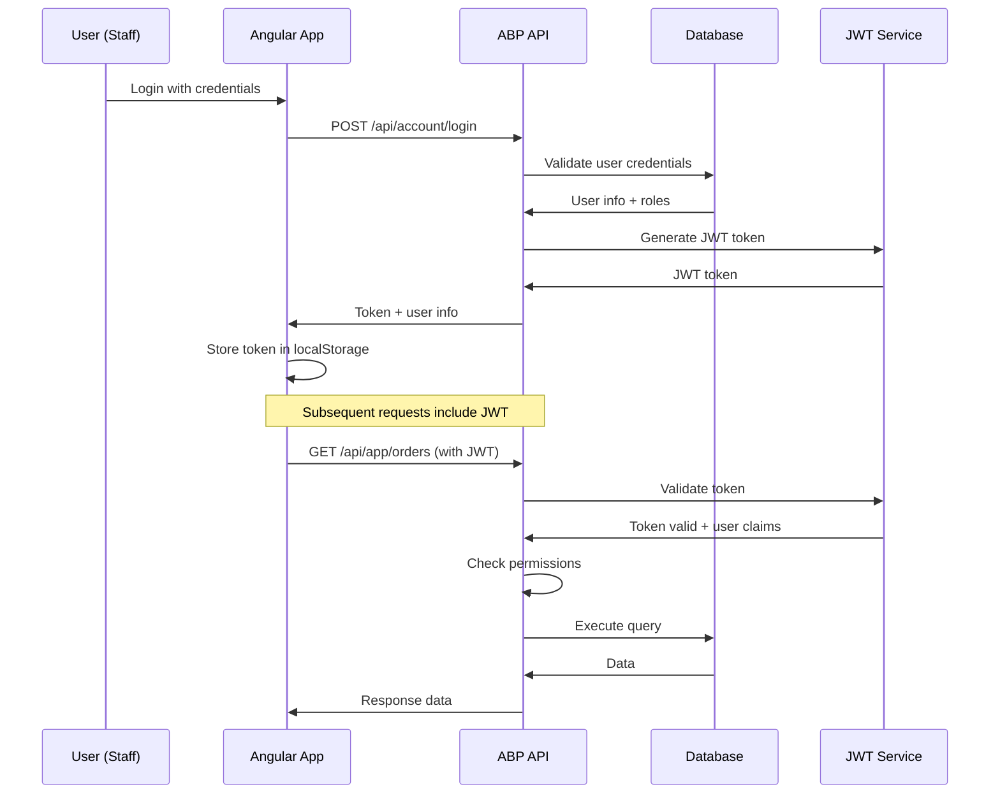

# Backend Architecture

## Service Architecture (Kiến trúc Dịch vụ)

### Traditional Server Architecture (ABP Framework) (Kiến trúc Server Truyền thống)

#### ABP Auto API Controllers (ABP Auto API Controllers)

**No Manual Controllers Required (Không cần Controller thủ công)**: ABP Framework automatically generates Web API controllers from Application Services. You only need to create Application Services (ABP Framework tự động tạo Web API controllers từ Application Services. Bạn chỉ cần tạo Application Services).

```
src/SmartRestaurant.Application/
├── Orders/
│   ├── OrderAppService.cs           # Auto-generates /api/app/order endpoints
│   └── IOrderAppService.cs          # Interface (in Contracts layer)
├── Menu/
│   ├── MenuAppService.cs            # Auto-generates /api/app/menu endpoints
│   └── MenuItemAppService.cs        # Auto-generates /api/app/menu-item endpoints
├── Tables/
│   ├── TableAppService.cs           # Auto-generates /api/app/table endpoints
│   └── ReservationAppService.cs     # Auto-generates /api/app/reservation endpoints
├── Payments/
│   └── PaymentAppService.cs         # Auto-generates /api/app/payment endpoints
└── SmartRestaurantApplicationModule.cs # Module configuration

src/SmartRestaurant.HttpApi/
├── Hubs/                           # Only manual components needed
│   ├── KitchenHub.cs               # Kitchen real-time updates
│   └── TableManagementHub.cs       # Table status updates
└── SmartRestaurantHttpApiModule.cs # Module configuration for auto API
```

#### Application Service Template (Mẫu Application Service)

**ABP automatically converts Application Services to REST API controllers (ABP tự động chuyển đổi Application Services thành REST API controllers)**:

```csharp
// src/SmartRestaurant.Application/Orders/OrderAppService.cs
using Volo.Abp.Application.Services;
using Volo.Abp.Application.Dtos;
using Volo.Abp.Authorization;

namespace SmartRestaurant.Orders
{
    [Authorize] // ABP tự động áp dụng authorization cho tất cả API endpoints
    public class OrderAppService : ApplicationService, IOrderAppService
    {
        private readonly IOrderRepository _orderRepository;
        private readonly IOrderDomainService _orderDomainService;

        public OrderAppService(
            IOrderRepository orderRepository,
            IOrderDomainService orderDomainService)
        {
            _orderRepository = orderRepository;
            _orderDomainService = orderDomainService;
        }

        /// <summary>ABP tự động tạo: GET /api/app/order</summary>
        public async Task<PagedResultDto<OrderDto>> GetListAsync(GetOrdersInput input)
        {
            var query = await _orderRepository.GetQueryableAsync();
            
            // Filter by status (Lọc theo trạng thái)
            if (input.Status.HasValue)
            {
                query = query.Where(o => o.Status == input.Status.Value);
            }
            
            // Filter by table (Lọc theo bàn)
            if (input.TableId.HasValue)
            {
                query = query.Where(o => o.TableId == input.TableId.Value);
            }

            var totalCount = await AsyncExecuter.CountAsync(query);
            var orders = await AsyncExecuter.ToListAsync(query.PageBy(input));

            return new PagedResultDto<OrderDto>
            {
                TotalCount = totalCount,
                Items = ObjectMapper.Map<List<Order>, List<OrderDto>>(orders)
            };
        }

        /// <summary>ABP tự động tạo: POST /api/app/order</summary>
        [Authorize(SmartRestaurantPermissions.Orders.Create)]
        public async Task<OrderDto> CreateAsync(CreateOrderDto input)
        {
            // Validate table availability (Kiểm tra bàn có sẵn)
            await _orderDomainService.ValidateTableAvailabilityAsync(input.TableId);
            
            // Create order entity (Tạo entity đơn hàng)
            var order = new Order(
                GuidGenerator.Create(),
                input.TableId,
                input.OrderType,
                input.Notes
            );

            // Add order items (Thêm món vào đơn hàng)
            foreach (var item in input.OrderItems)
            {
                order.AddOrderItem(
                    item.MenuItemId,
                    item.Quantity,
                    item.Price,
                    item.Notes
                );
            }

            await _orderRepository.InsertAsync(order);
            
            // Trigger kitchen notification (Thông báo bếp)
            await _orderDomainService.NotifyKitchenAsync(order.Id);
            
            return ObjectMapper.Map<Order, OrderDto>(order);
        }

        /// <summary>ABP tự động tạo: PUT /api/app/order/{id}/status</summary>
        [Authorize(SmartRestaurantPermissions.Orders.Edit)]
        public async Task UpdateStatusAsync(Guid id, UpdateOrderStatusDto input)
        {
            var order = await _orderRepository.GetAsync(id);
            order.UpdateStatus(input.Status, input.Notes);
            await _orderRepository.UpdateAsync(order);
        }

        /// <summary>ABP tự động tạo: POST /api/app/order/{id}/print-kitchen-bill</summary>
        [Authorize(SmartRestaurantPermissions.Kitchen.PrintBills)]
        public async Task PrintKitchenBillAsync(Guid id)
        {
            await _orderDomainService.PrintKitchenBillAsync(id);
        }

        /// <summary>ABP tự động tạo: POST /api/app/order/{id}/payment</summary>
        [Authorize(SmartRestaurantPermissions.Payments.Process)]
        public async Task<PaymentDto> InitiatePaymentAsync(Guid id, InitiatePaymentDto input)
        {
            var order = await _orderRepository.GetAsync(id);
            var payment = await _orderDomainService.InitiatePaymentAsync(order, input);
            return ObjectMapper.Map<Payment, PaymentDto>(payment);
        }
    }
}
```

**ABP Auto API Configuration (Cấu hình ABP Auto API):**
```csharp
// src/SmartRestaurant.HttpApi.Host/SmartRestaurantHttpApiHostModule.cs
public override void ConfigureServices(ServiceConfigurationContext context)
{
    // ABP tự động tạo controllers từ Application Services
    Configure<AbpAspNetCoreMvcOptions>(options =>
    {
        options.ConventionalControllers.Create(typeof(SmartRestaurantApplicationModule).Assembly);
    });
}
```

## Database Architecture (Kiến trúc Cơ sở dữ liệu)

### Schema Design (Thiết kế Lược đồ)

```sql
-- ABP Framework base tables already included in schema above
-- Additional ABP-specific considerations:

-- ABP Audit Logging for restaurant operations
CREATE INDEX idx_auditlogs_restaurant ON AbpAuditLogs(EntityId) 
WHERE EntityTypeFullName LIKE '%Order%' OR EntityTypeFullName LIKE '%Payment%';

-- ABP Permission system for restaurant roles
-- Permissions will be defined in code as:
-- SmartRestaurant.Orders (view orders)
-- SmartRestaurant.Orders.Create (create orders)  
-- SmartRestaurant.Orders.Update (modify orders)
-- SmartRestaurant.Menu.Manage (manage menu)
-- SmartRestaurant.Tables.Manage (manage tables)
-- SmartRestaurant.Payments.Process (process payments)
-- SmartRestaurant.Kitchen.View (kitchen display access)
-- SmartRestaurant.Reports.View (view reports)

-- ABP Settings for restaurant configuration
INSERT INTO AbpSettings (Id, Name, Value, ProviderName, ProviderKey) VALUES
(NEWID(), 'SmartRestaurant.RestaurantName', 'Nhà Hàng Thông Minh', 'Global', NULL),
(NEWID(), 'SmartRestaurant.Currency', 'VND', 'Global', NULL),
(NEWID(), 'SmartRestaurant.Timezone', 'Asia/Ho_Chi_Minh', 'Global', NULL),
(NEWID(), 'SmartRestaurant.PeakHours.Lunch', '11:30-13:30', 'Global', NULL),
(NEWID(), 'SmartRestaurant.PeakHours.Dinner', '18:00-21:00', 'Global', NULL);
```

### Data Access Layer (Lớp Truy cập Dữ liệu)

```csharp
// Repository Pattern with ABP Framework
using Volo.Abp.Domain.Repositories.EntityFrameworkCore;
using Volo.Abp.EntityFrameworkCore;
using Microsoft.EntityFrameworkCore;

namespace SmartRestaurant.Orders
{
    public class OrderRepository : EfCoreRepository<SmartRestaurantDbContext, Order, Guid>, IOrderRepository
    {
        public OrderRepository(IDbContextProvider<SmartRestaurantDbContext> dbContextProvider) 
            : base(dbContextProvider)
        {
        }

        // Vietnamese-specific queries
        public async Task<List<Order>> GetOrdersByTableAsync(Guid tableId)
        {
            var dbContext = await GetDbContextAsync();
            return await dbContext.Orders
                .Include(o => o.OrderItems)
                    .ThenInclude(oi => oi.MenuItem)
                .Where(o => o.TableId == tableId && o.Status != OrderStatus.Paid)
                .OrderBy(o => o.CreatedAt)
                .ToListAsync();
        }

        public async Task<List<Order>> GetKitchenOrdersAsync()
        {
            var dbContext = await GetDbContextAsync();
            return await dbContext.Orders
                .Include(o => o.OrderItems)
                    .ThenInclude(oi => oi.MenuItem)
                .Where(o => o.Status == OrderStatus.Confirmed || o.Status == OrderStatus.Preparing)
                .OrderBy(o => o.CreatedAt) // FIFO for kitchen
                .ToListAsync();
        }

        public async Task<List<Order>> GetTakeawayOrdersAsync()
        {
            var dbContext = await GetDbContextAsync();
            return await dbContext.Orders
                .Include(o => o.OrderItems)
                .Where(o => o.OrderType == OrderType.Takeaway && 
                           o.Status != OrderStatus.Paid)
                .OrderBy(o => o.CreatedAt)
                .ToListAsync();
        }

        // Vietnamese text search for orders by customer info
        public async Task<List<Order>> SearchOrdersAsync(string searchTerm)
        {
            var dbContext = await GetDbContextAsync();
            return await dbContext.Orders
                .FromSqlRaw(@"
                    SELECT o.* FROM Orders o 
                    WHERE to_tsvector('vietnamese', unaccent(COALESCE(o.Notes, ''))) 
                    @@ plainto_tsquery('vietnamese', unaccent({0}))", searchTerm)
                .Include(o => o.OrderItems)
                .ToListAsync();
        }
    }

    // Menu Repository with Vietnamese search
    public class MenuItemRepository : EfCoreRepository<SmartRestaurantDbContext, MenuItem, Guid>, IMenuItemRepository
    {
        public MenuItemRepository(IDbContextProvider<SmartRestaurantDbContext> dbContextProvider) 
            : base(dbContextProvider)
        {
        }

        public async Task<List<MenuItem>> SearchMenuItemsAsync(string searchTerm)
        {
            var dbContext = await GetDbContextAsync();
            return await dbContext.MenuItems
                .FromSqlRaw(@"
                    SELECT m.* FROM MenuItems m 
                    WHERE m.IsAvailable = true 
                    AND m.SearchVector @@ plainto_tsquery('vietnamese', unaccent({0}))
                    ORDER BY ts_rank(m.SearchVector, plainto_tsquery('vietnamese', unaccent({0}))) DESC", 
                    searchTerm)
                .Include(m => m.Category)
                .ToListAsync();
        }

        public async Task<List<MenuItem>> GetAvailableMenuItemsAsync(Guid? categoryId = null)
        {
            var dbContext = await GetDbContextAsync();
            var query = dbContext.MenuItems
                .Include(m => m.Category)
                .Where(m => m.IsAvailable && m.Category.IsEnabled);

            if (categoryId.HasValue)
            {
                query = query.Where(m => m.CategoryId == categoryId.Value);
            }

            return await query
                .OrderBy(m => m.Category.DisplayOrder)
                .ThenBy(m => m.Name)
                .ToListAsync();
        }
    }
}
```

## Authentication and Authorization (Xác thực và Phân quyền)

### Auth Flow (Luồng Xác thực)



### Middleware/Guards (Middleware/Bảo vệ)

```csharp
// ABP Authorization Middleware
using Microsoft.AspNetCore.Authorization;
using Volo.Abp.Authorization.Permissions;

namespace SmartRestaurant.Authorization
{
    public static class SmartRestaurantPermissions
    {
        public const string GroupName = "SmartRestaurant";

        public static class Orders
        {
            public const string Default = GroupName + ".Orders";
            public const string Create = Default + ".Create";
            public const string Update = Default + ".Update";
            public const string Delete = Default + ".Delete";
        }

        public static class Menu
        {
            public const string Default = GroupName + ".Menu";
            public const string Manage = Default + ".Manage";
        }

        public static class Kitchen
        {
            public const string Default = GroupName + ".Kitchen";
            public const string View = Default + ".View";
        }

        public static class Payments
        {
            public const string Default = GroupName + ".Payments";
            public const string Process = Default + ".Process";
        }
    }

    public class SmartRestaurantPermissionDefinitionProvider : PermissionDefinitionProvider
    {
        public override void Define(IPermissionDefinitionContext context)
        {
            var smartRestaurantGroup = context.AddGroup(SmartRestaurantPermissions.GroupName, 
                L("Permission:SmartRestaurant"));

            var ordersPermission = smartRestaurantGroup.AddPermission(SmartRestaurantPermissions.Orders.Default, 
                L("Permission:Orders"));
            ordersPermission.AddChild(SmartRestaurantPermissions.Orders.Create, L("Permission:Orders.Create"));
            ordersPermission.AddChild(SmartRestaurantPermissions.Orders.Update, L("Permission:Orders.Update"));

            var menuPermission = smartRestaurantGroup.AddPermission(SmartRestaurantPermissions.Menu.Default, 
                L("Permission:Menu"));
            menuPermission.AddChild(SmartRestaurantPermissions.Menu.Manage, L("Permission:Menu.Manage"));

            smartRestaurantGroup.AddPermission(SmartRestaurantPermissions.Kitchen.View, 
                L("Permission:Kitchen.View"));

            smartRestaurantGroup.AddPermission(SmartRestaurantPermissions.Payments.Process, 
                L("Permission:Payments.Process"));
        }

        private static LocalizableString L(string name)
        {
            return LocalizableString.Create<SmartRestaurantResource>(name);
        }
    }

    // Usage in Application Service
    [Authorize(SmartRestaurantPermissions.Orders.Create)]
    public async Task<OrderDto> CreateAsync(CreateOrderDto input)
    {
        // Implementation
    }
}
```
