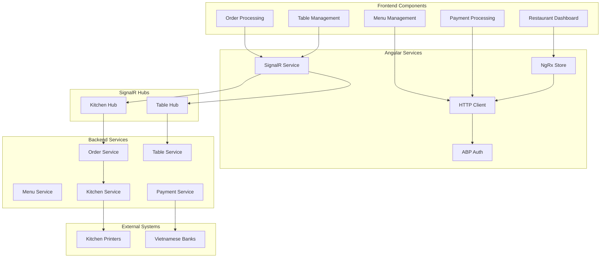

# Components (Các Thành phần)

## Frontend Components (Angular) (Các Thành phần Frontend)

### Restaurant Dashboard Component (Component Bảng điều khiển Nhà hàng)

**Responsibility (Trách nhiệm):** Main orchestration component for restaurant operations with real-time table status and order management (Component điều phối chính cho hoạt động nhà hàng với trạng thái bàn thời gian thực và quản lý đơn hàng)

**Key Interfaces (Giao diện Chính):**
- TableStatusService for real-time table updates (Dịch vụ cập nhật trạng thái bàn thời gian thực)
- OrderService for order lifecycle management (Dịch vụ quản lý vòng đời đơn hàng)
- SignalR connection for kitchen coordination (Kết nối SignalR để phối hợp bếp)

**Dependencies (Phụ thuộc):** NgRx store, SignalR service, ABP permission system

**Technology Stack (Ngăn xếp Công nghệ):** Angular 19, PrimeNG components, RxJS observables, TypeScript

### Menu Management Component (Component Quản lý Menu)

**Responsibility (Trách nhiệm):** Two-level menu management with category and item-level enable/disable functionality (Quản lý menu hai cấp với chức năng bật/tắt cấp danh mục và cấp món)

**Key Interfaces (Giao diện Chính):**
- MenuCategoryService for category operations (Dịch vụ thao tác danh mục)
- MenuItemService for item CRUD operations (Dịch vụ thao tác CRUD món ăn)
- ImageUploadService for menu photos (Dịch vụ tải ảnh menu)

**Dependencies (Phụ thuộc):** ABP authorization, Vietnamese text search, PrimeNG DataTable

**Technology Stack (Ngăn xếp Công nghệ):** Angular Reactive Forms, PrimeNG FileUpload, Vietnamese text validation

### Order Processing Component (Component Xử lý Đơn hàng)

**Responsibility (Trách nhiệm):** Complete order workflow from item selection to kitchen coordination (Quy trình đơn hàng hoàn chỉnh từ chọn món đến phối hợp bếp)

**Key Interfaces (Giao diện Chính):**
- TableSelectionService for table assignment (Dịch vụ chọn bàn)
- MenuBrowsingService for item selection (Dịch vụ duyệt menu)
- KitchenPrintService for bill printing (Dịch vụ in hóa đơn bếp)

**Dependencies (Phụ thuộc):** SignalR real-time updates, Payment processing service

**Technology Stack (Ngăn xếp Công nghệ):** Angular routing, PrimeNG components, SignalR client

### Payment Processing Component (Component Xử lý Thanh toán)  

**Responsibility (Trách nhiệm):** Vietnamese payment methods with staff confirmation workflow (Phương thức thanh toán Việt Nam với quy trình xác nhận nhân viên)

**Key Interfaces (Giao diện Chính):**
- PaymentService for payment processing (Dịch vụ xử lý thanh toán)
- QRCodeService for bank transfer codes (Dịch vụ mã QR chuyển khoản)
- ReceiptService for invoice generation (Dịch vụ tạo hóa đơn)

**Dependencies (Phụ thuộc):** Vietnamese banking QR standards, Printer service

**Technology Stack (Ngăn xếp Công nghệ):** QR code generation, Vietnamese number formatting

## Backend Services (.NET ABP) (Các Dịch vụ Backend)

### Order Management Service (Dịch vụ Quản lý Đơn hàng)

**Responsibility (Trách nhiệm):** Core business logic for order lifecycle management with real-time updates (Logic nghiệp vụ cốt lõi cho quản lý vòng đời đơn hàng với cập nhật thời gian thực)

**Key Interfaces (Giao diện Chính):**
- IOrderAppService for CRUD operations (Thao tác CRUD)
- IOrderDomainService for business rules (Quy tắc nghiệp vụ)
- IKitchenNotificationService for real-time updates (Thông báo bếp thời gian thực)

**Dependencies (Phụ thuộc):** Entity Framework Core, SignalR hub context, Domain events

**Technology Stack (Ngăn xếp Công nghệ):** ABP Application Services, AutoMapper, Domain-Driven Design patterns

### Menu Management Service (Dịch vụ Quản lý Menu)

**Responsibility (Trách nhiệm):** Two-level menu hierarchy with seasonal availability control (Hệ thống phân cấp menu hai tầng với kiểm soát tính khả dụng theo mùa)

**Key Interfaces (Giao diện Chính):**
- IMenuCategoryAppService for category management (Quản lý danh mục)
- IMenuItemAppService for item operations (Thao tác món ăn)
- IMenuAvailabilityService for real-time availability (Tính khả dụng thời gian thực)

**Dependencies (Phụ thuộc):** PostgreSQL full-text search, File storage service, Caching service

**Technology Stack (Ngăn xếp Công nghệ):** ABP Framework, Entity Framework Core, PostgreSQL Vietnamese text search

### Table Management Service (Dịch vụ Quản lý Bàn)

**Responsibility (Trách nhiệm):** Real-time table status management with reservation integration (Quản lý trạng thái bàn thời gian thực với tích hợp đặt bàn)

**Key Interfaces (Giao diện Chính):**
- ITableAppService for table operations (Thao tác bàn ăn)
- IReservationService for booking management (Quản lý đặt bàn)
- ITableStatusService for real-time updates (Cập nhật trạng thái thời gian thực)

**Dependencies (Phụ thuộc):** SignalR for status broadcasts, Domain events for state changes

**Technology Stack (Ngăn xếp Công nghệ):** ABP Domain Services, SignalR hub management, State machine pattern

### Payment Processing Service (Dịch vụ Xử lý Thanh toán)

**Responsibility (Trách nhiệm):** Vietnamese payment workflow with manual staff confirmation (Quy trình thanh toán Việt Nam với xác nhận thủ công của nhân viên)

**Key Interfaces (Giao diện Chính):**
- IPaymentAppService for payment operations (Thao tác thanh toán)
- IQRPaymentService for bank transfer integration (Tích hợp chuyển khoản QR)
- IReceiptService for invoice generation (Tạo hóa đơn)

**Dependencies (Phụ thuộc):** Vietnamese banking APIs, Printer integration, ABP audit logging

**Technology Stack (Ngăn xếp Công nghệ):** ABP Framework, Integration services, Vietnamese formatting libraries

## Component Diagrams (Sơ đồ Thành phần)

