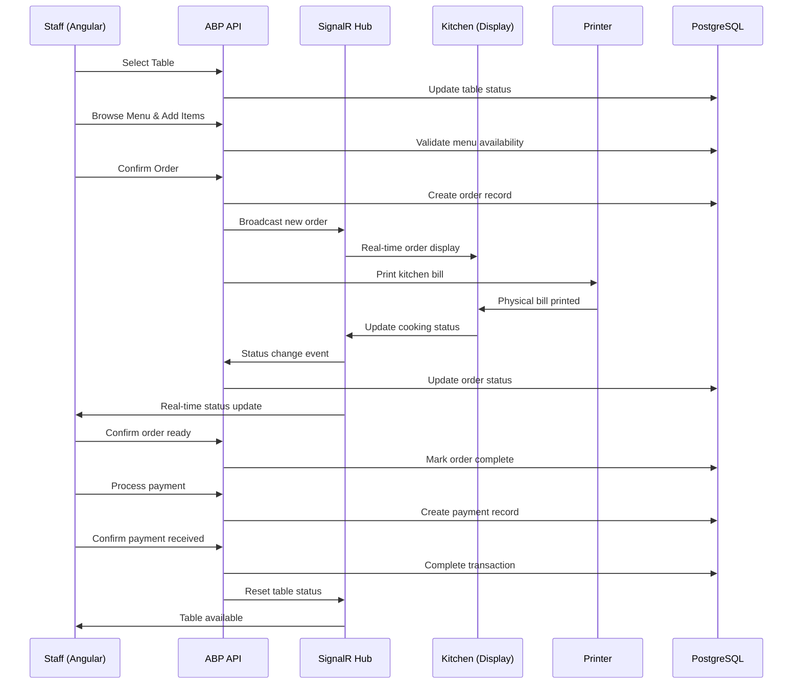
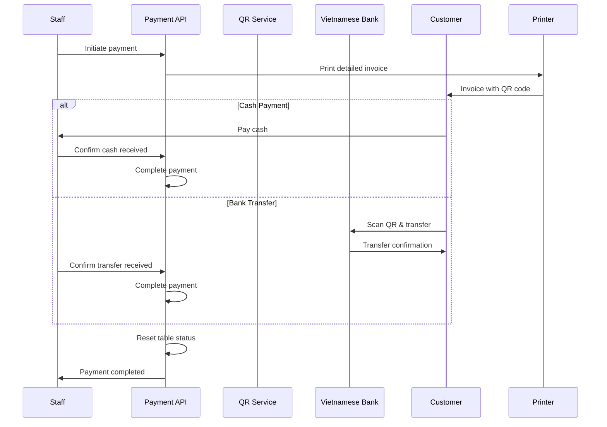
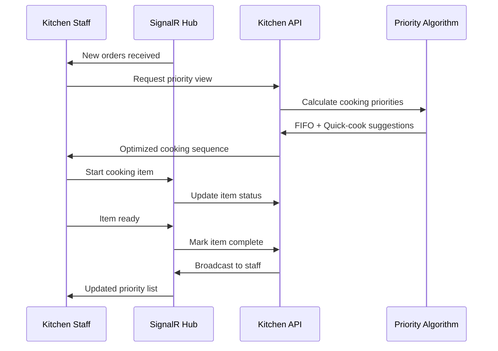

# Core Workflows

## Order Processing Workflow (Quy trình Xử lý Đơn hàng)

## Vietnamese Payment Workflow (Quy trình Thanh toán Việt Nam)

## Kitchen Priority Management Workflow (Quy trình Quản lý Ưu tiên Bếp)

