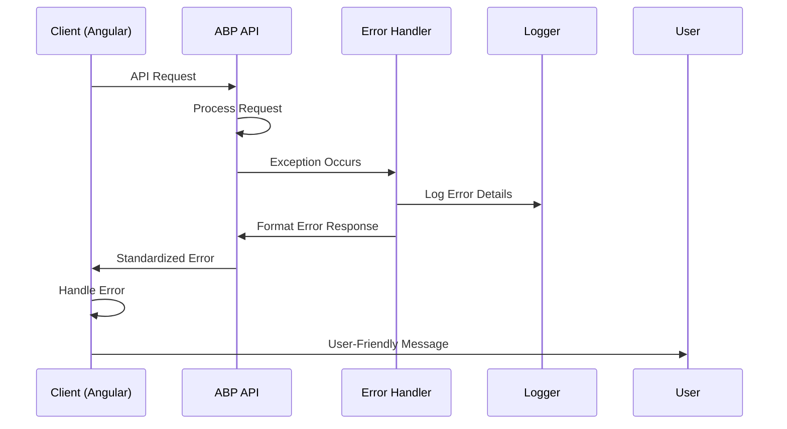

# Error Handling Strategy

## Error Flow (Luồng Lỗi)



## Error Response Format (Định dạng Phản hồi Lỗi)

```typescript
interface ApiError {
  error: {
    code: string;
    message: string;
    details?: Record<string, any>;
    timestamp: string;
    requestId: string;
    validationErrors?: ValidationError[];
  };
}

interface ValidationError {
  message: string;
  members: string[];
}

// Vietnamese error messages
const VietnameseErrorMessages = {
  'OrderNotFound': 'Không tìm thấy đơn hàng',
  'TableNotAvailable': 'Bàn không khả dụng',
  'MenuItemNotAvailable': 'Món ăn hiện không có sẵn',
  'PaymentFailed': 'Thanh toán thất bại',
  'InvalidQuantity': 'Số lượng không hợp lệ'
};
```

## Frontend Error Handling (Xử lý Lỗi Frontend)

```typescript
// Global Error Handler
import { Injectable } from '@angular/core';
import { HttpErrorResponse } from '@angular/common/http';
import { MessageService } from 'primeng/api';
import { Store } from '@ngrx/store';

@Injectable()
export class GlobalErrorHandler {
  constructor(
    private messageService: MessageService,
    private store: Store
  ) {}

  handleError(error: HttpErrorResponse): void {
    const apiError = error.error as ApiError;
    
    // Log error for debugging
    console.error('API Error:', apiError);
    
    // Display user-friendly Vietnamese message
    const message = this.getVietnameseMessage(apiError.error.code) || 
                   apiError.error.message || 
                   'Đã xảy ra lỗi. Vui lòng thử lại.';

    this.messageService.add({
      severity: 'error',
      summary: 'Lỗi',
      detail: message,
      life: 5000
    });

    // Handle specific error types
    switch (apiError.error.code) {
      case 'Unauthorized':
        this.store.dispatch(AuthActions.logout());
        break;
      case 'TableNotAvailable':
        this.store.dispatch(TableActions.refreshTableStatus());
        break;
      case 'MenuItemNotAvailable':
        this.store.dispatch(MenuActions.refreshMenuItems());
        break;
    }
  }

  private getVietnameseMessage(code: string): string {
    const messages = {
      'OrderNotFound': 'Không tìm thấy đơn hàng',
      'TableNotAvailable': 'Bàn không khả dụng',
      'MenuItemNotAvailable': 'Món ăn hiện không có sẵn',
      'PaymentFailed': 'Thanh toán thất bại',
      'InvalidQuantity': 'Số lượng không hợp lệ',
      'NetworkError': 'Lỗi kết nối mạng'
    };
    return messages[code];
  }
}

// HTTP Interceptor for automatic error handling
@Injectable()
export class ErrorInterceptor implements HttpInterceptor {
  constructor(private errorHandler: GlobalErrorHandler) {}

  intercept(req: HttpRequest<any>, next: HttpHandler): Observable<HttpEvent<any>> {
    return next.handle(req).pipe(
      catchError((error: HttpErrorResponse) => {
        this.errorHandler.handleError(error);
        return throwError(() => error);
      })
    );
  }
}
```

## Backend Error Handling (Xử lý Lỗi Backend)

```csharp
// Custom Business Exception for Restaurant Operations
using Volo.Abp;

namespace SmartRestaurant.Exceptions
{
    public class RestaurantBusinessException : BusinessException
    {
        public RestaurantBusinessException(string code, string message) 
            : base(code, message)
        {
        }

        public static RestaurantBusinessException TableNotAvailable(string tableNumber)
        {
            return new RestaurantBusinessException(
                "SmartRestaurant:TableNotAvailable",
                $"Table {tableNumber} is not available for ordering."
            );
        }

        public static RestaurantBusinessException MenuItemNotAvailable(string itemName)
        {
            return new RestaurantBusinessException(
                "SmartRestaurant:MenuItemNotAvailable", 
                $"Menu item '{itemName}' is currently not available."
            );
        }

        public static RestaurantBusinessException PaymentAlreadyProcessed(string orderNumber)
        {
            return new RestaurantBusinessException(
                "SmartRestaurant:PaymentAlreadyProcessed",
                $"Payment for order {orderNumber} has already been processed."
            );
        }
    }
}

// Global Exception Filter
using Microsoft.AspNetCore.Mvc.Filters;
using Volo.Abp.AspNetCore.Mvc.ExceptionHandling;

namespace SmartRestaurant.Web
{
    public class RestaurantExceptionFilter : IExceptionFilter
    {
        private readonly ILogger<RestaurantExceptionFilter> _logger;
        private readonly IStringLocalizer _localizer;

        public RestaurantExceptionFilter(
            ILogger<RestaurantExceptionFilter> logger,
            IStringLocalizer<RestaurantResource> localizer)
        {
            _logger = logger;
            _localizer = localizer;
        }

        public void OnException(ExceptionContext context)
        {
            var exception = context.Exception;
            
            // Log exception with restaurant context
            _logger.LogError(exception, 
                "Restaurant operation failed: {ExceptionType} - {Message}", 
                exception.GetType().Name, 
                exception.Message);

            // Handle specific restaurant business exceptions
            if (exception is RestaurantBusinessException businessException)
            {
                context.Result = new ObjectResult(new
                {
                    error = new
                    {
                        code = businessException.Code,
                        message = _localizer[businessException.Code, businessException.Details],
                        timestamp = DateTime.UtcNow,
                        requestId = Activity.Current?.Id ?? Guid.NewGuid().ToString()
                    }
                })
                {
                    StatusCode = 400
                };
                
                context.ExceptionHandled = true;
            }
        }
    }
}

// Domain Service with Error Handling
public class OrderDomainService : DomainService, IOrderDomainService
{
    public async Task ValidateTableAvailabilityAsync(Guid tableId)
    {
        var table = await _tableRepository.GetAsync(tableId);
        
        if (table.Status != TableStatus.Available)
        {
            throw RestaurantBusinessException.TableNotAvailable(table.TableNumber);
        }
    }

    public async Task ValidateMenuItemAvailabilityAsync(List<CreateOrderItemDto> orderItems)
    {
        foreach (var item in orderItems)
        {
            var menuItem = await _menuItemRepository.GetAsync(item.MenuItemId);
            
            if (!menuItem.IsAvailable || !menuItem.Category.IsEnabled)
            {
                throw RestaurantBusinessException.MenuItemNotAvailable(menuItem.Name);
            }
        }
    }
}
```
