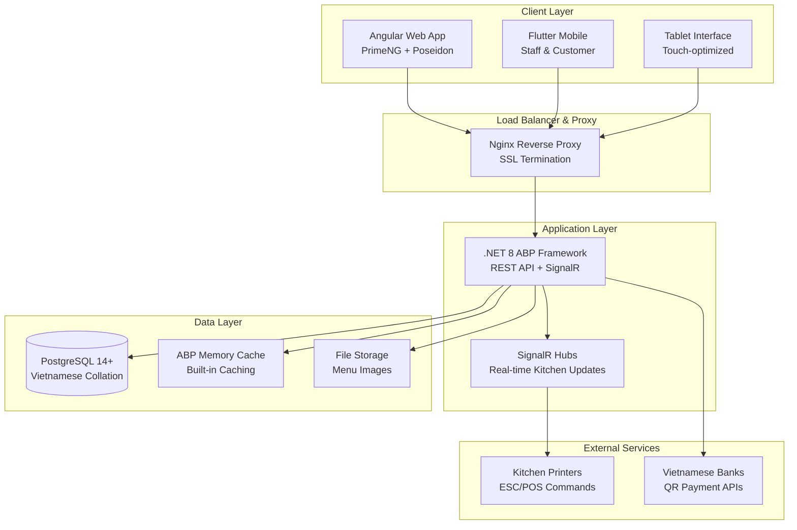

# High Level Architecture (Kiến trúc Tổng quan)

## Technical Summary (Tóm tắt Kỹ thuật)

Smart Restaurant Management System uses **ABP Framework Modular Monolith** architecture with .NET 8 backend and Angular 19 frontend, deployed via Docker containers on VPS. The architecture focuses on real-time performance for restaurant operations with SignalR WebSocket connections, PostgreSQL with Vietnamese collation for menu search, and ABP built-in memory caching for improved performance. Frontend uses PrimeNG with Poseidon theme for tablet-friendly interface, while Flutter mobile app supports staff and customer workflows. The entire system is designed for Vietnamese payment methods and restaurant-specific workflows like two-level menu management and seasonal category control (Hệ thống Quản lý Nhà hàng Thông minh sử dụng kiến trúc ABP Framework Modular Monolith với backend .NET 8 và frontend Angular 19, được triển khai qua containers Docker trên VPS. Kiến trúc tập trung vào hiệu suất thời gian thực cho hoạt động nhà hàng với kết nối SignalR WebSocket, PostgreSQL với collation tiếng Việt để tìm kiếm menu, và ABP memory caching built-in để cải thiện hiệu suất. Frontend sử dụng PrimeNG với theme Poseidon cho giao diện thân thiện với tablet, trong khi ứng dụng di động Flutter hỗ trợ quy trình làm việc của nhân viên và khách hàng).

## Platform and Infrastructure Choice (Lựa chọn Nền tảng và Hạ tầng)

**Platform:** VPS (Ubuntu 22.04 LTS) with Docker containerization (VPS (Ubuntu 22.04 LTS) với đóng gói Docker)
**Key Services:** Nginx reverse proxy, PostgreSQL 14+, .NET 8 Runtime với ABP Memory Cache, Angular static hosting (Các dịch vụ chính: Nginx reverse proxy, PostgreSQL 14+, .NET 8 Runtime với ABP Memory Cache, Angular static hosting)
**Deployment Host and Regions:** Single VPS deployment (Asia/Ho_Chi_Minh timezone) with horizontal scaling capability (Máy chủ và Khu vực triển khai: Triển khai VPS đơn lẻ với khả năng mở rộng ngang)

**Rationale (Lý do lựa chọn):**
- **Cost-effective**: VPS suitable for small restaurant budget ($20-50/month) (Hiệu quả chi phí: VPS phù hợp với ngân sách nhà hàng nhỏ)
- **Performance**: Local deployment reduces latency for real-time kitchen orders (Hiệu suất: Triển khai cục bộ giảm độ trễ cho đơn hàng bếp thời gian thực)
- **Control**: Full control over Vietnamese-specific configurations (Kiểm soát: Toàn quyền kiểm soát cấu hình đặc thù Việt Nam)
- **Scalability**: Can expand to multi-restaurant chain later (Khả năng mở rộng: Có thể mở rộng thành chuỗi nhiều nhà hàng sau này)

## Repository Structure (Cấu trúc Repository)

**Structure**: ABP CLI Generated Monorepo (Monorepo được tạo bởi ABP CLI)
**ABP Framework**: Standard Clean Architecture with Domain-Driven Design layers (Clean Architecture chuẩn với các lớp Domain-Driven Design)
**Package Organization**: Layer-based separation following ABP best practices (Tổ chức gói: Phân tách theo lớp tuân theo best practice ABP)

**Actual ABP CLI Generated Structure (Cấu trúc thực tế được tạo bởi ABP CLI):**
```
smart-restaurant/
├── aspnet-core/                    # ABP Framework backend projects (Dự án backend ABP Framework)
│   ├── SmartRestaurant.sln              # Visual Studio solution file (File solution Visual Studio)
│   ├── SmartRestaurant.sln.DotSettings  # ReSharper settings (Cài đặt ReSharper)
│   ├── common.props                     # Common MSBuild properties (Thuộc tính MSBuild chung)
│   ├── NuGet.Config                     # NuGet package sources (Nguồn package NuGet)
│   ├── src/                             # Source code projects (Dự án mã nguồn)
│   │   ├── SmartRestaurant.Domain.Shared/           # Shared constants, enums, localization
│   │   ├── SmartRestaurant.Domain/                 # Domain entities, services, events
│   │   ├── SmartRestaurant.Application.Contracts/  # DTOs, interfaces, permissions
│   │   ├── SmartRestaurant.Application/            # Application services, business logic
│   │   ├── SmartRestaurant.EntityFrameworkCore/    # Data access, DbContext, repositories
│   │   ├── SmartRestaurant.HttpApi/                # Web API controllers
│   │   ├── SmartRestaurant.HttpApi.Host/           # Web host, configuration, startup
│   │   ├── SmartRestaurant.HttpApi.Client/         # HTTP client proxies
│   │   └── SmartRestaurant.DbMigrator/             # Database migration console app
│   └── test/                            # Test projects (Dự án kiểm thử)
│       ├── SmartRestaurant.TestBase/              # Test infrastructure
│       ├── SmartRestaurant.Domain.Tests/          # Domain unit tests
│       ├── SmartRestaurant.Application.Tests/     # Application service tests
│       ├── SmartRestaurant.EntityFrameworkCore.Tests/ # Data access tests
│       └── SmartRestaurant.HttpApi.Client.ConsoleTestApp/ # API client tests
├── angular/                         # Angular frontend (ABP Angular template)
│   ├── src/app/                    # Angular application with ABP integration
│   ├── package.json                # Dependencies with @abp/ng.* packages
│   ├── angular.json                # Angular workspace configuration
│   ├── tsconfig.json               # TypeScript configuration
│   └── karma.conf.js               # Test runner configuration
├── infrastructure/                 # Docker & deployment configs (Cấu hình Docker & triển khai)
│   └── docker/                     # Docker containerization
│       ├── docker-compose.dev.yml  # Development environment
│       ├── docker-compose.prod.yml # Production environment
│       ├── Dockerfile.api          # Backend container
│       ├── Dockerfile.web          # Frontend container
│       ├── nginx.conf              # Nginx reverse proxy config
│       └── init-scripts/           # Database initialization scripts
├── docs/                           # Architecture documentation (Tài liệu kiến trúc)
│   ├── architecture.md             # Complete architecture document
│   ├── architecture/               # Detailed architecture components
│   ├── prd.md                      # Product requirements
│   └── stories/                    # Development stories
├── .github/                        # CI/CD workflows (Quy trình CI/CD)
│   └── workflows/                  # GitHub Actions
│       ├── ci.yaml                 # Continuous integration
│       └── deploy.yaml             # Deployment pipeline
├── package.json                    # Root workspace scripts (Script workspace gốc)
├── CLAUDE.md                       # Development guide (Hướng dẫn phát triển)
├── README.md                       # Project overview (Tổng quan dự án)
└── .env.example                    # Environment template (Template môi trường)
```

## High Level Architecture Diagram (Sơ đồ Kiến trúc Tổng quan)



## Architectural Patterns (Các Mẫu Kiến trúc)

- **Modular Monolith (ABP Framework):** Domain-driven modules với clear boundaries - _Rationale:_ Easier deployment và maintenance cho restaurant operations, có thể extract thành microservices sau này
- **Event-Driven Architecture:** Domain events cho order status changes - _Rationale:_ Real-time updates cho kitchen staff và table management
- **Repository Pattern:** Abstract data access với Entity Framework Core - _Rationale:_ Testability và future database migration flexibility
- **CQRS Pattern:** Command Query Responsibility Segregation cho complex operations - _Rationale:_ Optimized reads cho reporting và analytics
- **API Gateway Pattern:** Nginx reverse proxy với centralized routing - _Rationale:_ Security, rate limiting, và SSL termination
- **Component-Based UI (Angular):** Reusable components với TypeScript - _Rationale:_ Maintainability cho large restaurant management interface
- **Progressive Web App (PWA):** Offline capability cho critical operations - _Rationale:_ Ensure restaurant operations continue during network issues
