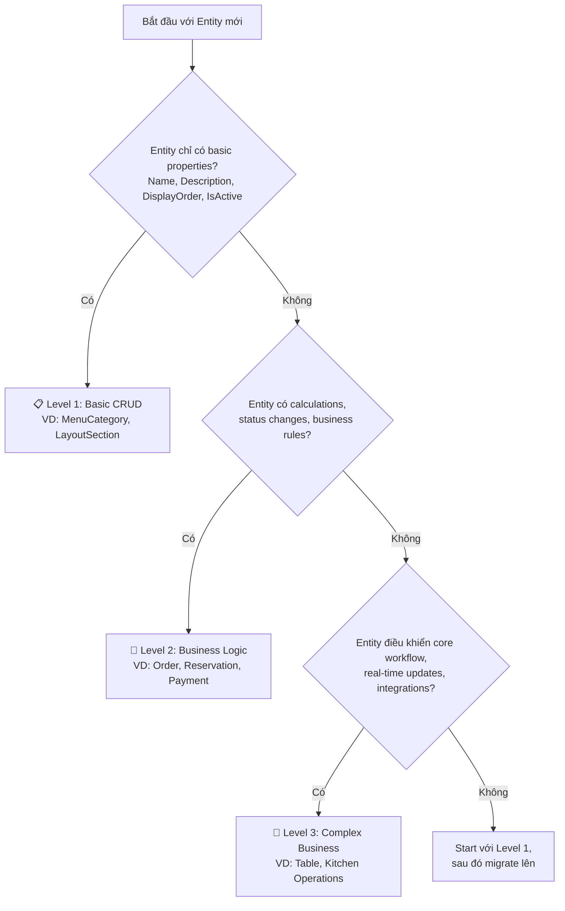
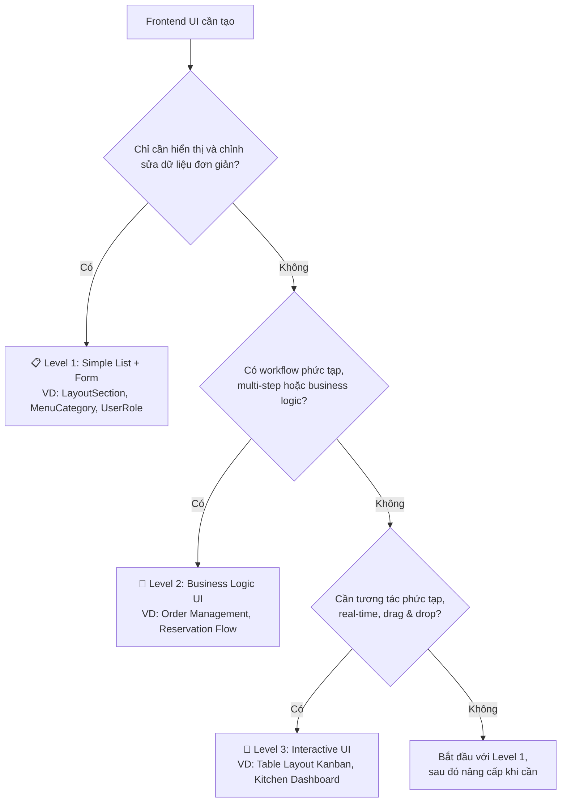

# SmartRestaurant Code Templates

## Tổng quan

Đây là bộ template hoàn chỉnh cho dự án SmartRestaurant, giúp standardize và tăng tốc độ phát triển các features mới. Template bao gồm:

- **Backend Template**: Domain entities, Application services, API endpoints
- **Frontend Template**: Angular components, services, forms  
- **Mobile Template**: Flutter screens, widgets, models
- **Testing Template**: Unit tests, Integration tests cho tất cả layers

## Cấu trúc Template

```
templates/
├── backend-template.md      # .NET ABP Framework backend
├── frontend-template.md     # Angular 19 frontend  
├── mobile-template.md       # Flutter mobile app
├── testing-template.md      # Testing cho tất cả layers
└── README.md               # Hướng dẫn sử dụng (file này)
```

## Template Selection Decision Tree

### 🤔 Chọn Template Level nào?



### 📊 Backend Template Comparison

| Feature | Level 1 | Level 2 | Level 3 |
|---------|---------|---------|---------|
| **Basic CRUD** | ✅ | ✅ | ✅ |
| **Business Methods** | ❌ | ✅ | ✅ |
| **State Management** | ❌ | ✅ | ✅ |
| **Domain Events** | ❌ | ✅ | ✅ |
| **Domain Services** | ❌ | ❌ | ✅ |
| **Real-time Updates** | ❌ | ❌ | ✅ |
| **Background Jobs** | ❌ | ❌ | ✅ |
| **Caching** | ❌ | ❌ | ✅ |
| **Analytics/Reporting** | ❌ | ❌ | ✅ |

### 🎨 Frontend Template Comparison

| Tính năng | Level 1 | Level 2 | Level 3 |
|-----------|---------|---------|---------|
| **Basic CRUD UI** | ✅ | ✅ | ✅ |
| **Form validation** | ✅ | ✅ | ✅ |
| **Angular Signals** | ❌ | ✅ | ✅ |
| **Multi-step workflow** | ❌ | ✅ | ✅ |
| **Business logic** | ❌ | ✅ | ✅ |
| **Status management** | ❌ | ✅ | ✅ |
| **Progress indicators** | ❌ | ✅ | ✅ |
| **Drag & Drop** | ❌ | ❌ | ✅ |
| **Real-time updates** | ❌ | ❌ | ✅ |
| **Advanced interactions** | ❌ | ❌ | ✅ |
| **Context menus** | ❌ | ❌ | ✅ |
| **Auto-refresh** | ❌ | ❌ | ✅ |
| **Animations** | ❌ | ❌ | ✅ |

### 🎯 Examples by Template Level

#### Backend Templates

**Level 1 - Basic CRUD (Master Data):**
- ✅ MenuCategory, LayoutSection, UserRole, Settings, Tags
- ✅ Simple lookup tables
- ✅ Configuration entities

**Level 2 - Business Logic (Transactional Data):**
- ✅ Order, Reservation, Payment, Inventory
- ✅ Customer feedback, Reviews
- ✅ Entities with calculations or status workflows

**Level 3 - Complex Business (Core Workflow):**
- ✅ Table (với real-time status), MenuItem (với pricing rules)
- ✅ Kitchen Operations, Staff Management
- ✅ Entities requiring external integrations

#### Frontend Templates

**Level 1 - Simple List + Form UI:**
- ✅ LayoutSection List/Form, MenuCategory Management
- ✅ User Role Management, Settings Configuration
- ✅ Basic lookup data entry screens

**Level 2 - Business Logic UI:**
- ✅ Order Management Workflow, Reservation Booking
- ✅ Multi-step forms với validation
- ✅ Status tracking và progress indicators

**Level 3 - Interactive UI:**
- ✅ Table Layout Kanban (Drag & Drop), Kitchen Dashboard
- ✅ Real-time monitoring screens
- ✅ Complex dashboard với advanced interactions

### 🔄 Frontend Decision Tree



## Cách sử dụng Template

### Bước 1: Chọn Template Level

Sử dụng decision tree ở trên để chọn level phù hợp. **Lưu ý**: Luôn bắt đầu với Level 1 nếu không chắc chắn, sau đó migrate lên khi cần.

### Bước 2: Chuẩn bị thông tin

Trước khi sử dụng template, hãy chuẩn bị các thông tin sau:

```
EntityName: PascalCase (VD: LayoutSection, Table, MenuItem)
entityName: camelCase (VD: layoutSection, table, menuItem) 
entity-name: kebab-case (VD: layout-section, table, menu-item)
entity_name: snake_case (VD: layout_section, table, menu_item)
PropertyName: PascalCase property chính (VD: SectionName, TableNumber)
propertyName: camelCase property chính (VD: sectionName, tableNumber)
property-name: kebab-case property chính (VD: section-name, table-number)
Module: Module chứa entity (VD: TableManagement, MenuManagement)
ModuleName: Tên module cho permissions (VD: Tables, Menus)
Entity Display Name: Tên hiển thị tiếng Việt (VD: Khu vực bố cục, Bàn ăn)
entity-display-name: kebab-case display name (VD: khu-vực-bố-cục)
RelatedEntity: Entity liên quan (VD: Table, Order)
RelatedEntities: Collection property (VD: Tables, Orders)
```

### Bước 3: Tạo Backend (ABP Framework)

1. **Tạo Domain Entity**
   ```bash
   # File: aspnet-core/src/SmartRestaurant.Domain/Entities/{Module}/{EntityName}.cs
   ```
   - Copy template từ `backend-template.md` section 1
   - Replace các placeholder bằng thông tin thực tế
   - Thêm validation attributes phù hợp

2. **Tạo Repository Interface & Implementation**
   ```bash
   # Interface: aspnet-core/src/SmartRestaurant.Domain/Repositories/I{EntityName}Repository.cs
   # Implementation: aspnet-core/src/SmartRestaurant.EntityFrameworkCore/Repositories/EfCore{EntityName}Repository.cs
   ```

3. **Tạo Application Contracts**
   ```bash
   # DTOs: aspnet-core/src/SmartRestaurant.Application.Contracts/{Module}/{EntityName}s/Dto/
   # Service Interface: aspnet-core/src/SmartRestaurant.Application.Contracts/{Module}/{EntityName}s/I{EntityName}AppService.cs
   ```

4. **Tạo Application Service**
   ```bash
   # Service: aspnet-core/src/SmartRestaurant.Application/{Module}/{EntityName}s/{EntityName}AppService.cs
   # AutoMapper: aspnet-core/src/SmartRestaurant.Application/{Module}/{EntityName}s/{EntityName}AutoMapperProfile.cs
   ```

5. **Cập nhật DbContext và Permissions**
   - Thêm DbSet vào `SmartRestaurantDbContext.cs`
   - Configure entity trong `OnModelCreating`
   - Thêm permissions vào `SmartRestaurantPermissions.cs`
   - Update `SmartRestaurantPermissionDefinitionProvider.cs`

6. **Tạo Migration**
   ```bash
   cd aspnet-core
   dotnet ef migrations add Add{EntityName} -p src/SmartRestaurant.EntityFrameworkCore
   dotnet run --project src/SmartRestaurant.DbMigrator
   ```

7. **Generate Angular Proxies**
   ```bash
   cd angular
   abp generate-proxy -t ng -u https://localhost:44346
   ```

### Bước 4: Tạo Frontend (Angular) - Template Level Selection

#### Level 1: Simple List + Form UI

1. **Tạo List Component**
   ```bash
   # File: angular/src/app/features/{module}/{entity-name}/{entity-name}-list/{entity-name}-list.component.ts
   ```
   - Copy Level 1 template từ `frontend-template.md`
   - Replace placeholders với entity information
   - Customize table columns và search fields

2. **Tạo Form Component**
   ```bash
   # File: angular/src/app/features/{module}/{entity-name}/{entity-name}-form/{entity-name}-form.component.ts
   ```
   - Copy Level 1 form template
   - Setup reactive forms với validation
   - Configure PrimeNG components

#### Level 2: Business Logic UI

1. **Tạo Workflow Component**
   ```bash
   # File: angular/src/app/features/{module}/{entity-name}/{entity-name}-management/{entity-name}-management.component.ts
   ```
   - Copy Level 2 template (Order Management example)
   - Configure multi-step workflow với Angular Signals
   - Setup computed values và business logic
   - Add progress indicators và status management

2. **Configure State Management**
   - Implement reactive state với signals
   - Add validation cho each step
   - Setup error handling và loading states

#### Level 3: Interactive UI

1. **Tạo Interactive Component**
   ```bash
   # File: angular/src/app/features/{module}/{entity-name}-kanban/{entity-name}-kanban.component.ts
   ```
   - Copy Level 3 template (Table Kanban example)
   - Configure CDK Drag & Drop
   - Setup SignalR cho real-time updates
   - Add context menus và advanced interactions

2. **Advanced Features Setup**
   - Configure animations và transitions
   - Setup auto-refresh mechanisms
   - Add performance optimizations
   - Implement accessibility features

#### Common Steps for All Levels:

3. **Tạo Dialog Service** (if needed)
   ```bash
   # File: angular/src/app/features/{module}/{entity-name}/{entity-name}-form/{entity-name}-form-dialog.service.ts
   ```

4. **Cập nhật Routes và Navigation**
   - Thêm route vào module routes file
   - Cập nhật navigation menu nếu cần
   - Configure lazy loading cho performance

5. **Tạo Integration Test**
   ```bash
   # File: angular/src/app/features/{module}/{entity-name}s/{entity-name}.integration.spec.ts
   ```

6. **Performance Optimization**
   - Implement OnPush change detection
   - Add trackBy functions cho *ngFor
   - Configure lazy loading cho large datasets

#### Template Selection Guide:

- **Chọn Level 1** cho: Master data, lookup tables, simple configuration
- **Chọn Level 2** cho: Complex forms, workflow processes, business transactions  
- **Chọn Level 3** cho: Real-time dashboards, interactive management, complex user interactions

#### Frontend Best Practices:

- **Vietnamese Labels**: Tất cả UI text phải bằng tiếng Việt
- **Responsive Design**: Mobile-first approach với PrimeNG Flex
- **Accessibility**: ARIA labels và keyboard navigation
- **Performance**: Virtual scrolling cho large lists, lazy loading
- **Error Handling**: User-friendly Vietnamese error messages

### Bước 5: Tạo Mobile (Flutter)

1. **Tạo Model**
   ```bash
   # File: flutter_mobile/lib/shared/models/{entity_name}_model.dart
   ```
   - Copy template từ `mobile-template.md` section 2
   - Replace placeholders
   - Run code generation: `flutter packages pub run build_runner build`

2. **Tạo Screen**
   ```bash
   # File: flutter_mobile/lib/features/{module}/{entity_name}_screen.dart
   ```
   - Copy template từ `mobile-template.md` section 1
   - Customize UI và business logic

3. **Tạo Widgets**
   ```bash
   # Card: flutter_mobile/lib/features/{module}/widgets/{entity_name}_card.dart
   # Form: flutter_mobile/lib/features/{module}/widgets/{entity_name}_form.dart
   ```

4. **Tạo API Service**
   ```bash
   # File: flutter_mobile/lib/shared/services/api/{entity_name}_api_service.dart
   ```

5. **Cập nhật Routes và Constants**
   - Thêm route constants
   - Update Vietnamese constants
   - Cập nhật navigation

### Bước 6: Tạo Tests

1. **Backend Tests**
   ```bash
   # Unit Tests: aspnet-core/test/SmartRestaurant.Application.Tests/{Module}/{EntityName}AppServiceTests.cs
   # Domain Tests: aspnet-core/test/SmartRestaurant.Domain.Tests/{Module}/{EntityName}Tests.cs
   ```

2. **Frontend Tests**
   ```bash
   # Component Tests: angular/src/app/features/{module}/{entity-name}/{entity-name}-list/{entity-name}-list.component.spec.ts
   # Form Tests: angular/src/app/features/{module}/{entity-name}/{entity-name}-form/{entity-name}-form.component.spec.ts
   ```

3. **Mobile Tests**
   ```bash
   # Widget Tests: flutter_mobile/test/features/{module}/{entity_name}_screen_test.dart
   # Model Tests: flutter_mobile/test/shared/models/{entity_name}_model_test.dart
   ```

## Ví dụ thực tế

### Tạo Entity "MenuCategory" cho module "MenuManagement"

**Thông tin:**
- EntityName: `MenuCategory`
- entityName: `menuCategory`
- entity-name: `menu-category`
- PropertyName: `CategoryName`
- propertyName: `categoryName`
- Module: `MenuManagement`
- Entity Display Name: `Danh mục món ăn`

**1. Backend Entity:**
```csharp
public class MenuCategory : FullAuditedEntity<Guid>
{
    /// <summary>Tên danh mục món ăn (ví dụ: "Khai vị", "Món chính", "Tráng miệng")</summary>
    [Required]
    [MaxLength(128)]
    public string CategoryName { get; set; }
    
    /// <summary>Mô tả chi tiết danh mục</summary>
    [MaxLength(512)]
    public string? Description { get; set; }
    
    /// <summary>Thứ tự hiển thị danh mục</summary>
    public int DisplayOrder { get; set; }
    
    /// <summary>Danh mục có đang hoạt động hay không</summary>
    public bool IsActive { get; set; }
    
    // Navigation properties
    /// <summary>Danh sách món ăn thuộc danh mục này</summary>
    public virtual ICollection<MenuItem> MenuItems { get; set; }
}
```

**2. Frontend Component:**
```typescript
export class MenuCategoryListComponent extends ComponentBase implements OnInit {
  menuCategories: MenuCategoryDto[] = [];
  
  // Vietnamese category name suggestions
  categoryNameSuggestions = [
    'Khai vị',
    'Món chính',
    'Tráng miệng',
    'Đồ uống',
    'Rượu bia',
    'Cà phê',
    'Trà',
    'Nước ép',
    'Smoothie',
    'Cocktail',
    'Món Việt',
    'Món Âu',
    'Món Á',
    'Món chay',
    'Set combo',
    'Món đặc biệt'
  ];
  
  // ... rest of implementation
}
```

**3. Mobile Screen:**
```dart
class MenuCategoryScreen extends StatefulWidget {
  final String? mode;
  final String? menuCategoryId;
  
  const MenuCategoryScreen({
    Key? key, 
    this.mode, 
    this.menuCategoryId
  }) : super(key: key);
}

// Vietnamese category suggestions for mobile
final List<String> categoryNameSuggestions = [
  'Khai vị',
  'Món chính', 
  'Tráng miệng',
  'Đồ uống',
  'Rượu bia',
  'Cà phê',
  'Trà',
  'Nước ép',
  'Smoothie',
  'Cocktail',
  'Món Việt',
  'Món Âu',
  'Món Á',
  'Món chay',
  'Set combo',
  'Món đặc biệt'
];
```

## Best Practices

### 1. Naming Conventions
- **Backend**: PascalCase cho classes, methods, properties
- **Frontend**: PascalCase cho components, camelCase cho variables
- **Mobile**: PascalCase cho classes, camelCase cho variables
- **Database**: PascalCase cho table và column names

### 2. Vietnamese Localization
- Tất cả labels, messages, và documentation phải bằng tiếng Việt
- Sử dụng Vietnamese constants cho mobile app
- Error messages phải user-friendly và bằng tiếng Việt

### 3. Validation
- Client-side validation với proper error messages
- Server-side validation với Data Annotations
- Consistent validation rules across all layers

### 4. Testing
- Minimum 80% code coverage
- Test cả success và error scenarios
- Sử dụng realistic Vietnamese test data

### 5. Security
- Authorization attributes trên mỗi action
- Input sanitization và validation
- Proper error handling không expose sensitive info

## Tools và Commands

### Code Generation
```bash
# ABP CLI
abp generate-proxy -t ng -u https://localhost:44346
abp install-libs

# Flutter build runner
flutter packages pub run build_runner build

# Entity Framework migrations  
dotnet ef migrations add MigrationName -p src/SmartRestaurant.EntityFrameworkCore
```

### Testing
```bash
# Backend tests
dotnet test aspnet-core/SmartRestaurant.sln

# Frontend tests
cd angular && npm test

# Mobile tests
cd flutter_mobile && flutter test
```

### Build và Deploy
```bash
# Development
npm run dev

# Production build
npm run build:prod

# Mobile build
npm run build:mobile
```

## Troubleshooting

### Common Issues

1. **ABP Proxy Generation Failed**
   - Đảm bảo API đang chạy
   - Check connection string trong appsettings.json
   - Verify permissions được define đúng

2. **Angular Build Errors**
   - Run `npm install` và `abp install-libs`
   - Check import statements
   - Verify proxy types được generate

3. **Flutter Build Issues**
   - Run `flutter clean && flutter pub get`
   - Check model generation với build_runner
   - Verify screen util initialization

4. **Database Migration Issues**
   - Check connection string
   - Ensure PostgreSQL service running
   - Verify entity configuration trong DbContext

### Getting Help

1. Check template documentation trong từng file .md
2. Review existing implementations (LayoutSection, Table)
3. Check ABP framework documentation
4. Review Angular và Flutter official docs

## Contribution

Khi cải tiến template:
1. Update documentation
2. Test với ít nhất 1 entity mới
3. Ensure backward compatibility
4. Update example implementations

---

**Lưu ý:** Template này được thiết kế cho SmartRestaurant project. Adapt cho projects khác có thể cần modifications.